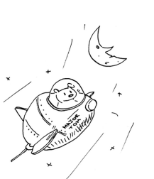
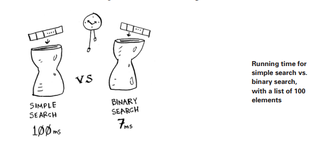
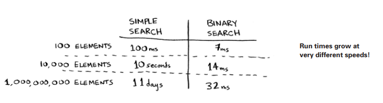
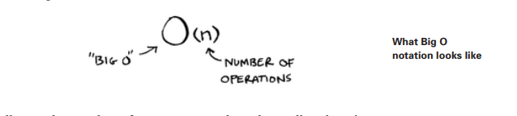
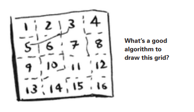
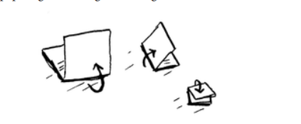
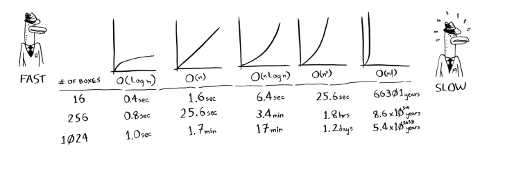

## Big O notation 

Big O notatsiyasi -- bu algoritm qanchalik tez ekanligini aytadigan maxsus belgi. 

Kimni ishi bor? Xo'sh, siz boshqa odamlarning algoritmlarini tez-tez ishlatasiz. Ular qanchalik tez yoki asta ekanligini bilish ajoyib. Ushbu bo'limda Big O notation haqida gaplashamiz va sizga eng ko'p tarqalgan algoritmlarning ishlash vaqtlarini ko'rsatamiz.

### Algorithm running times grow at different rates

Bob NASA uchun qidiruv algoritmi yozmoqda. Uning algoritmi raketa Oyga qo'nmoqchi bo'lganda ishga tushadi va u qayerga qo'nish kerakligini hisoblashga yordam beradi. 
Ikki algoritmning ishlash vaqti qanday turli xil darajada o'sishini ko'rsatadi.

Bob simple search va binary search o'rtasida qaror qilmoqchi. Algoritm ham tez, ham to'g'ri bo'lishi kerak. Bir tomondan binary search tez. Bobda esa qayerga qo'nish kerakligini aniqlash uchun bor-yo'g'i 10 soniya bor -- aks holda raketa kursdan chiqib ketadi. Boshqa tomondan, oddiy qidiruvni yozish osonroq va xatolarni kiritish ehtimoli kamroq.Va Bob haqiqatan ham koddagi xatolar raketani qo'ndirishni xohlamaydi! Ehtiyot bo'lish uchun Bob ikkala algoritmni ham 100 ta element ro'yxati bilan vaqtni belgilashga qaror qiladi. Aytaylik, bitta elementni tekshirish uchun 1 millisekund kerak bo'ladi. Simple search bilan Bob 100 ta elementni tekshirishi kerak, shuning uchun qidiruv 100ms vaqtni oladi. Boshqa tomondan, u binary search bilan faqatgina 7ta elementni tekshirishi kerak(log2100 taxminan 7), shuning uchun qidiruvni bajarishga 7ms ketadi. Ammo haqiqatdan ham ro'yxat milliardga yaqin elementga ega bo'ladi. Agar shunday bo'lsa, oddiy qidiruv qancha vaqt oladi? Ikkilik qidiruv qancha vaqt oladi? O'qishdan oldin har bir savolga javobingiz borligiga ishonch hosil qiling.

Bob 1 milliard element bilan binary searchni ishlatadi va u 30ms oladi(log21.000.000.000 taxminan 30). "32 ms !". Binary searchning simple qidiruvdan 15 baravar tezroq, chunki simple search 100 element bilan 100ms, binary search bilan esa 7ms vaqt oladi. Shunday qilib, simple search 30 × 15 = 450 ms vaqtni oladi, to'g'rimi? 10 soniyalikdan ancha past." Bob simple search bilan borishga qaror qildi. Bu to'g'ri tanlovmi?

Yo'q. Ma'lum bo'lishicha, Bob noto'g'ri. Dead wrong. Simple search bilan 1 milliard elementda 1 milliard ms bo'ladi, bu 11 kun ! Muammo shundaki, binary search va simple search bilan bir xil darajada o'smaydi. 

Ya'ni, elementlar soni ortib borayotganligi sababli, binary searchni ishga tushirish uchun biroz ko'proq vaqt kerak bo'ladi. Ammo simple searchni amalga oshirish uchun ko'proq vaqt kerak bo'ladi. Shunday qilib, raqamlar ro'yxati kattalashgani sayin, binary search birdan simple searchdan ko'ra tezroq bo'ladi. Bob binary search simple searchdan 15 baravar tezroq deb o'ylagan, ammo bu to'g'ri emas. Agar ro'yxatda 1 milliard narsa bo'lsa, bu 33 million marta tezroq. Shuning uchun algoritmni ishga tushirish uchun qancha vaqt ketishini bilishning o'zi etarli emas - ro'yxat hajmi oshgani sayin ish vaqti qanday oshishini bilishingiz kerak. Bu erda Big O belgisi(notation) paydo bo'ladi.

Big O notation sizga algoritm qanchalik tez ekanligini aytadi. Misol uchun, sizda n o'lchamli ro'yxat bor deylik. simple search har bir elementni tekshirishi kerak, shuning uchun u n ta operatsiyani oladi. Big O notatsiyasida ishlash vaqti O(n). Soniyalar qayerda? Hech narsa - Big O sizga soniyalarda tezlikni aytmaydi. *Big O notation operatsiyalar sonini solishtirish imkonini beradi*. Bu sizga algoritm qanchalik tez o'sishini aytadi.

Mana yana bir misol. Binary search n o'lchamli ro'yxatni tekshirish uchun log(n) operatsiyalarini talab qiladi. Big O notatsiyasida ishlash vaqti qancha? Bu O (log n). Umuman olganda, Big O belgisi quyidagicha yoziladi.

Bu sizga algoritm bajaradigan operatsiyalar sonini bildiradi. Bu Big O notation deb ataladi, chunki siz operatsiyalar sonining oldiga "katta O" qo'yasiz (bu hazilga o'xshaydi, lekin bu haqiqat!). Endi ba'zi misollarni ko'rib chiqaylik. Ushbu algoritmlarning ishlash vaqtini aniqlay olasizmi yoki yo'qligini ko'ring.

### Visualizing different Big O run times

Mana, siz uyda bir nechta qog'oz va qalam bilan amal qilishingiz mumkin bo'lgan amaliy misol. Aytaylik, siz 16 qutidan iborat panjara chizishingiz kerak.

##### Algorithm 1

Buning usullaridan biri bir vaqtning o'zida 16 ta qutini chizishdir. Esingizda bo'lsin, Big O belgisi operatsiyalar sonini hisoblaydi. Ushbu misolda bitta qutini chizish bitta operatsiyadir. Siz 16 ta qutini chizishingiz kerak. Bir vaqtning o'zida bitta qutini chizish uchun nechta operatsiya kerak bo'ladi?

16 ta qutini chizish uchun 16 qadam kerak. Ushbu algoritm uchun ishlash vaqti qancha?

##### Algorithm 2

Buning o'rniga ushbu algoritmni sinab ko'ring. Qog'ozni buklang.

Ushbu misolda qog'ozni bir marta buklash operatsiya hisoblanadi. Siz shu operatsiya bilan ikkita quti yasadingiz! Qog'ozni yana, yana va yana buklang.  Uni to'rtta buklangandan keyin oching, shunda siz chiroyli to'rga ega bo'lasiz! Har bir katlama qutilar sonini ikki baravar oshiradi. Siz 4 ta operatsiya bilan 16 ta quti yasadingiz!

Har bir buklash bilan ikki barobar ko'p qutilarni "chizishingiz" mumkin, shuning uchun siz 4 bosqichda 16 ta qutini chizishingiz mumkin. Ushbu algoritm uchun ishlash vaqti qancha? Davom etishdan oldin ikkala algoritm uchun ham ish vaqtini aniqlang. Javoblar: 1-algoritm uchun O(n) vaqt, 2-algoritm O(log n) vaqt oladi.

### Big O establishes a worst-case run time

Aytaylik, siz telefon kitobidan odamni izlash uchun simple searchdan foydalanyapsiz. Bilasizmi, simple search O(n) vaqtini oladi, ya'ni eng yomon holatda telefon kitobingizdagi har bir yozuvni ko'rib chiqishingiz kerak bo'ladi. Bunday holda, siz Aditni qidiryapsiz. Bu odam telefon kitobingizdagi birinchi yozuv. Shunday qilib, siz birinchi urinishda topilgan har bir yozuvni ko'rib chiqishingiz shart emas edi. Bu algoritm O(n) vaqtni oldimi? Yoki birinchi urinishda odamni topganingiz uchun O(1) vaqt kerak bo'ldimi? Simple search hali ham O(n) vaqtni oladi. Bunday holda, siz qidirayotgan narsangizni darhol topdingiz. Bu eng yaxshi stsenariy. Ammo Big O notation eng yomon stsenariy (*worst-case*) haqida. Shunday qilib, siz aytishingiz mumkinki, eng yomon holatda, telefon kitobidagi har bir yozuvga bir marta qarashingiz kerak bo'ladi. Bu O(n) vaqti. Bu ishonch - siz simple search hech qachon O(n) vaqtidan sekin bo'lmasligini bilasiz

> ### Note
> Eng yomon ish vaqti bilan bir qatorda, o'rtacha ish vaqtiga qarash ham muhimdir. O'rtacha holatga nisbatan eng yomon holat 4-bobda muhokama qilinadi.

### Some common Big O run times

Mana beshta siz ko'p uchratadigan Big O run timelari, eng tezdan sekinga saralangan:

 - O(log n), shuningdek, log time sifatida ham tanilgan. Misol: Binary search.
 - O(n), chiziqli vaqt sifatida ham tanilgan(linear time). Misol: Simple search.
 - O(n * log n). Misol: Tez tartiblash algoritmi, Quick sort kabi
(4-bobda muhokama qilinadi).
 - O(n2). Misol: Sekin saralash algoritmi, masalan, Selection sort
(2-bobda muhokama qilinadi).
 - O(n!). Misol: Traveling salesperson kabi juda sekin algoritm sotuvchi (keyingi o'rinda!).

Aytaylik, siz yana 16 ta katakchadan iborat panjara chizmoqdasiz va buni amalga oshirish uchun 5 xil algoritmdan birini tanlashingiz mumkin. Agar siz birinchi algoritmdan foydalansangiz, panjara chizish uchun sizga O(log n) vaqt kerak bo'ladi. Siz soniyada 10 ta operatsiyani bajarishingiz mumkin. O(log n) vaqti bilan 16 ta katakchadan iborat to'rni chizish uchun 4 ta amalni bajarish kerak bo'ladi (log16 = 4). Shunday qilib, panjara chizish uchun sizga 0,4 soniya kerak bo'ladi. Agar siz 1024 ta quti chizishingiz kerak bo'lsa-chi? 1024 ta katakchadan iborat katakchani chizish uchun sizga log1024 = 10 ta operatsiya yoki 1 soniya kerak bo'ladi. Bu raqamlar birinchi algoritmdan foydalaniladi. Ikkinchi algoritm sekinroq: bu O(n) vaqtni oladi. 16 ta qutini chizish uchun 16 ta operatsiya kerak bo'ladi va shunday bo'ladi. 1024 ta qutini chizish uchun 1024 ta operatsiyani bajarasiz. Bu soniyalarda qancha vaqt? Qolgan algoritmlar uchun eng tezdan eng sekingacha bo'lgan to'rni chizish uchun qancha vaqt kerak bo'ladi:

Boshqa run timelar ham bor, lekin bular beshta eng keng tarqalgan.   soddalashtirish. Haqiqatda siz Big O ish vaqtidan bir qator operatsiyalarga bunchalik chiroyli tarzda aylantira olmaysiz, ammo bu hozircha etarli. Yana bir nechta algoritmlarni o'rganganingizdan so'ng, biz 4-bobda Big O notatsiyasiga qaytamiz. Hozircha asosiy yo'nalishlar quyidagilar:

 - Algoritm tezligi soniyalarda emas, balki operatsiyalar soni o'sishda o'lchanadi

 - Buning o'rniga, kirish hajmi oshgani sayin algoritmning ishlash vaqti qanchalik tez ortishi haqida gapiramiz.

 - Algoritmlarning ishlash vaqti Big O belgisida ifodalanadi.

 - O(log n) O(n) dan tezroq, lekin siz qidirayotgan narsalar roʻyxati oshgani sayin u ancha tezlashadi.

### Mashqlar
Ushbu stsenariylarning har biri uchun Big O nuqtai nazaridan ishlash vaqtini bering.
 
 1.3 Sizning ismingiz bor va siz telefon kitobidan odamning telefon raqamini topmoqchisiz.

 1.4 Sizda telefon raqamingiz bor va siz telefon kitobidan odamning ismini topmoqchisiz. (Maslahat: Siz butun kitobni qidirishingiz kerak bo'ladi!)
 
 1.5 Telefon kitobidagi har bir kishining raqamlarini o'qishni xohlaysiz.
 
 1.6 Siz faqat A raqamlarini o'qishni xohlaysiz. (Bu juda qiyin! U 4-bobda koʻproq yoritilgan tushunchalarni oʻz ichiga oladi. Javobni oʻqing — hayron boʻlishingiz mumkin!)