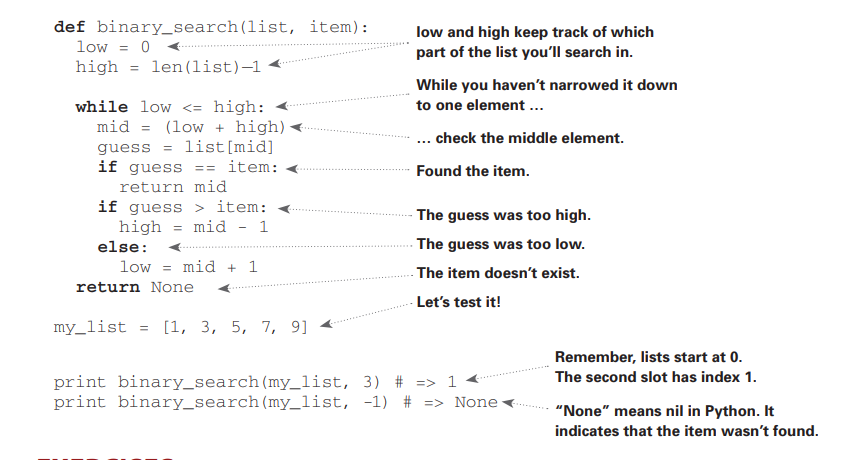

> ### Nimani bilishingiz kerak
> Ushbu kitobni boshlashdan oldin boshlang'ich algebrani bilishingiz kerak. Misol uchun, bu funksiyani olsak: f(x)= x * 2. f(5) qanday bo'ladi? Agar siz 10 deb javob bersangiz, siz tayyorsiz. Bundan tashqari, bu bobda (va bu kitobda) agar birorta dasturlash tilini bilsangiz amalda qilib ko'rish osonroq bo'ladi. Kitobdagi barcha misollar Pythonda berilgan. Agar dasturlash tilini bilmasangiz va o'rganishni xohlasangiz, Pythonni tanlang - boshlovchilar uchun ajoyib. Agar siz boshqa tilni bilasangiz, Rubyga o'xshash,  you'll be fine.

## Binary Search

Aytaylik siz telefonlar kitobidan bir odamni qidiryabsiz (qanday eski gap). Uning ismi K bilan boshlanadi.
Siz boshidan boshlab K-ga yetganingizcha sahifalarni varaqlab davom etishingiz mumkin.Lekin sizda o'rtadagi sahifadan boshlash ehtimoli ko'proq, chunki bilasiz K telefon kitobi o'rtasiga yaqin bo'ladi. Yoki aytaylik siz lug'atdan so'z qidiryabsiz, va u O bilan boshlanadi. Yana, siz o'rtasidan boshlaysiz.


Endi siz Facebookka kiring deylik,Siz kirganingizda Facebook hisobingiz borligini tekshirishi kerak. Demak, ma'lumotlar bazasidan sizning usernamengizni qidirishi kerak. Facebook A dan sizni ismingizni qidirib boshlaydi - lekin o'rtaroqdan boshlashi mantiqiyroq.
Bu qidirish muammosiz. Va hamma bu holatda muammoni yechish uchun bir xil algoritmdan foydalanadi: ikkilik qidiruv (binary search).

__Binary search__ -- bu algoritm. Kiruvchisi tartiblangan elementlar ro'yxati (Nima uchun tartiblangan bo'lishini keyinroq tushuntiriladi).
Agar qidirayotgan elementingiz ro'yxatda bo'lsa algoritm - joylashgan o'rnini qaytaradi. Boshqa holatda, algoritm null qaytaradi.


Binary search qanday ishlashiga namuna ko'ramiz. Men 1 va 100 orasida bir raqam o'ylayman. 


Siz iloji boricha kamroq urunishda topishga harakat qiling. Har bir taxminda Men taxminingiz juda katta, juda past yoki to'g'ri deb aytaman.Aytaylik, siz shunday taxmin qilishni boshladingiz: 1, 2, 3, 4 ... . 


Bu oddiy qidiruv (ahmoqlik yaxshi atama). Har bir taxmin bilan siz 1ta raqam yo'q qilayabsiz. Agar men o'ylagan son 99 bo'lsa, u yerga borish uchun siz 99 marta taxmin qilishingiz kerak bo'ladi.

### A better way to search


Yaxshiroq usuli - 50 dan boshlang. Juda past, lekin siz raqamlarning yarmini yo'q qildingiz. Siz 1-50 taxminlarini hammasi pastligini bilasiz. Keyingi taxmin: 75.


Juda baland, lekin siz qolgan raqamlarni yana yarmini tashlaysiz. **Binary search bilan har safar o'rta raqamni taxmin qilasiz va qolgan raqamlarni yarmini yo'q qilasiz.** Keyingisi: 63 (50 va 75 o'rtasida). 
<br>
Bu Binary search. Siz birinchi algoritmingizni o'rgandingiz. Bu yerda har safar raqamlarni qanday yo'q bo'lishi bor.


Men qaysi raqamni o'ylagan bo'lsam ham siz maksimal 7ta taxmin qilishingiz mumkin. Chunki har taxminda ko'p raqamlarni yo'q qilasiz.

Aytaylik, lug'atdan so'z qidiryapsiz. Lug'atda 240.000 ta so'z bor. Eng yomon holatda har bir qidiruv qancha qadam oladi deb o'ylaysiz? 

Agar so'z kitobning eng oxirida bo'lsa Oddiy qidiruv(Simple search)da 240.000 qadam oladi. Binary search bilan, har bir qadamda siz 1ta so'z qolmaguncha sonlar yarmini qirqasiz.


Shunday qilib, Binary search 18ta qadamni oladi -- bu katta farq! Umuman olganda har qanday n ro'yxat uchun binary search log<sub>2</sub>n qadamni oladi, oddiy qidiruvda esa n qadamni oladi.

#### Logarithms
Siz logarifm nima ekanligini eslay olmasligingiz mumkin, balki eksponentlar nima ekanligini bilarsiz. log <sub>10</sub>100 --   "10ni nechi marta ko'paytirsak 100 bo'ladi" deb so'rashga o'xshaydi. Javob 2. Chunki 10<sup>2</sup> = 100. log<sub>10</sub>100 = 2.


#### Loglar exponentlarning aylanishi

Ushbu kitobda, Big O notatsiyasida ishlash vaqti haqida gapirganimda (birozdan keyin tushuntirilgan), log har doim log<sub>2</sub> degan ma'noni anglatadi.Oddiy qidiruv yordamida elementni qidirganingizda, eng yomon holatda har bir elementga qarashingiz kerak bo'lishi mumkin. Demak, 8 ta raqamdan iborat ro'yxat uchun siz ko'pi bilan 8 ta raqamni tekshirishingiz kerak bo'ladi.
Ikkilik qidiruv uchun siz eng yomon holatda *log(n)* elementlarini tekshirishingiz kerak.8 ta element ro'yxati uchun, log 8 == 3, chunki 2<sup>3</sup> == 8. Shunday qilib, 8 ta raqam ro'yxati uchun, ko'pi bilan 3 ta raqamni tekshirishingiz kerak bo'ladi. 1.024 ta element roʻyxati uchun, log(1.024) = 10, chunki 2<sup>10</sup> == 1,024. Shunday qilib, 1.024 raqam ro'yxati uchun siz ko'pi bilan 10 ta raqamni tekshirish kerak.

> #### Note 
> Bu kitobda log vaqtlari haqida ko'p gapiriladi. Shuning uchun, logarifmlar konseptsiyasini tushunishingiz kerak bo'ladi. Agar bilmasangiz, KhanAcademy.org da logarifmlar haqida ajoyib darslar mavjud.

> #### Note
> Binary search faqatgina sizning ro'yxatingiz tartiblangan bo'lgandagina ishlaydi. Misol uchun, telefonlar kitobi ismlar alifbo tartibida saralangan. Shuning uchun siz ism qidirishda binary searchdan foydalanishingiz mumkin. Nima deb o'ylaysiz, agar ismlar saralanmagan bo'lsa nima sodir bo'ladi?

Keling, Pythonda binary search qanday yozilishini ko'raylik.Bu yerdagi kod namunasi massivlardan foydalanadi. Agar massivlar qanday ishlashini bilmasangiz, havotirlanmang. Ular keyingi bobda yoritiladi. Siz shunchaki elementlar ketma-ketligini massiv deb ataladigan ketma-ket chelaklar qatorida saqlashingiz mumkinligini bilishingiz kerak. Chelaklar 0 dan boshlab raqamlangan, birinchi chelak #0, ikkinchi #1, uchinchi #2 va hokazo. `Binary search` tartiblangan raqamlar va bir elementni oladi. Agar element ro'yxatda bo'lsa, u elementning joylashgan o'rni(pozitsiyasini) qaytaradi. Agar element ro'yxatda bo'lmasa, null qaytaradi. Siz massivni qaysi qismini qidirishingiz kerakligini kuzatib borasiz. Dastlab, butun massiv:

```python
low = 0
high = len(list) - 1
```


Har doim, o'rtadagi element tekshiriladi:
```python
mid = (low + high) / 2
guess = list[mid]
```
Agar taxminiy son juda past bo'lsa, shunga mos ravishda `low` ni yangilaysiz.

```python
if guess < item:
	low = mid + 1
```


Agar taxminiy son juda baland bo'lsa, shunga mos ravishda `high` ni yangilaysiz.
Quyida kodning to'liq versiyasini ko'rasiz.

#### Python
```python
def binary_search(list []int, item int)
    low = 0
    high = len(list) - 1
    while low <= high:
        mid = ( low + high ) / 2
        guess = list[mid]
        if guess == item:
            return mid
        if guess > item:
            high = mid - 1 
        else:
            low = mid + 1
    return None
```

#### Golang
```golang
func binary_search(list []int, item int) int {
	low := 0
	high := len(list) - 1

	for low <= high {

		mid := (low + high) / 2
		guess := list[mid]

		if guess == item {
			return mid
		} else if guess > item {
			high = mid - 1
		} else {
			low = mid + 1
		}
	}

	return -1
}
```



### Mashqlar

1.1 Aytaylik, sizda 128ta saralangan ismlar ro'yxati bor, va siz binary search orqali qidirasiz. Maksimal qadamlar soni qancha bo'ladi?

1.2 Ro'yxat hajmini ikki baravar oshirdingiz deylik. Endi maksimal qadamlar soni qancha?


### Running time
Har safar algoritm haqida gapirilganida, uning ishlash vaqti muhokama qilinadi. Umuman olganda, siz eng samarali algoritmni tanlashni xohlaysiz -- vaqt va joy uchun optimallashtirishga harakat qilasiz. 

Binary searchga qaytamiz. Undan foydalanish bilan qancha vaqtni  tejaysiz.  Birinchi yondashuv, har bir raqamni birma-bir tekshirish edi. Agar ro'yxatda 100 ta raqam bo'lsa, siz 100 marta tekshirishingiz kerak bo'ladi. Agar ro'yxatda 4.000.000 ta raqam bo'lsa, siz 4.000.000 marta tekshirishingiz kerak bo'ladi. Shunday qilib, taxminlarning maksimal soni ro'yhay hajmi bilan bir xil. Bu chiziqli vaqt deb ataladi(linear time). 

Binary search boshqacha. Agar ro'yxat 100ta elementdan iborat bo'lsa, u ko'pi bilan 7ta taxmin qiladi. Agar ro'yxat 4.000.000 ta elementdan iborat bo'lsa, u ko'pi bilan 32ta taxmin qiladi.Kuchli a? Binary search logarifmik vaqtda ishlaydi (yoki log vaqti, log time).
Mana bugungi natijalarimizni umumlashtiradigan jadval.

