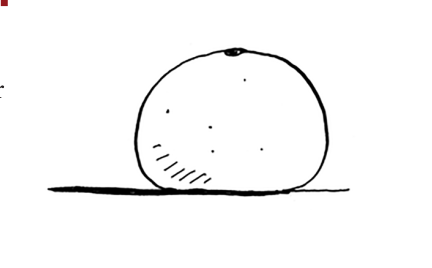
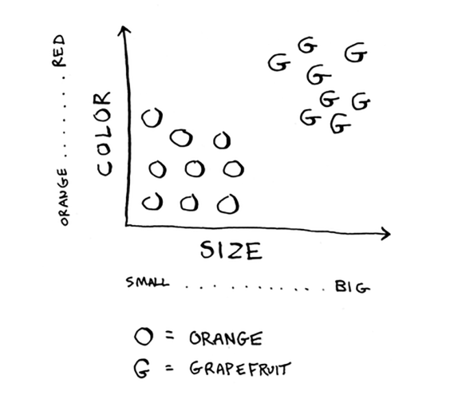
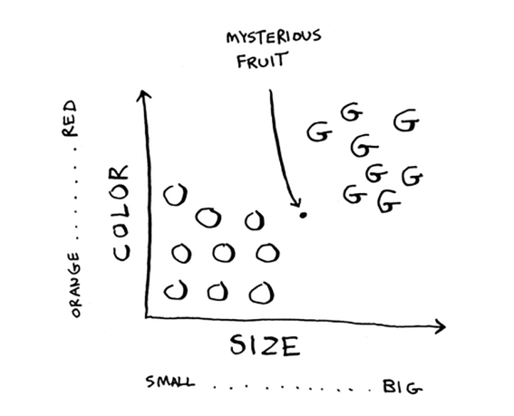
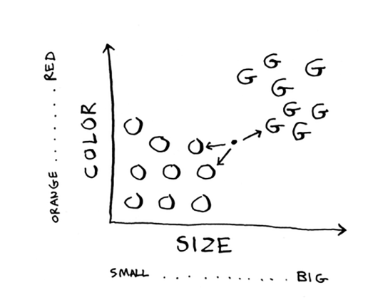
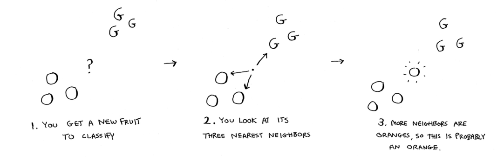

# Classifying oranges vs. grapefruit

Bu mevaga qarang. Bu apelsinmi yoki greyfurtmi? Men greyfurtlarning odatda kattaroq va qizilroq ekanligini bilaman.

Mening fikrlash jarayonim shunday: mening miyamda grafik bor.

Umuman olganda, kattaroq, qizilroq mevalar greyfurtlardir. Bu meva katta va qizil, shuning uchun bu greyfurt bo'lishi mumkin. Ammo bunday mevani olsangiz nima bo'ladi?

Ushbu mevani qanday `tasniflagan` bo'lardingiz? Buning bir usuli - bu joyning qo'shnilariga qarash. Bu joyning uchta eng yaqin qo'shnisiga qarang.

Greypfrutdan ko'ra ko'proq qo'shnilar apelsindir. Shunday qilib, bu meva, ehtimol, apelsindir. Tabriklaymiz: Siz hozirgina *tasniflash* uchun *k-yaqin qo'shnilar (KNN)* algoritmidan foydalandingiz! Butun algoritm juda oddiy.

KNN algoritmi oddiy, ammo foydali! Agar biror narsani tasniflamoqchi bo'lsangiz, avval KNNni sinab ko'rishingiz mumkin. Keling, haqiqiyroq misolni ko'rib chiqaylik.