# Building a recommendations system

Aytaylik, siz Netflixsiz va foydalanuvchilaringiz uchun film tavsiyalar tizimini yaratmoqchisiz. Yuqori darajada, bu greyfurt muammosiga o'xshaydi!

Har bir foydalanuvchini grafikda chizishingiz mumkin.

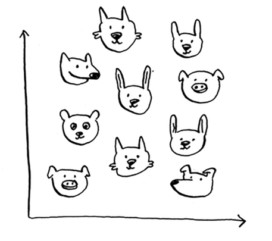

Ushbu foydalanuvchilar o'xshashlik bo'yicha tuzilgan, shuning uchun o'xshash ta'mga ega foydalanuvchilar bir-biriga yaqinroq chizilgan. Aytaylik, siz Priyanka uchun filmlar tavsiya qilmoqchisiz. Unga eng yaqin besh foydalanuvchini toping.

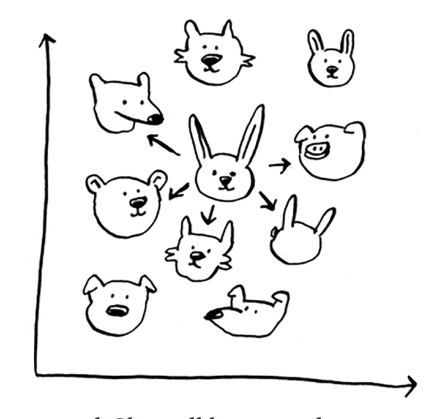

Justin, JC, Joey, Lance va Chris filmlarda bir xil didga ega. Demak, *ular* qanday filmlarni yoqtirmasin, Priyanka ham yoqadi! Ushbu grafikni olganingizdan so'ng, tavsiyalar tizimini yaratish oson. Agar Jastin filmni yoqtirsa, uni Priyankaga tavsiya eting.

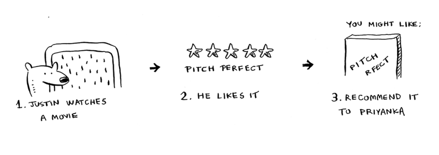

Ammo hali ham katta bir qism etishmayapti. Siz foydalanuvchilarning o'xshashligi bo'yicha grafik tuzdingiz. Ikki foydalanuvchining o'xshashligini qanday aniqlash mumkin?

## Feature extraction

Greypfrut misolida siz mevalarni ularning qanchalik kattaligi va qanchalik qizil ekanligiga qarab taqqosladingiz. Hajmi va rangi siz solishtirayotgan xususiyatlardir. Aytaylik, sizda uchta meva bor. Siz xususiyatlarni ajratib olishingiz mumkin.

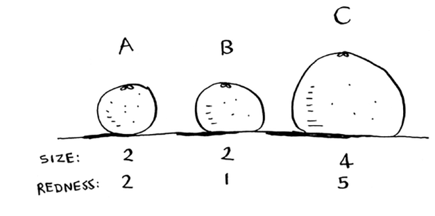

Keyin uchta mevaning grafigini chizishingiz mumkin.

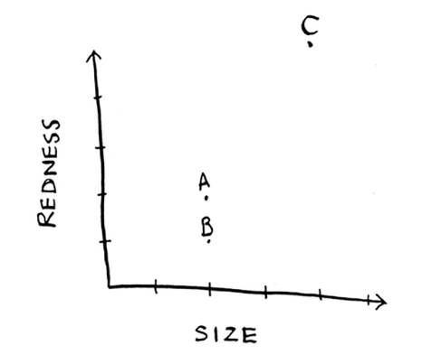

Grafikdan siz A va B mevalari o'xshashligini vizual tarzda aniqlashingiz mumkin. Keling, ularning qanchalik yaqinligini o'lchaylik. Ikki nuqta orasidagi masofani topish uchun siz Pifagor formulasidan foydalanasiz.

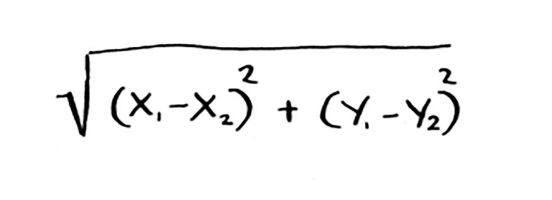

Bu erda, masalan, A va B orasidagi masofa.

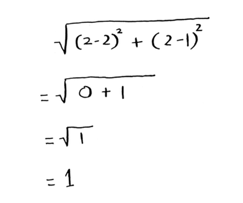

A va B orasidagi masofa 1 ga teng. Qolgan masofalarni ham topishingiz mumkin.

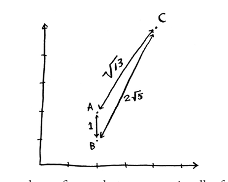

Masofa formulasi siz ko'rgan narsalarni vizual tarzda tasdiqlaydi: A va B mevalari o'xshash. 

Aytaylik, siz Netflix foydalanuvchilarini solishtiryapsiz. Foydalanuvchilarning grafigini tuzish uchun sizga qandaydir usul kerak. Shunday qilib, har bir foydalanuvchini meva uchun qilganingiz kabi koordinatalar to'plamiga aylantirishingiz kerak.

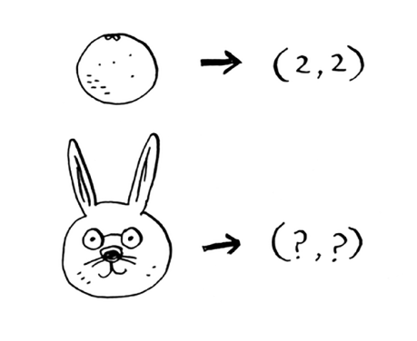

Foydalanuvchilarning grafikasini chizganingizdan so'ng, ular orasidagi masofani o'lchashingiz mumkin. 

Qanday qilib foydalanuvchilarni raqamlar to'plamiga aylantirishingiz mumkin. Foydalanuvchilar Netflix-ga ro'yxatdan o'tganlarida, ularga filmlarning ayrim toifalarini ushbu toifalarni qanchalik yoqtirishiga qarab baholashlarini so'rang. Har bir foydalanuvchi uchun endi sizda reytinglar to'plami mavjud!

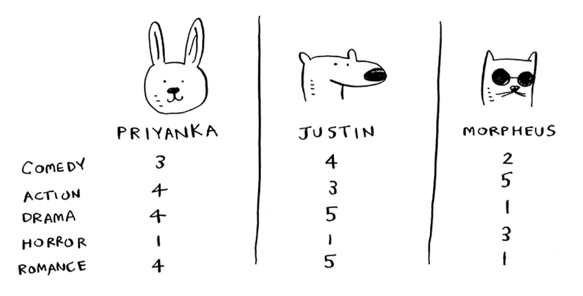

Priyanka va Jastin romantikani yaxshi ko'radilar va dahshatdan nafratlanishadi. Morfey Harakatni yaxshi ko'radi, lekin Romantikani yomon ko'radi (u yaxshi jangovar filmni ishqiy sahnada vayron qilishdan nafratlanadi). Qanday qilib apelsin va greyfurtda har bir meva ikkita raqam bilan ifodalanganligini eslaysizmi? Bu erda har bir foydalanuvchi beshta raqamdan iborat to'plam bilan ifodalanadi.

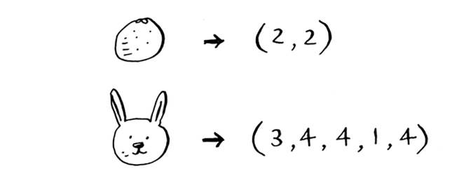

Matematikning aytishicha, masofani ikki o'lchovda hisoblash o'rniga, endi siz masofani *besh* o'lchovda hisoblaysiz. Ammo masofa formulasi bir xil bo'lib qoladi.

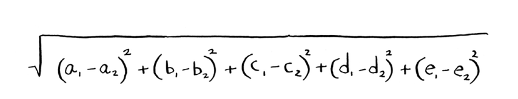

Bu faqat ikkita raqam to'plami o'rniga beshta raqamni o'z ichiga oladi.

Masofa formulasi moslashuvchan: siz million raqamlar to'plamiga ega bo'lishingiz mumkin va masofani topish uchun bir xil eski masofa formulasidan foydalanishingiz mumkin. Ehtimol, siz "beshta raqamingiz bo'lsa, masofa nimani anglatadi?" Deb o'ylayotgandirsiz. Masofa sizga bu raqamlar to'plami qanchalik o'xshashligini ko'rsatadi.

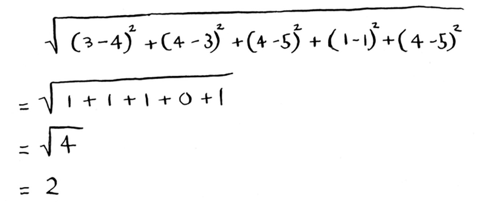

Mana Priyanka va Jastin orasidagi masofa.

Priyanka va Jastin juda o'xshash. Priyanka va Morfey o'rtasidagi farq nima? Harakat qilishdan oldin masofani hisoblang.

To'g'ri tushundingizmi? Priyanka va Morfey bir-biridan 24 yoshda. Masofa sizga Priyankaning didi Morfeynikidan ko'ra Jastinnikiga o'xshashligini aytadi.

Ajoyib! Endi Priyankaga filmlarni tavsiya qilish oson: agar Jastin filmni yoqtirsa, uni Priyankaga tavsiya eting va aksincha. Siz hozirgina kino tavsiyalar tizimini yaratdingiz!

Agar siz Netflix foydalanuvchisi bo'lsangiz, Netflix sizga "Iltimos, ko'proq filmlarni baholang. Qanchalik koʻp filmlarni baholasangiz, tavsiyalaringiz shunchalik yaxshi boʻladi". Endi nima uchun ekanligini bilasiz. Qanchalik ko'p filmlarni baholasangiz, Netflix boshqa foydalanuvchilarga o'xshashligingizni shunchalik aniqroq ko'rishi mumkin.

#### EXERCISES
10.1 Netflix misolida siz masofa formulasi yordamida ikki xil foydalanuvchilar orasidagi masofani hisoblab chiqdingiz. Lekin hamma foydalanuvchilar filmlarni bir xil baholayvermaydi. Faraz qilaylik, sizda filmlarda bir xil didga ega bo'lgan ikkita foydalanuvchi, Yogi va Pinki bor. Ammo Yogi o'zi yoqtirgan har qanday filmni 5 ball bilan baholaydi, Pinki esa tanlashni afzal ko'radi va 5 ballni faqat eng yaxshisi uchun ajratadi. Ular yaxshi mos keladi, lekin masofa algoritmiga ko'ra, ular qo'shni emas. Ularning turli reyting strategiyalarini qanday hisobga olgan bo'lardingiz?

10.2 Aytaylik, Netflix "ta'sir qiluvchilar" guruhini nomzod qilib ko'rsatmoqda. Misol uchun, Kventin Tarantino va Ues Anderson Netflix-ga ta'sir o'tkazuvchilardir, shuning uchun ularning reytinglari oddiy foydalanuvchinikidan ko'ra ko'proq hisoblanadi. Tavsiyalar tizimini qanday o'zgartirgan bo'lar edingiz, shunda u ta'sir qiluvchilarning reytingiga mos keladi?

## Regression

Aytaylik, siz filmni tavsiya qilishdan ko'ra ko'proq narsani qilishni xohlaysiz: Priyanka bu filmga qanday baho berishini taxmin qilmoqchisiz. Unga eng yaqin besh kishini oling. Aytgancha, men eng yaqin besh kishi haqida gapirishda davom etaman. Hech narsa yo'q

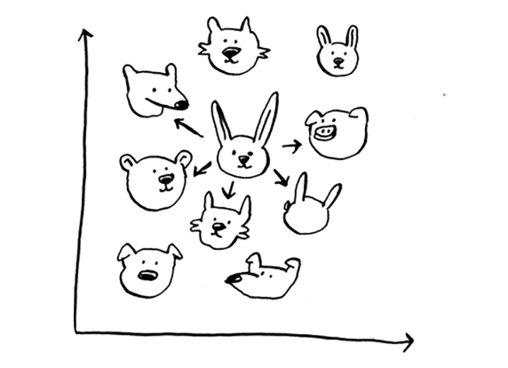

5 raqami haqida alohida: siz eng yaqin 2 yoki 10 yoki 10 000 ni qilishingiz mumkin. Shuning uchun algoritm beshta eng yaqin qo'shni emas, balki k-eng yaqin qo'shnilar deb ataladi! 

Aytaylik, siz *Pitch Perfect* reytingini taxmin qilmoqchisiz. Xo'sh, Justin, JC, Joey, Lance va Chris buni qanday baholadilar?

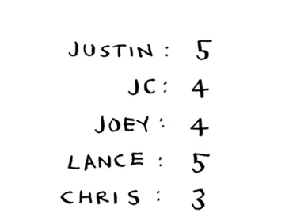

Siz ularning o'rtacha bahosini olib, 4,2 yulduzga ega bo'lishingiz mumkin. Bu *regressiya* deb ataladi. Bular KNN bilan bajaradigan ikkita asosiy narsa - tasniflash va regressiya:

• Tasniflash = guruhga ajratish

• Regressiya = javobni bashorat qilish (masalan, raqam)

Regressiya juda foydali. Aytaylik, siz Berklida kichik novvoyxona ishlaysiz va har kuni yangi non tayyorlaysiz. Siz bugungi kunda qancha non tayyorlashni taxmin qilishga harakat qilyapsiz. Sizda bir qator xususiyatlar mavjud:

• 1 dan 5 gacha bo'lgan shkala bo'yicha ob-havo (1 = yomon, 5 = ajoyib).

• Dam olish kunlarimi yoki bayrammi? (agar bu hafta oxiri yoki dam olish kuni bo'lsa, 1, aks holda 0.)

• O'yin bormi? (Ha bo'lsa 1, yo'q bo'lsa 0.)

Va siz o'tmishda turli xil xususiyatlar uchun qancha non sotganingizni bilasiz.

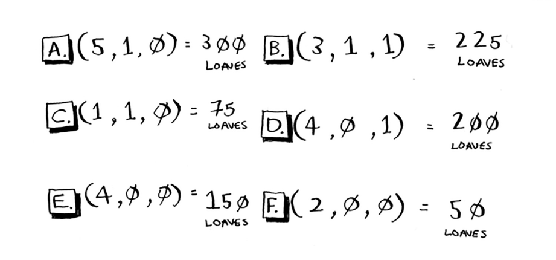

Bugun dam olish kuni, ob-havo yaxshi. Siz ko'rgan ma'lumotlarga asoslanib, qancha non sotasiz? Keling, KNN dan foydalanamiz, bu erda K = 4. Birinchidan, bu nuqta uchun eng yaqin to'rtta qo'shnini aniqlang.

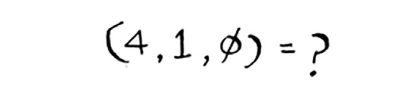

Mana masofalar. A, B, D va E eng yaqin.

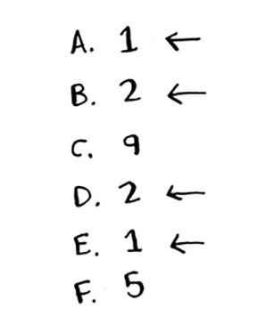

O'sha kunlarda sotilgan nonlarning o'rtacha hisobini oling va siz 218,75 olasiz. Bugun qancha non tayyorlashingiz kerak!

> Kosinus o'xshashligi (Cosine similarity)
> 
> Hozirgacha siz ikki foydalanuvchi orasidagi masofani solishtirish uchun masofa formulasidan foydalangansiz. Bu foydalanish uchun eng yaxshi formulami? Amalda qo'llaniladigan keng tarqalgan kosinus o'xshashligi. Aytaylik, ikkita foydalanuvchi o'xshash, ammo ulardan biri o'z reytinglarida konservativroq. Ikkalasi ham Manmohan Desayning Amar Akbar Entonini yaxshi ko'rardi. Pol uni 5 yulduz bilan baholadi, lekin Rowan uni 4 yulduz bilan baholadi. Masofa formulasidan foydalanishda davom etsangiz, bu ikki foydalanuvchi bir-birining qo'shnisi bo'lmasligi mumkin, garchi ular o'xshash ta'mga ega bo'lsalar ham.
> 
> Kosinus o'xshashligi ikkita vektor orasidagi masofani o'lchamaydi. Buning o'rniga u ikkita vektorning burchaklarini taqqoslaydi. Bunday holatlar bilan shug'ullanish yaxshiroqdir. Kosinusning o'xshashligi ushbu kitobning doirasiga kirmaydi, lekin agar siz KNN dan foydalansangiz, uni qidiring!

## Picking good features

Tavsiyalarni aniqlash uchun siz foydalanuvchilar filmlar toifalarini baholagansiz. Buning o'rniga mushuklarning rasmlarini baholasangiz nima bo'ladi? Keyin siz ushbu rasmlarni xuddi shunday baholagan foydalanuvchilarni topasiz. Bu, ehtimol, yomonroq tavsiyalar mexanizmi bo'lar edi, chunki "xususiyatlar" filmlardagi ta'mga ko'p aloqasi yo'q!

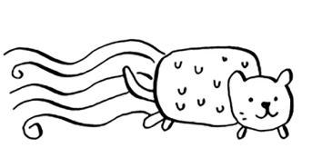

Yoki foydalanuvchilardan filmlarni baholashni soʻraysiz, shunda siz ularga tavsiyalar berasiz — lekin siz ulardan faqat "*Oʻyinchoqlar hikoyasi*", "*Oʻyinchoqlar tarixi 2*" va "*Oʻyinchoqlar hikoyasi 3*" filmlarini baholashlarini soʻraysiz. Bu foydalanuvchilarning kino didi haqida koʻp narsa aytmaydi!

KNN bilan ishlayotganingizda, taqqoslash uchun to'g'ri xususiyatlarni tanlash juda muhimdir. To'g'ri xususiyatlarni tanlash degani

• Siz tavsiya qilmoqchi bo'lgan filmlar bilan bevosita bog'liq xususiyatlar

• Noto'g'ri bo'lmagan funksiyalar (masalan, foydalanuvchilardan faqat komediya filmlarini baholashni so'rasangiz, bu ularga jangovar filmlarni yoqtirishini bildirmaydi)

Sizningcha, reytinglar filmlarni tavsiya qilishning yaxshi usulimi? Balki men "*The Wire*"ga "*House Hunters*"ga qaraganda yuqori baho berganman, lekin aslida "*House Hunters*" filmini tomosha qilish uchun ko'proq vaqt sarflayman. Ushbu Netflix tavsiyalar tizimini qanday yaxshilagan bo'lardingiz?

Nonvoyxonaga qaytsak: novvoyxona uchun tanlagan ikkita yaxshi va ikkita yomon xususiyat haqida o'ylay olasizmi? Ehtimol, siz qog'ozga reklama qilganingizdan keyin ko'proq non tayyorlashingiz kerak. Yoki dushanba kunlari ko'proq non tayyorlashingiz kerak.

Yaxshi xususiyatlarni tanlashda bitta to'g'ri javob yo'q. Siz ko'rib chiqishingiz kerak bo'lgan barcha narsalar haqida o'ylashingiz kerak.

#### EXERCISES
10.3 Netflix millionlab foydalanuvchilarga ega. Avvalgi misolda tavsiyalar tizimini yaratish uchun eng yaqin beshta qo'shni ko'rib chiqildi. Bu juda pastmi? Juda balandmi?