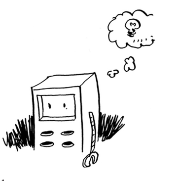
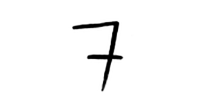
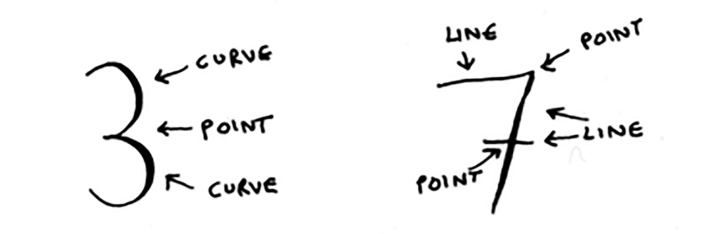
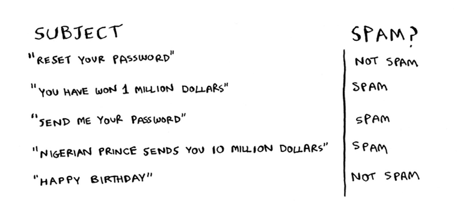
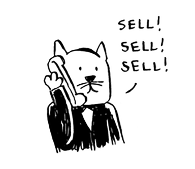

# Introduction to machine learning

KNN - bu haqiqatan ham foydali algoritm va bu sizning sehrli mashinalarni o'rganish dunyosiga kirishingizdir! Mashinani o'rganish - bu sizning kompyuteringizni yanada aqlli qilishdir. Siz allaqachon mashinani o'rganishning bitta misolini ko'rgansiz: tavsiyalar tizimini yaratish. Keling, boshqa misollarni ko'rib chiqaylik.

## OCR

OCR optik belgilarni aniqlashni anglatadi. Bu siz matn sahifasini suratga olishingiz mumkinligini anglatadi va kompyuteringiz matnni siz uchun avtomatik ravishda o'qiydi. Google kitoblarni raqamlashtirish uchun OCR dan foydalanadi. OCR qanday ishlaydi? Masalan, bu raqamni ko'rib chiqing.

Bu qanday raqam ekanligini avtomatik ravishda qanday aniqlaysiz? Buning uchun KNN dan foydalanishingiz mumkin:

1. Raqamlarning ko'plab tasvirlarini ko'rib chiqing va bu raqamlarning xususiyatlarini ajratib oling.

2. Yangi rasmni olganingizda, ushbu rasmning xususiyatlarini ajratib oling va uning eng yaqin qo'shnilari nima ekanligini ko'ring!

Bu apelsin va greyfurt bilan bir xil muammo. Umuman olganda, OCR algoritmlari chiziqlar, nuqtalar va egri chiziqlarni o'lchaydi.

Keyin, yangi belgi olganingizda, xuddi shu xususiyatlarni chiqarib olishingiz mumkin
undan.

Xususiyatlarni ajratib olish OCRda meva misoliga qaraganda ancha murakkabroq. Ammo shuni tushunish kerakki, hatto murakkab texnologiyalar ham KNN kabi oddiy g'oyalarga asoslanadi. Nutqni aniqlash yoki yuzni aniqlash uchun bir xil g'oyalardan foydalanishingiz mumkin. Fotosuratni Facebook-ga yuklaganingizda, ba'zida fotosuratdagi odamlarni avtomatik ravishda belgilash aqlli bo'ladi. Mashinani o'rganish amalda!

Raqamlar tasvirlarini ko'rib chiqish va xususiyatlarni ajratib olish OCR ning birinchi bosqichi *trening* deb ataladi. Ko'pgina mashinalarni o'rganish algoritmlari o'qitish bosqichiga ega: kompyuteringiz vazifani bajarishdan oldin uni o'rgatish kerak. Keyingi misol spam-filtrlarni o'z ichiga oladi va unda o'quv bosqichi mavjud.

## Building a spam filter

Spam filtrlari *Naive Bayes tasniflagichi* deb ataladigan boshqa oddiy algoritmdan foydalanadi. Birinchidan, siz Naive Bayes klassifikatoringizni ba'zi ma'lumotlarga o'rgatasiz. 

Aytaylik, sizga "million dollaringizni hozir yig'ing!" mavzusidagi elektron xat keldi. Bu spammi? Siz ushbu jumlani so'zlarga bo'lishingiz mumkin. Keyin, har bir so'z uchun, bu so'zning spam elektron pochtasida paydo bo'lish ehtimoli qancha ekanligini ko'ring. Misol uchun, bu juda oddiy modelda *million* so'zi faqat spam elektron pochta xabarlarida ko'rinadi. Naive Bayes biror narsaning spam bo'lish ehtimolini aniqlaydi. U KNN ga o'xshash ilovalarga ega.

Misol uchun, mevalarni tasniflash uchun siz Naive Bayes-dan foydalanishingiz mumkin: sizda katta va qizil meva bor. Bu greyfurt bo'lish ehtimoli qanday? Bu juda samarali bo'lgan yana bir oddiy algoritm. Biz bu algoritmlarni yaxshi ko'ramiz!

Mashinani o'rganish bilan shug'ullanish qiyin bo'lgan narsa: fond bozori ko'tariladimi yoki pasayadimi, bashorat qilish. Birjada yaxshi xususiyatlarni qanday tanlash mumkin? Faraz qilaylik, agar kechagi aksiyalar qimmatlashgan bo'lsa, bugun ham ko'tariladi. Bu yaxshi xususiyatmi? Yoki may oyida qimmatli qog'ozlar har doim pasayadi, deylik. Bu ishlaydimi? Kelajakdagi samaradorlikni bashorat qilish uchun o'tgan raqamlardan foydalanishning kafolatlangan usuli yo'q. Kelajakni bashorat qilish qiyin va juda ko'p o'zgaruvchilar ishtirok etganda bu deyarli mumkin emas.

## Predicting the stock market