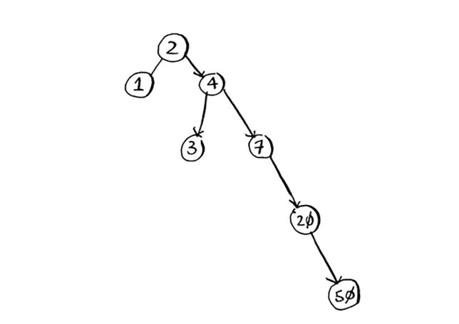

# Trees

Keling, ikkilik qidiruv misoliga qaytaylik. Foydalanuvchi Facebook-ga kirganda, Facebook foydalanuvchi nomi mavjudligini bilish uchun katta massivni ko'rib chiqishi kerak. Biz ushbu massiv orqali qidirishning eng tezkor usuli ikkilik qidiruvni amalga oshirish ekanligini aytdik. Ammo muammo bor: har safar yangi foydalanuvchi ro'yxatdan o'tganda, siz uning foydalanuvchi nomini massivga kiritasiz. Keyin massivni qayta saralashingiz kerak, chunki ikkilik qidiruv faqat tartiblangan massivlar bilan ishlaydi. Massivni keyinchalik saralash shart emasligi uchun foydalanuvchi nomini darhol massivdagi to'g'ri uyaga kiritsangiz yaxshi bo'lmasmidi? Bu *ikkilik qidiruv daraxti* ma'lumotlar tuzilishi ortidagi g'oya.

Ikkilik qidiruv daraxti shunday ko'rinadi.

Har bir tugun uchun uning chap tomonidagi tugunlar *kichikroq*, o'ngdagi tugunlar esa *kattaroqdir*.

Aytaylik, siz Meggini qidiryapsiz. Siz ildiz tugunidan boshlaysiz.

*Meggi* *Dovuddan* keyin keladi, shuning uchun o'ngga boring.

*Meggi* *Menningdan* oldin keladi, shuning uchun chapga boring.

Siz Meggini topdingiz! Bu deyarli ikkilik qidiruvni ishga tushirishga o'xshaydi! Ikkilik qidiruv daraxtida elementni qidirish *o'rtacha* O(log n) vaqtini va *eng yomon holatda* O(n) vaqtini oladi. Saralangan massivni qidirish *eng yomon holatda* O(log n) vaqtni oladi, shuning uchun tartiblangan massiv yaxshiroq deb o'ylashingiz mumkin. Ammo ikkilik qidiruv daraxti o'rtacha kiritish va o'chirish uchun juda tezroq.

Ikkilik qidiruv daraxtlarining kamchiliklari ham bor: birinchi navbatda, siz tasodifiy kirish huquqiga ega bo'lmaysiz. Siz: "Menga bu daraxtning beshinchi elementini bering", deb ayta olmaysiz. Ushbu ishlash vaqtlari ham o'rtacha bo'lib, muvozanatli daraxtga tayanadi. Aytaylik, sizda keyingi ko'rsatilgandek muvozanatsiz daraxt bor.

Qanday qilib o'ngga egilganini ko'rdingizmi? Bu daraxt juda yaxshi ko'rsatkichlarga ega emas, chunki u muvozanatli emas. O'zlarini muvozanatlashtiradigan maxsus ikkilik qidiruv daraxtlari mavjud. Bir misol, qizil-qora daraxt. Ikkilik qidiruv daraxtlari qachon ishlatiladi? *B-daraxtlar*, ikkilik daraxtning maxsus turi, odatda ma'lumotlar bazalarida ma'lumotlarni saqlash uchun ishlatiladi. Agar siz ma'lumotlar bazalari yoki yanada rivojlangan ma'lumotlar tuzilmalariga qiziqsangiz, quyidagilarni tekshiring:

• B-daraxtlar

• Qizil-qora daraxtlar

• Uyumlar

• Daraxtlarni yoyish