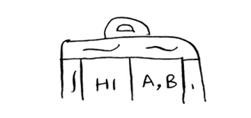

# Inverted indexes

Bu erda qidiruv tizimi qanday ishlashining juda soddalashtirilgan versiyasi. Aytaylik, sizda ushbu oddiy tarkibga ega uchta veb-sahifa bor.

Keling, ushbu tarkibdan xesh jadvalini tuzamiz.

Xesh jadvalining kalitlari so'zlardir va qiymatlar har bir so'z qaysi sahifalarda paydo bo'lishini aytadi. Aytaylik, foydalanuvchi *salom* ni qidiradi. Keling, qaysi sahifalarda *salom* ko'rsatilishini ko'rib chiqaylik.

Aha: U A va B sahifalarida paydo bo'ladi. Natijada foydalanuvchiga o'sha sahifalarni ko'rsatamiz. Yoki foydalanuvchi *u yerda* qidiradi deylik. Bilasizmi, u A va C sahifalarida ko'rinadi. Juda oson, a? Bu foydali ma'lumotlar tuzilmasi: so'zlarni ular paydo bo'ladigan joylarga ko'rsatadigan xesh. Ushbu ma'lumotlar strukturasi *teskari indeks* deb ataladi va u odatda qidiruv tizimlarini yaratish uchun ishlatiladi. Agar siz qidiruvga qiziqsangiz, bu boshlash uchun yaxshi joy.

