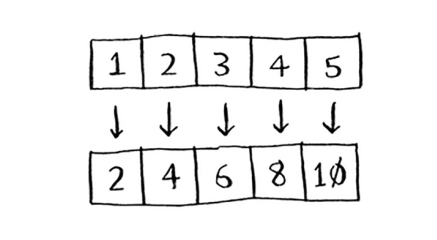
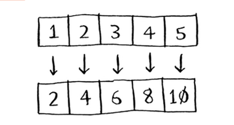
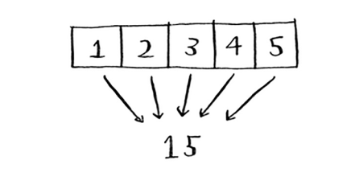

# MapReduce

Borgan sari mashhur bo'lib borayotgan alohida turdagi parallel algoritm mavjud: *taqsimlangan algoritm*. Agar sizga ikkitadan to'rttagacha yadro kerak bo'lsa, noutbukda parallel algoritmni ishga tushirish yaxshi, lekin yuzlab yadrolar kerak bo'lsa-chi? Keyin bir nechta mashinalarda ishlash uchun algoritmingizni yozishingiz mumkin. MapReduce algoritmi mashhur taqsimlangan algoritmdir. Siz uni mashhur ochiq manbali Apache Hadoop vositasi orqali ishlatishingiz mumkin.

## Why are distributed algorithms useful?

Aytaylik, sizda milliardlab yoki trillionlab qatorlardan iborat jadvalingiz bor va siz unda murakkab SQL so'rovini bajarishni xohlaysiz. Siz uni MySQL-da ishga tushira olmaysiz, chunki u bir necha milliard qatordan keyin kurashadi. Hadoop orqali MapReduce-dan foydalaning!

Yoki siz ishlarning uzoq ro'yxatini qayta ishlashingiz kerak deylik. Har bir ishni qayta ishlash uchun 10 soniya vaqt ketadi va bu kabi 1 million ishni qayta ishlashingiz kerak. Agar buni bitta mashinada qilsangiz, bu sizga bir necha oy vaqt oladi! Agar siz uni 100 ta mashinada ishlata olsangiz, bir necha kun ichida ishni bajarishingiz mumkin.

Taqsimlangan algoritmlar sizda juda ko'p ish bo'lsa va uni bajarish uchun zarur bo'lgan vaqtni tezlashtirishni xohlasangiz juda yaxshi. Xususan, MapReduce ikkita oddiy fikrdan iborat: `map` funksiyasi va `kamaytirish` funksiyasi.

## The map function
`Map` funksiyasi oddiy: u massivni oladi va massivdagi har bir elementga bir xil funksiyani qo'llaydi. Masalan, biz massivdagi har bir elementni ikki barobarga oshiramiz:

```
>>> arr1 = [1, 2, 3, 4, 5]
>>> arr2 = map(lambda x: 2 * x, arr1)
[2, 4, 6, 8, 10]
```



`arr2` endi `[2, 4, 6, 8, 10]` ni o'z ichiga oladi - `arr1` ning har bir elementi ikki barobar ko'paytirildi! Elementni ikki barobarga oshirish juda tez. Ammo siz qayta ishlash uchun ko'proq vaqt talab qiladigan funktsiyani qo'llaysiz deylik. Ushbu psevdokodga qarang:

```
>>> arr1 = # URLlar roʻyxati
>>> arr2 = xarita (yuklab olish_sahifasi, arr1)
```

Bu yerda sizda URL manzillar roʻyxati bor va siz har bir sahifani yuklab olib, mazmunini `arr2` da saqlamoqchisiz. Bu har bir URL uchun bir necha soniya vaqt olishi mumkin. Agar sizda 1000 ta URL bo'lsa, bu bir necha soat vaqt olishi mumkin!

Agar sizda 100 ta mashina bo'lsa va `map` avtomatik ravishda ularning barchasiga ishni tarqatishi mumkin bo'lsa, yaxshi bo'lmaydimi? Shunda siz bir vaqtning o'zida 100 ta sahifani yuklagan bo'lar edingiz va ish juda tez ketadi! Bu MapReduce-dagi "map" ortidagi g'oya.

## The reduce function

`Kamaytirish` funksiyasi ba'zan odamlarni chalg'itadi. G'oya shundan iboratki, siz elementlarning butun ro'yxatini bitta elementga "qisqartirasiz". `Map` yordamida siz bir massivdan ikkinchisiga o'tasiz.



Qisqartirish bilan siz massivni bitta elementga aylantirasiz.



Mana bir misol:

```
>>> arr1 = [1, 2, 3, 4, 5]
>>> reduce(lambda x,y: x+y, arr1)
15
```

Bunday holda siz massivdagi barcha elementlarni jamlaysiz:` 1 + 2 + 3 + 4 + 5 = 15!` Men bu erda `qisqartirishni` batafsil tushuntirmayman, chunki Internetda ko'plab darsliklar mavjud.

MapReduce bir nechta mashinalarda ma'lumotlar bo'yicha so'rovlarni bajarish uchun ushbu ikkita oddiy tushunchadan foydalanadi. Katta ma'lumotlar to'plamiga (milliardlab qatorlar) ega bo'lsangiz, MapReduce sizga an'anaviy ma'lumotlar bazasi soatlab ketishi mumkin bo'lgan bir necha daqiqada javob berishi mumkin.