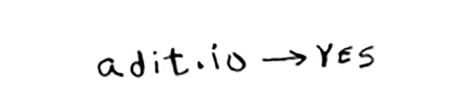

# Bloom filters and HyperLogLog

Aytaylik, siz Reddit-ni ishga tushiryapsiz. Kimdir havolani joylashtirganda, siz u ilgari joylashtirilgan yoki yo'qligini ko'rishni xohlaysiz. Ilgari e'lon qilinmagan hikoyalar qimmatroq hisoblanadi. Shunday qilib, siz ushbu havola ilgari joylashtirilgan yoki yo'qligini aniqlashingiz kerak.

Yoki siz Google ekansiz va veb-sahifalarni skanerlayapsiz deylik. Agar siz hali ham veb-sahifani ko'rib chiqmagan bo'lsangiz, uni skanerlashni xohlaysiz. Shunday qilib, siz ushbu sahifa ilgari tekshirilganligini aniqlashingiz kerak.

Yoki siz bit.ly ishlayapsiz, deylik, bu URL qisqartiruvchi. Siz foydalanuvchilarni zararli veb-saytlarga yo'naltirishni xohlamaysiz. Sizda zararli deb hisoblangan URL manzillar to'plami mavjud. Endi siz foydalanuvchini ushbu to'plamdagi URL manziliga yo'naltirayotganingizni aniqlashingiz kerak.

Bu misollarning barchasi bir xil muammoga ega. Sizda juda katta to'plam bor.

Endi sizda yangi element bor va siz uning ushbu to'plamga tegishli yoki yo'qligini ko'rishni xohlaysiz. Buni hash yordamida tezda qilishingiz mumkin. Misol uchun, Google katta xeshga ega deylik, uning kalitlari u skanerlagan barcha sahifalardir.

Siz adit.io-ni allaqachon skanerlaganingizni ko'rishni xohlaysiz. Uni xeshda toping.

`adit.io` - bu xeshdagi kalit, shuning uchun siz uni allaqachon o'rganib chiqdingiz. Xesh-jadvallar uchun o'rtacha qidirish vaqti O (1). `adit.io` xeshda, shuning uchun siz uni allaqachon o'rganib chiqdingiz. Siz buni doimiy ravishda aniqladingiz. Juda yaxshi!

Bundan tashqari, bu hash *juda katta* bo'lishi kerak. Google trillionlab veb-sahifalarni indekslaydi. Agar bu xeshda Google indekslagan barcha URL manzillari bo'lsa, u juda ko'p joy egallaydi. Reddit va bit.ly bir xil bo'shliq muammosiga ega. Agar sizda juda ko'p ma'lumotlar mavjud bo'lsa, siz ijodkor bo'lishingiz kerak!

## Bloom filters

Bloom filtrlari yechim taklif qiladi. Bloom filtrlari - *ehtimollik ma'lumotlar tuzilmalari*. Ular sizga noto'g'ri bo'lishi mumkin bo'lgan javobni berishadi, lekin ehtimol to'g'ri. Xesh o'rniga, siz ushbu URL manzilini ilgari skanerlagan bo'lsangiz, gullash filtridan so'rashingiz mumkin. Xash jadvali sizga aniq javob beradi. Gullash filtri sizga to'g'ri javob beradi:

• Noto'g'ri ijobiy natijalar bo'lishi mumkin. Google "Siz bu saytni allaqachon tekshirib chiqdingiz", deb aytishi mumkin, garchi qilmagan bo'lsangiz ham.

• Noto'g'ri negativlar mumkin emas. Agar gullash filtri: "Siz bu saytni ko'rib chiqmagansiz" deb aytsa, demak, siz bu saytni *tekshirmagansiz*.

Bloom filtrlari juda yaxshi, chunki ular juda kam joy egallaydi. Xesh-jadval Google tomonidan tekshirilgan har bir URL-manzilni saqlashi kerak, ammo gullash filtri buni amalga oshirishi shart emas. Bu misollarning barchasida bo'lgani kabi, sizga aniq javob kerak bo'lmaganda ular juda yaxshi. Bit.ly uchun: "Biz bu sayt zararli boʻlishi mumkin, shuning uchun ehtiyot boʻling" deyishi mumkin.

## HyperLogLog

Xuddi shu qatorda HyperLogLog deb nomlangan yana bir algoritm mavjud. Aytaylik, Google o'z foydalanuvchilari tomonidan amalga oshirilgan noyob qidiruvlar sonini hisoblamoqchi. Yoki Amazon bugungi kunda foydalanuvchilar ko'rgan noyob narsalar sonini hisoblamoqchi deylik. Bu savollarga javob berish juda ko'p joy oladi! Google yordamida siz barcha noyob qidiruvlar jurnalini yuritishingiz kerak bo'ladi. Foydalanuvchi biror narsani qidirganda, u allaqachon jurnalda yoki yo'qligini ko'rishingiz kerak. Agar yo'q bo'lsa, uni jurnalga qo'shishingiz kerak. Hatto bir kun uchun ham bu jurnal juda katta bo'lar edi!

HyperLogLog to'plamdagi noyob elementlar sonini taxmin qiladi. Bloom filtrlari kabi, u sizga aniq javob bermaydi, lekin u juda yaqin keladi va bunday vazifani bajarish uchun xotiraning faqat bir qismini ishlatadi.

Agar sizda juda ko'p ma'lumotlar bo'lsa va taxminiy javoblar bilan qoniqsangiz, ehtimollik algoritmlarini tekshiring!