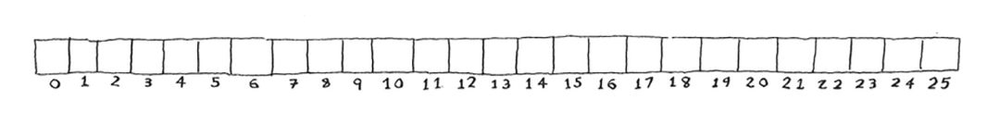
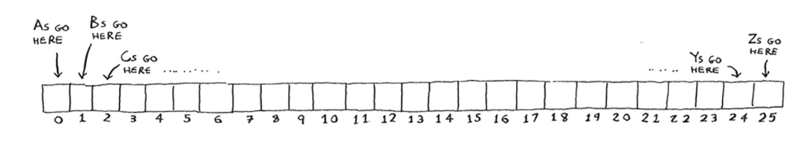
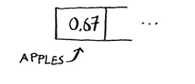
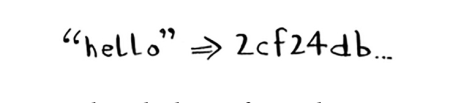
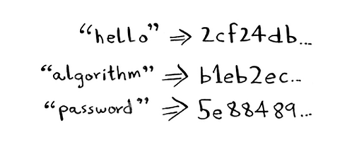
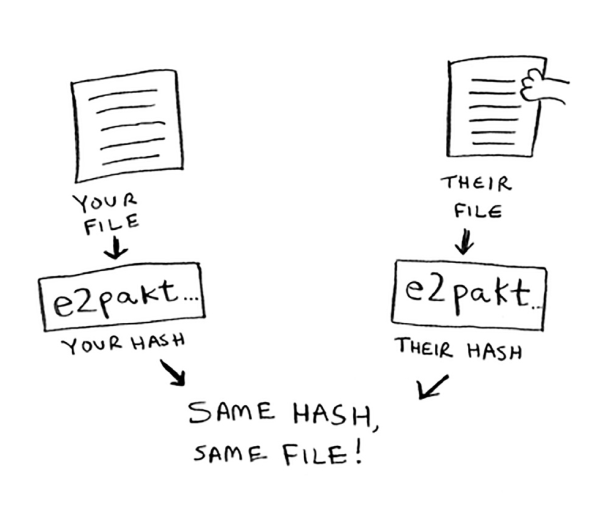
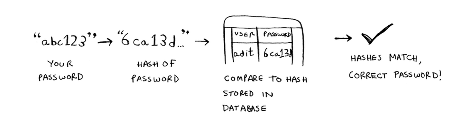
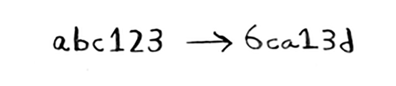
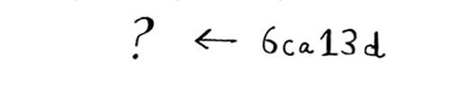

# The SHA algorithms

5-bobdagi xeshni eslaysizmi? Xulosa qilish uchun sizda kalit bor va siz tegishli qiymatni massivga qo'ymoqchisiz deylik.

Qiymatni qaysi uyaga qo'yish kerakligini aytish uchun siz hash funktsiyasidan foydalanasiz.

Va siz qiymatni o'sha uyaga qo'yasiz.

Bu sizga doimiy qidiruvlarni amalga oshirish imkonini beradi. Kalitning qiymatini bilmoqchi bo'lganingizda, xash funktsiyasidan yana foydalanishingiz mumkin va u sizga O(1) vaqtida qaysi slotni tekshirish kerakligini aytadi.

Bunday holda, siz hash funktsiyasi sizga yaxshi taqsimot berishini xohlaysiz. Shunday qilib, xesh funktsiyasi satrni oladi va sizga ushbu satr uchun slot raqamini beradi.

## Comparing files

Yana bir xesh funktsiyasi xavfsiz xesh algoritmi (SHA) funktsiyasidir. Agar qator berilgan bo'lsa, SHA sizga ushbu satr uchun xeshni beradi.

Bu erda terminologiya biroz chalkash bo'lishi mumkin. SHA - bu *hash funksiyasi*. U *xeshni* hosil qiladi, bu shunchaki qisqa satrdir. Xesh-jadvallar uchun xesh funktsiyasi satrdan massiv indeksiga o'tdi, SHA esa satrdan satrga o'tadi.

SHA har bir satr uchun boshqa xeshni hosil qiladi.

> Note
>
> SHA xeshlari uzoq. Ular bu erda kesilgan.

Ikki fayl bir xil yoki yo'qligini aniqlash uchun SHA dan foydalanishingiz mumkin. Bu juda katta fayllarga ega bo'lganingizda foydalidir. Aytaylik, sizda 4 GB hajmli fayl bor. Do'stingizda bir xil katta fayl bor yoki yo'qligini tekshirmoqchisiz. Siz ularga katta faylingizni elektron pochta orqali yuborishga harakat qilishingiz shart emas. Buning o'rniga siz SHA xeshini hisoblashingiz va uni solishtirishingiz mumkin.

## Checking passwords

SHA, shuningdek, asl satr nima ekanligini ko'rsatmasdan, satrlarni solishtirmoqchi bo'lsangiz ham foydalidir. Misol uchun, Gmail buzib tashlandi va tajovuzkor barcha parollarni o'g'irladi deylik! Parolingiz ochiqmi? Yo'q, unday emas. Google asl parolni saqlamaydi, faqat parolning SHA xeshini saqlaydi! Parolingizni kiritganingizda, Google uni xeshlaydi va maʼlumotlar bazasidagi xesh bilan tekshiradi.

Demak, bu faqat xeshlarni solishtirish — parolni saqlash shart emas! SHA bu kabi parollarni xeshlash uchun juda keng tarqalgan. Bu bir tomonlama xesh. Siz satrning xeshini olishingiz mumkin.

Lekin xeshdan asl satrni ololmaysiz.

Bu shuni anglatadiki, agar tajovuzkor SHA xeshlarini Gmail'dan olsa, ular bu xeshlarni asl parollarga qaytara olmaydi! Parolni xeshga aylantirishingiz mumkin, lekin aksincha emas.

SHA aslida algoritmlar oilasi: SHA-0, SHA-1, SHA-2 va SHA-3. Ushbu yozish paytida SHA-0 va SHA-1 ba'zi zaif tomonlarga ega. Agar parolni xeshlash uchun SHA algoritmidan foydalansangiz, SHA-2 yoki SHA-3 dan foydalaning. Parolni xeshlash funksiyalari uchun oltin standart hozirda bcrypt hisoblanadi (garchi hech narsa ishonchli emas).