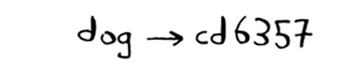
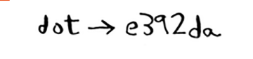

# Locality-sensitive hashing

SHA yana bir muhim xususiyatga ega: u mahalliylikni sezmaydi. Aytaylik, sizda satr bor va siz u uchun xeshni yaratasiz.

Agar siz satrning faqat bitta belgisini o'zgartirsangiz va xeshni qayta yaratsangiz, u butunlay boshqacha!

Bu yaxshi, chunki tajovuzkor parolni buzishga yaqinligini bilish uchun xeshlarni solishtira olmaydi.

Ba'zan siz buning aksini xohlaysiz: siz mahalliylikka sezgir xesh funktsiyasini xohlaysiz. Bu erda *Simhash* keladi. Agar siz satrga ozgina o'zgartirish kiritsangiz, Simhash biroz farq qiladigan xeshni hosil qiladi. Bu sizga xeshlarni solishtirish va ikkita satr qanchalik o'xshashligini ko'rish imkonini beradi, bu juda foydali!

* Google Internetni skanerlashda dublikatlarni aniqlash uchun Simhash-dan foydalanadi.

* O'qituvchi Simhash yordamida talaba internetdan inshoni ko'chiryaptimi yoki yo'qligini bilishi mumkin. Diffie-Hellman kalit almashinuvi

* Scribd foydalanuvchilarga hujjatlar yoki kitoblarni boshqalar bilan baham ko'rish uchun yuklash imkonini beradi. Lekin Scribd foydalanuvchilarning mualliflik huquqi bilan himoyalangan kontentni yuklashini xohlamaydi! Sayt Simhash yordamida yuklash Garri Potter kitobiga oʻxshashligini tekshirishi va agar shunday boʻlsa, uni avtomatik ravishda rad etishi mumkin.

Simhash shunga o'xshash narsalarni tekshirmoqchi bo'lganingizda foydalidir.