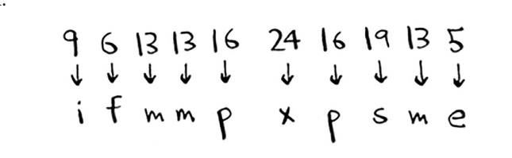
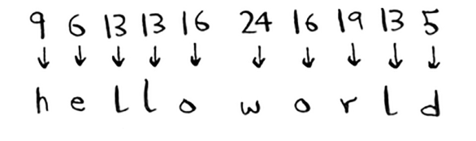

# Diffie-Hellman key exchange

Bu erda *Diffie-Hellman algoritmini* eslatib o'tish kerak, chunki u ko'p asrlik muammoni nafis tarzda hal qiladi. Xabarni faqat siz yuborgan odam o'qishi uchun qanday shifrlaysiz?

Eng oson yo'li - a = 1, b = 2 va hokazo kabi shifrni o'ylab topish. Keyin sizga "4,15,7" xabarini yuborsam, uni "d,o,g" ga tarjima qilishingiz mumkin. Ammo buning ishlashi uchun ikkalamiz ham shifrni kelishib olishimiz kerak. Biz elektron pochta haqida kelisha olmaymiz, chunki kimdir sizning elektron pochtangizni buzishi, shifrni aniqlashi va xabarlarimizni dekodlashi mumkin. Heck, agar biz shaxsan uchrashsak ham, kimdir shifrni taxmin qilishi mumkin - bu murakkab emas. Shuning uchun biz uni har kuni o'zgartirishimiz kerak. Ammo keyin har kuni o'zgartirish uchun biz shaxsan uchrashishimiz kerak!

Agar biz uni har kuni o'zgartirishga muvaffaq bo'lsak ham, bunday oddiy shifrni qo'pol kuch hujumi bilan buzish oson. Aytaylik, men "9,6,13,13,16 24,16,19,13,5" xabarini ko'rmoqdaman. O'ylaymanki, bu a = 1, b = 2 va hokazolardan foydalanadi.

Bu bema'nilik. Keling, a = 2, b = 3 va hokazolarni sinab ko'raylik.

Bu ishladi! Bunday oddiy shifrni buzish oson. Nemislar Ikkinchi Jahon urushida ancha murakkab shifrdan foydalanganlar, ammo u hali ham buzilgan edi. Diffie-Hellman ikkala muammoni ham hal qiladi:

• Ikkala tomon ham shifrni bilishi shart emas. Shunday qilib, biz uchrashishimiz va shifr qanday bo'lishi kerakligiga rozi bo'lishimiz shart emas.

• Shifrlangan xabarlarni dekodlash *nihoyatda* qiyin..

Diffie-Hellman ikkita kalitga ega: ochiq kalit va shaxsiy kalit. Ochiq kalit aynan shunday: ommaviy. Siz uni veb-saytingizga joylashtirishingiz, do'stlaringizga elektron pochta orqali yuborishingiz yoki u bilan xohlagan narsani qilishingiz mumkin. Siz uni yashirishingiz shart emas. Kimdir sizga xabar yubormoqchi bo'lsa, uni ochiq kalit yordamida shifrlaydi. Shifrlangan xabarni faqat shaxsiy kalit yordamida hal qilish mumkin. Maxfiy kalitga ega bo'lgan yagona shaxs ekansiz, bu xabarni faqat siz hal qila olasiz!

Diffie-Hellman algoritmi uning vorisi RSA bilan birga amalda hamon qo'llaniladi. Agar siz kriptografiyaga qiziqsangiz, Diffie-Hellman boshlash uchun yaxshi joy: u oqlangan va unga amal qilish juda qiyin emas.