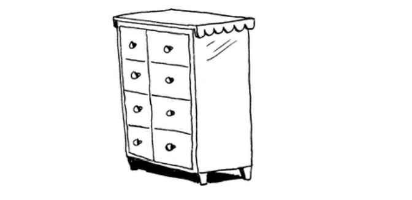
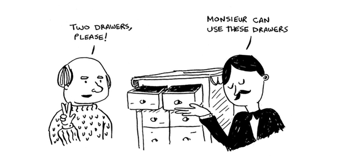
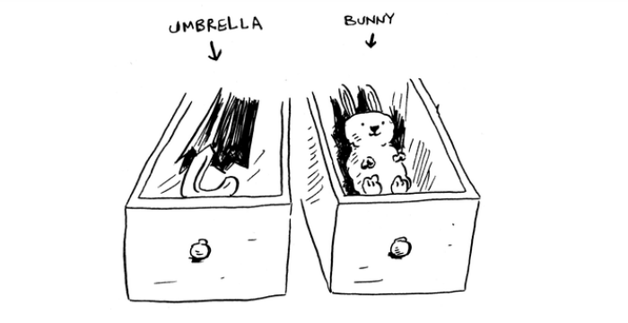
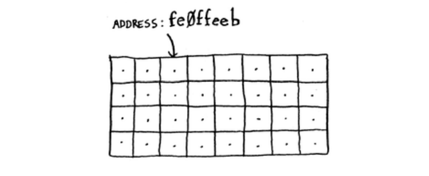

## How memory works

Tasavvur qiling-a, siz tomoshaga borasiz va narsalaringizni tekshirishingiz kerak. Sandiq mavjud.

Har bir tortma bitta elementni ushlab turishi mumkin. Siz ikkita narsani saqlamoqchisiz, shuning uchun ikkita tortma so'raysiz.

Ikki narsangizni shu yerda saqlaysiz

Va siz namoyishga tayyorsiz! Bu, asosan, kompyuteringiz xotirasi qanday ishlaydi. Sizning kompyuteringiz ulkan tortma to'plamiga o'xshaydi va har bir tortmada manzil mavjud.

fe0ffeeb - xotiradagi uyaning manzili.
Har safar ob'ektni xotirada saqlamoqchi bo'lganingizda, siz kompyuterdan biroz joy so'raysiz va u sizga elementingizni saqlashingiz mumkin bo'lgan manzilni beradi. Agar siz bir nechta elementlarni saqlamoqchi bo'lsangiz, buni amalga oshirishning ikkita asosiy usuli mavjud: massivlar va ro'yxatlar(Array and Lists). Men massivlar va ro'yxatlar haqida, shuningdek, har birining ijobiy va salbiy tomonlari haqida gapiraman. Har bir foydalanish holati uchun narsalarni saqlashning bitta to'g'ri usuli yo'q, shuning uchun farqlarni bilish muhimdir.