## Arrays and linked lists

Ba'zan elementlar ro'yxatini xotirada saqlashingiz kerak bo'ladi. Aytaylik, siz vazifalaringizni boshqarish uchun ilova yozyapsiz. Vazifalarni xotirada ro'yxat sifatida saqlashni xohlaysiz.

Massiv yoki bog'langan ro'yxatni ishlatishingiz kerakmi? Keling, birinchi navbatda vazifalarni massivda saqlaymiz, chunki tushunish osonroq. Massivdan foydalanish sizning barcha vazifalaringiz xotirada ketma-ket (bir-birining yonida) saqlanishini anglatadi

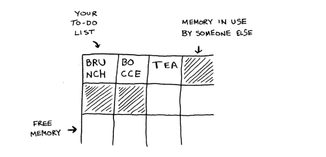

Endi siz to'rtinchi vazifani qo'shmoqchisiz deylik. Ammo keyingi tortma boshqa birovning narsalari tomonidan olinadi!

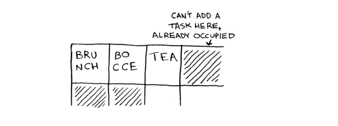

Bu do'stlaringiz bilan kinoga borib, o'tirish uchun joy topishga o'xshaydi -- lekin boshqa do'st sizga qo'shiladi va ular uchun joy yo'q. Barchangizga mos keladigan yangi joyga ko'chishingiz kerak. Bunday holda, siz kompyuteringizdan to'rtta vazifaga mos keladigan boshqa xotira qismini so'rashingiz kerak. Keyin barcha vazifalaringizni u erga ko'chirishingiz kerak.

Agar boshqa do'st kelsa, siz yana xonadasiz - va hammangiz ikkinchi marta harakat qilishingiz kerak! Qanday og'riq. Xuddi shunday, massivga yangi elementlar qo'shish katta og'riq bo'lishi mumkin. Agar sizda bo'sh joy bo'lmasa va har safar xotiraning yangi joyiga o'tishingiz kerak bo'lsa, yangi element qo'shish juda sekin bo'ladi. Oson tuzatishlardan biri "o'rindiqlarni ushlab turish": vazifalar ro'yxatida faqat 3 ta narsa bo'lsa ham, har qanday holatda kompyuterdan 10 ta uyani so'rashingiz mumkin. Keyin ko'chirmasdan vazifalar ro'yxatiga 10 ta element qo'shishingiz mumkin. Bu yaxshi vaqtinchalik yechim, lekin siz bir nechta salbiy tomonlardan xabardor bo'lishingiz kerak:

• Siz so'ragan qo'shimcha uyalar kerak bo'lmasligi mumkin, keyin esa bu xotira behuda ketadi. Siz undan foydalanmayapsiz, lekin undan boshqa hech kim foydalana olmaydi.

• Vazifalar ro'yxatiga 10 dan ortiq element qo'shishingiz mumkin va kerak bo'ladi
baribir harakatlaning.

Demak, bu yaxshi vaqtinchalik yechim, lekin bu mukammal yechim emas. Bog'langan ro'yxatlar elementlarni qo'shish muammosini hal qiladi.

### Linked lists
Bog'langan ro'yxatlar bilan sizning narsalaringiz xotiraning istalgan joyida bo'lishi mumkin

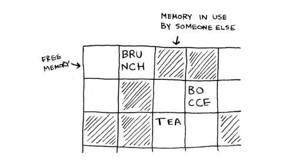

Har bir element ro'yxatdagi keyingi elementning manzilini saqlaydi. Bir qator tasodifiy xotira manzillari bir-biriga bog'langan.

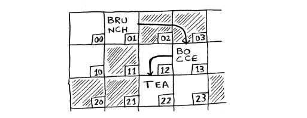

Bu xazina oviga o'xshaydi. Siz birinchi manzilga borasiz va unda "Keyingi elementni 123-manzilda topish mumkin" deb yozilgan. Shunday qilib, siz 123-manzilga borasiz va unda "Keyingi elementni 847-manzilda topish mumkin" va hokazo. Bog'langan ro'yxatga element qo'shish oson: siz uni xotiraning istalgan joyiga qo'yasiz va manzilni oldingi element bilan birga saqlaysiz. 

Bog'langan ro'yxatlar bilan siz hech qachon narsalarni ko'chirishingiz shart emas. Siz boshqa muammodan ham qochasiz. Aytaylik, siz beshta do'stingiz bilan mashhur filmga borasiz. Oltinchiga o'tirishga joy topmoqchisizlar, lekin teatr gavjum. Birgalikda oltita o'rindiq yo'q. Xo'sh, ba'zida bu massivlar bilan sodir bo'ladi. Aytaylik, siz massiv uchun 10 000 ta uyni topishga harakat qilyapsiz. Sizning xotirangizda 10 000 uyalar mavjud, lekin u bilan birga 10 000 uyalar mavjud emas. Massivingiz uchun joy topa olmaysiz! Bog'langan ro'yxat "Keling, bo'linib, filmni tomosha qilaylik" deganga o'xshaydi. Xotirada bo'sh joy bo'lsa, bog'langan ro'yxatingiz uchun joy mavjud. 

Agar bog'langan ro'yxatlar qo'shimchalarda juda yaxshi bo'lsa, massivlar nima uchun yaxshi?

### Arrays
Top-10 ro'yxatiga ega bo'lgan veb-saytlar sahifalarni ko'proq ko'rish uchun yomon taktikadan foydalanadi. Roʻyxatni bitta sahifada koʻrsatish oʻrniga ular har bir sahifaga bitta element qoʻyadi va roʻyxatning keyingi bandiga oʻtish uchun “Keyingi” tugmasini bosishga majbur qiladi. Masalan, eng yaxshi 10 ta eng yaxshi televidenie yovuzlari sizga butun ro'yxatni bitta sahifada ko'rsatmaydi. Buning o'rniga siz №10 (Newman) dan boshlaysiz va №1 (Gustavo Fring) ga erishish uchun har bir sahifada "Keyingi" tugmasini bosishingiz kerak. Ushbu uslub veb-saytlarga sizga reklama ko'rsatish uchun 10 ta to'liq sahifani beradi, ammo №1 ga o'tish uchun "Keyingi" tugmasini 9 marta bosish zerikarli. Agar butun ro'yxat bitta sahifada bo'lsa va qo'shimcha ma'lumot olish uchun har bir kishining ismini bossangiz yaxshi bo'lardi.

Bog'langan ro'yxatlar ham xuddi shunday muammoga ega. Aytaylik, siz bog'langan ro'yxatdagi oxirgi elementni o'qimoqchisiz. Siz uni shunchaki o'qib bo'lmaydi, chunki u qaysi manzilda ekanligini bilmaysiz. Buning o'rniga, №2 elementning manzilini olish uchun №1 bandga o'tishingiz kerak. Keyin №3 bandning manzilini olish uchun №2 bandga o'tishingiz kerak. Va shunga o'xshash, oxirgi elementga kelguningizcha. Agar siz barcha elementlarni birma-bir o'qimoqchi bo'lsangiz, bog'langan ro'yxatlar juda yaxshi: siz bitta elementni o'qishingiz, keyingi elementga manzilni kuzatishingiz va hokazo. Ammo agar siz sakrab yurishni davom ettirmoqchi bo'lsangiz, bog'langan ro'yxatlar dahshatli.

Massivlar har xil. Siz massivingizdagi har bir element uchun manzilni bilasiz. Masalan, massivingiz beshta elementni o'z ichiga oladi va siz u 00 manzildan boshlanganini bilasiz. №5 elementning manzili nima?

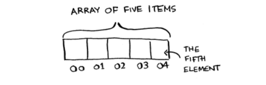

Oddiy matematika sizga aytadi: bu 04. Agar siz tasodifiy elementlarni o'qishni istasangiz, massivlar juda yaxshi, chunki siz massivingizdagi istalgan elementni bir zumda qidirishingiz mumkin. Bog'langan ro'yxat bilan elementlar bir-birining yonida emas, shuning uchun siz beshinchi elementning xotiradagi o'rnini bir zumda hisoblay olmaysiz, ikkinchi elementning manzilini olish uchun birinchi elementga o'tishingiz kerak, keyin esa ikkinchi element uchinchi elementning manzilini olish uchun va beshinchi elementga yetguncha davom etadi.

### Terminology

Massivdagi elementlar raqamlangan. Bu raqamlash 1 dan emas, 0 dan boshlanadi.

Masalan, bu massivda 20 1-pozitsiyada. 10 esa 0-pozitsiyada. Bu odatda yangi dasturchilarni aylanish uchun tashlaydi. 0 dan boshlab barcha turdagi massivga asoslangan kodlarni yozishni osonlashtiradi, shuning uchun dasturchilar unga yopishib olishdi. Siz foydalanadigan deyarli har bir dasturlash tili massiv elementlarini 0 dan boshlab raqamlaydi. Tez orada unga ko'nikasiz.

Elementning joylashuvi uning indeksi deyiladi. Shunday qilib, "20 1-pozitsiyada" deyish o'rniga, to'g'ri atama "20 indeks 1da". Men ushbu kitobdagi pozitsiyani bildirish uchun indeksdan foydalanaman.

Bu erda massivlar va ro'yxatlar bo'yicha umumiy operatsiyalar uchun ishlash vaqtlari keltirilgan

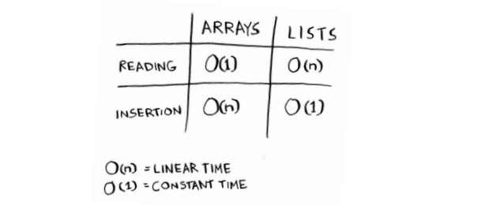

Savol: Nega massivga element kiritish uchun O(n) vaqt kerak? Aytaylik, siz massivning boshiga element kiritmoqchi edingiz. Buni qanday qilgan bo'lardingiz? Qancha vaqt ketadi? Bu savollarga javobni keyingi bo'limda topasiz!

### EXERCISE
2.1 Faraz qiling, siz o'z moliyaviy ahvolingizni kuzatib borish uchun ilova yaratyapsiz.

Har kuni siz pul sarflagan hamma narsani yozasiz. Oy oxirida siz o'z xarajatlaringizni ko'rib chiqasiz va qancha sarflaganingizni umumlashtirasiz. Shunday qilib, sizda juda ko'p qo'shimchalar va bir nechta o'qishlar mavjud. Massiv yoki ro'yxatni ishlatishingiz kerakmi?

### Inserting into the middle of a list

Aytaylik, siz vazifalar ro'yxati taqvim kabi ishlashini xohlaysiz. Ilgari siz ro'yxatning oxiriga narsalarni qo'shgan edingiz. Endi siz ularni bajarilishi kerak bo'lgan tartibda qo'shmoqchisiz.

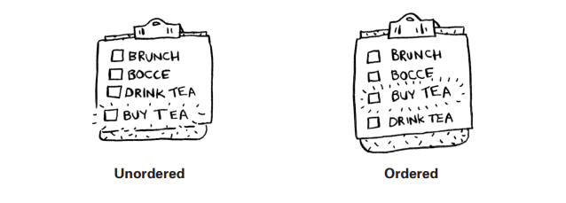

Elementlarni o'rtaga qo'shishni istasangiz yaxshiroq nima: massivlar yoki ro'yxatlar? Ro'yxatlar bilan oldingi element nimani ko'rsatayotganini o'zgartirish kabi oson.

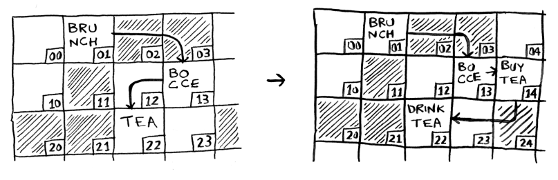

Ammo massivlar uchun qolgan barcha elementlarni pastga siljitish kerak.

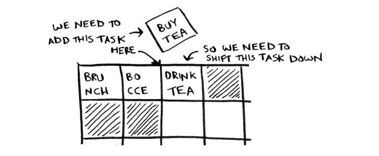

Va agar bo'sh joy bo'lmasa, hamma narsani yangi joyga nusxalashingiz kerak bo'lishi mumkin! Agar siz elementlarni o'rtasiga qo'shmoqchi bo'lsangiz, ro'yxatlar yaxshiroqdir

### Deletions

Elementni o'chirmoqchi bo'lsangiz nima bo'ladi? Shunga qaramay, ro'yxatlar yaxshiroq, chunki oldingi element nimani ko'rsatayotganini o'zgartirishingiz kerak. Massivlar bilan elementni o'chirishda hamma narsa yuqoriga ko'chirilishi kerak. Qo'shishlardan farqli o'laroq, o'chirish har doim ishlaydi. Xotirada bo'sh joy qolmasa, ba'zan qo'shish muvaffaqiyatsiz bo'lishi mumkin. Lekin siz har doim elementni o'chirishingiz mumkin. Bu yerda massivlar va bog'langan ro'yxatlar uchun umumiy operatsiyalar uchun ishlash vaqtlari keltirilgan.

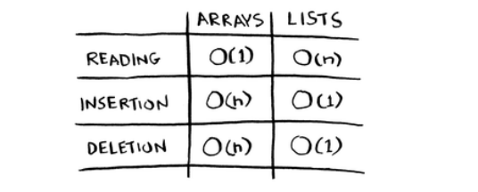

Shuni ta'kidlash kerakki, qo'shish va o'chirish O (1) vaqt, agar siz o'chiriladigan elementga darhol kirishingiz mumkin bo'lsa. Bog'langan ro'yxatdagi birinchi va oxirgi elementlarni kuzatib borish odatiy holdir, shuning uchun ularni o'chirish uchun faqat O (1) vaqt kerak bo'ladi.

Qaysi biri ko'proq ishlatiladi: massiv yoki ro'yxatlar? Shubhasiz, bu foydalanish holatiga bog'liq. Ammo massivlar juda ko'p foydalanishni ko'radi, chunki ular tasodifiy kirishga imkon beradi. Ikki xil kirish turi mavjud: tasodifiy kirish va ketma-ket kirish. Ketma-ket kirish birinchi elementdan boshlab elementlarni birma-bir o'qishni anglatadi. Bog'langan ro'yxatlar faqat ketma-ket kirishni amalga oshirishi mumkin. Agar bog'langan ro'yxatning 10-elementini o'qishni istasangiz, birinchi 9 ta elementni o'qib chiqishingiz va 10-elementga havolalarni bajarishingiz kerak. Tasodifiy kirish siz to'g'ridan-to'g'ri 10-elementga o'tishingiz mumkinligini anglatadi. Massivlar tezroq o'qiladi, deganimni tez-tez eshitasiz. Buning sababi, ular tasodifiy kirishni ta'minlaydi. Ko'p foydalanish holatlari tasodifiy kirishni talab qiladi, shuning uchun massivlar juda ko'p ishlatiladi. Massivlar va ro'yxatlar boshqa ma'lumotlar tuzilmalarini ham amalga oshirish uchun ishlatiladi (kitobda keyinroq chiqadi).

### EXERCISES
* 2.2 Aytaylik, siz restoranlar uchun mijozlar buyurtmalarini qabul qilish uchun dastur yaratyapsiz. Ilovangiz buyurtmalar roʻyxatini saqlashi kerak. Serverlar ushbu ro'yxatga buyurtmalar qo'shishda davom etadilar va oshpazlar buyurtmalarni ro'yxatdan olib tashlab, ularni tuzadilar. Bu buyurtma navbati: serverlar navbatning orqa tomoniga buyurtma qo'shadi va oshpaz navbatdagi birinchi buyurtmani olib, uni pishiradi. 

Ushbu navbatni amalga oshirish uchun massiv yoki bog'langan ro'yxatni ishlatasizmi? (Maslahat: Bog'langan ro'yxatlar qo'shish/o'chirish uchun, massivlar esa tasodifiy kirish uchun yaxshi. Bu erda qaysi birini qilmoqchisiz?)

* 2.3 Keling, fikrlash tajribasini o'tkazaylik. Aytaylik, Facebook foydalanuvchi nomlari ro'yxatini saqlaydi. Kimdir Facebook-ga kirishga harakat qilganda, uning foydalanuvchi nomi uchun qidiruv amalga oshiriladi. Agar ularning ismi foydalanuvchi nomlari ro'yxatida bo'lsa, ular tizimga kirishlari mumkin. Odamlar Facebook-ga juda tez-tez kirishadi, shuning uchun foydalanuvchi nomlari ro'yxati orqali juda ko'p qidiruvlar mavjud. Aytaylik, Facebook ro'yxatni qidirish uchun ikkilik qidiruvdan foydalanadi. Ikkilik qidiruv tasodifiy kirishni talab qiladi - siz darhol foydalanuvchi nomlari ro'yxatining o'rtasiga kirishingiz kerak. Buni bilib, ro'yxatni massiv yoki bog'langan ro'yxat sifatida amalga oshirasizmi?

* 2.4 Odamlar ham Facebook-ga tez-tez ro'yxatdan o'tishadi. Siz foydalanuvchilar ro'yxatini saqlash uchun massivdan foydalanishga qaror qildingiz deylik. Qo'shimchalar uchun massivning qanday kamchiliklari bor? Xususan, siz loginlarni qidirish uchun ikkilik qidiruvdan foydalanyapsiz deylik. Massivga yangi foydalanuvchilarni qo'shsangiz nima bo'ladi?

* 2.5 Aslida, Facebook foydalanuvchi ma'lumotlarini saqlash uchun massivdan ham, bog'langan ro'yxatdan ham foydalanmaydi. Gibrid ma'lumotlar strukturasini ko'rib chiqaylik: bog'langan ro'yxatlar to'plami. Sizda 26 ta uyaga ega massiv bor. Har bir slot bog'langan ro'yxatga ishora qiladi. Masalan, massivdagi birinchi slot a bilan boshlangan barcha foydalanuvchi nomlarini o'z ichiga olgan bog'langan ro'yxatga ishora qiladi. Ikkinchi slot b harfidan boshlanadigan barcha foydalanuvchi nomlarini o'z ichiga olgan bog'langan ro'yxatga ishora qiladi va hokazo

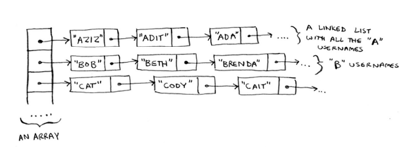

Aytaylik, Adit B Facebook-da ro'yxatdan o'tgan va siz ularni ro'yxatga qo'shmoqchisiz. Siz massivdagi 1-uyaga o'tasiz, 1-uya uchun bog'langan ro'yxatga o'ting va oxirida Adit B qo'shing. Aytaylik, siz Zakhir H ni qidirmoqchisiz. Siz barcha Z nomlarining bog'langan ro'yxatini ko'rsatadigan 26-uyaga borasiz. Keyin siz Zakhir H.ni topish uchun ushbu roʻyxatni qidirasiz.

Ushbu gibrid maʼlumotlar strukturasini massivlar va bogʻlangan roʻyxatlar bilan solishtiring. Qidirish va kiritish uchun har biridan sekinmi yoki tezroqmi? Siz Big O ish vaqtlarini berishingiz shart emas, faqat yangi ma'lumotlar strukturasi tezroq yoki sekinroq bo'ladimi.

