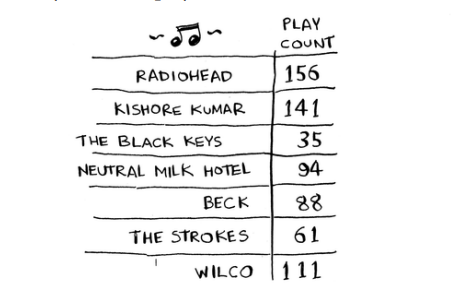
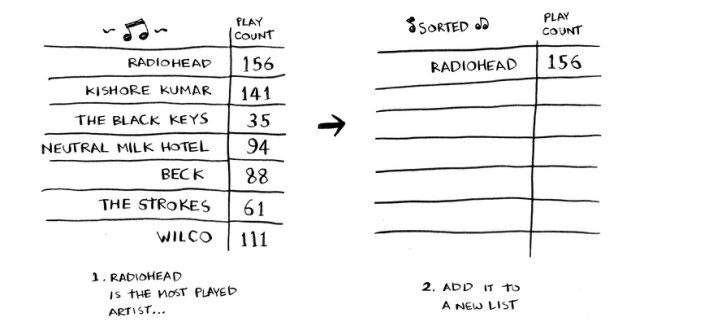
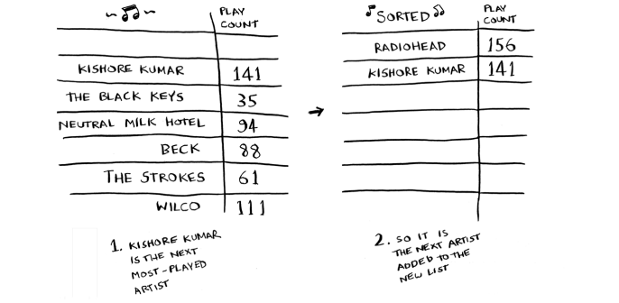
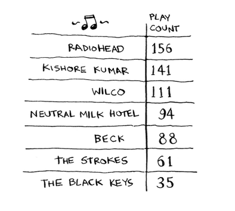
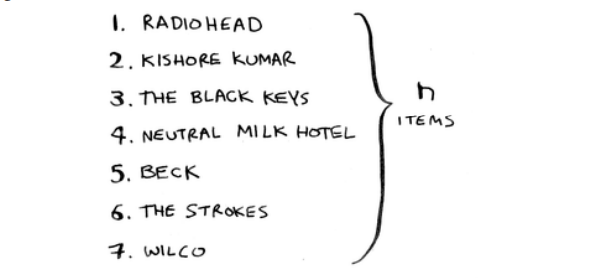
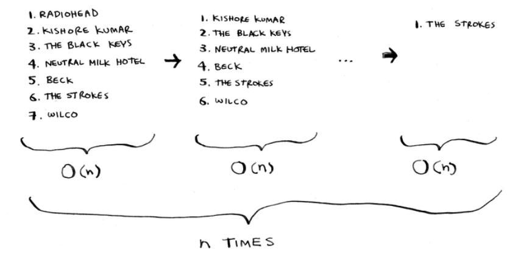
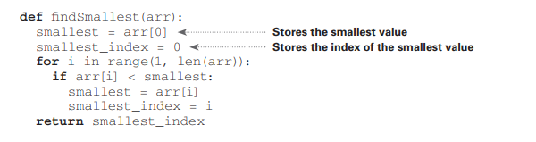
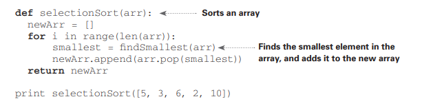

## Selection sort

Keling, ikkinchi algoritmingizni o'rganish uchun barchasini birlashtiramiz: tanlash tartibi. Ushbu bo'limga amal qilish uchun siz massivlar va ro'yxatlarni, shuningdek Big O belgilarini tushunishingiz kerak. Aytaylik, sizning kompyuteringizda bir nechta musiqa bor. Har bir rassom uchun sizda musiqalar soni bor.



Sevimli san'atkorlaringizni tartiblash uchun siz ushbu ro'yxatni eng ko'p qo'yilganidan eng kamigacha tartiblashni xohlaysiz. Buni qanday qila olasiz?

Buning bir usuli - ro'yxatni ko'rib chiqish va eng ko'p o'ynalgan rassomni topish. Ushbu rassomni yangi ro'yxatga qo'shing.



Keyingi eng ko'p o'ynagan rassomni topish uchun buni yana bajaring



Buni davom eting va siz tartiblangan ro'yxatni olasiz



Keling, kompyuter fanlari bo'yicha shlyapalarimizni kiyaylik va bu qancha vaqt davom etishini ko'raylik. Esda tutingki, O(n) vaqti roʻyxatdagi har bir elementga bir marta teginishingizni bildiradi. Misol uchun, rassomlar ro'yxati bo'yicha oddiy qidiruvni amalga oshirish har bir rassomga bir marta qarashni anglatadi.



O'yinlar soni eng yuqori bo'lgan rassomni topish uchun siz ro'yxatdagi har bir elementni tekshirishingiz kerak. Bu siz ko'rganingizdek O(n) vaqtini oladi. Shunday qilib, sizda O(n) vaqtni oladigan operatsiyangiz bor va buni n marta bajarishingiz kerak:



Bu O(n × n) vaqt yoki O(n<sup>2</sup>) vaqtni oladi.
Saralash algoritmlari juda foydali. Endi siz tartiblashingiz mumkin
* Telefon kitobidagi ismlar
* Sayohat sanalari
* E-pochtalar (eng yangidan eng eskisiga)

> Har safar kamroq elementlarni tekshirish
>
>Ehtimol, siz hayron bo'lgandirsiz: operatsiyalardan o'tayotganingizda, tekshirishingiz kerak bo'lgan elementlar soni kamayib boraveradi. Oxir-oqibat, siz faqat bitta elementni tekshirishingiz kerak bo'ladi. Xo'sh, qanday qilib ish vaqti O (n2) bo'lishi mumkin? Bu yaxshi savol va javob Big O belgisidagi doimiylar bilan bog'liq. Men bu haqda 4-bobda batafsil to'xtalib o'taman, ammo bu erda asosiy narsa.
>
>Siz har safar n ta element ro'yxatini tekshirishingiz shart emasligi to'g'ri. Siz n ta elementni tekshirasiz, keyin n -- 1, n - 2 … 2, 1. Oʻrtacha (1/2) × n elementga ega boʻlgan roʻyxatni tekshirasiz. Ish vaqti O (n × (1/2) × n). Ammo Big O notatsiyasida (1/2) kabi doimiylar e'tiborga olinmaydi (yana to'liq muhokama qilish uchun 4-bobga qarang), shuning uchun siz faqat O(n × n) yoki O(n<sup>2</sup>) ni yozasiz.

Selection sort  - aniq algoritm, lekin u juda tez emas. Quicksort - bu tezroq saralash algoritmi bo'lib, u faqat O(n log n) vaqtni oladi. Bu keyingi bobda chiqadi!

### EXAMPLE CODE LISTING

Biz sizga musiqa roʻyxatini tartiblash uchun kodni koʻrsatmadik, lekin quyida juda oʻxshash ishni bajaradigan baʼzi kodlar keltirilgan: massivni eng kichikdan kattagacha tartiblash. Massivdagi eng kichik elementni topish funksiyasini yozamiz:



#### Python
```python
def findSmallest(arr):

  smallest = arr[0]
  smallest_index = 0

  for i in range(1, len(arr)):
    if arr[i] < smallest:
      smallest_index = i
      smallest = arr[i]

  return smallest_index
```

#### Golang
```golang
func findSmallest(arr []int) int {

    smallest := arr[0]
    smallest_index := 0

    for i := range arr {
        if arr[i] < smallest {
            smallest_index = i
            smallest = arr[i]
        }
    }

    return smallest_index
}
```

Endi siz ushbu funksiyadan tanlash tartibini yozish uchun foydalanishingiz mumkin:



#### Python
```python
def selectionSort(arr):
    newArr = []
    for i in range len(arr):
        smallest = findSmallest(arr)
        newArr.append(arr.pop(smallest))
    return newArr

print(selectionSort([5, 3, 6, 2, 10]))
```

#### Golang
```golang
func selectionSort(arr []int) []int {
    var newArr []int
    for i := range arr {
        smallest := findSmallest(arr)
        newArr = append(newArr, arr[smallest])
        arr = append(arr[:smallest], arr[smallest+1:]...)
    }
    return newArr
}
```