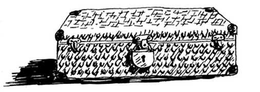
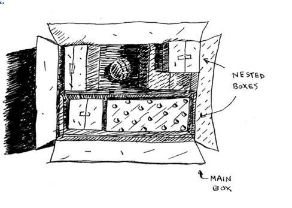
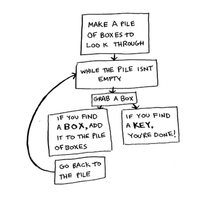
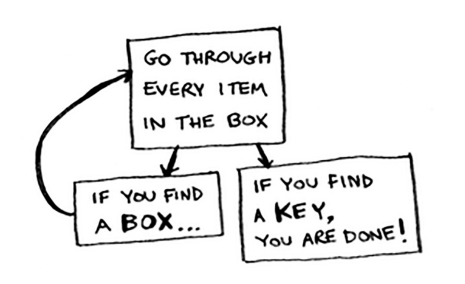
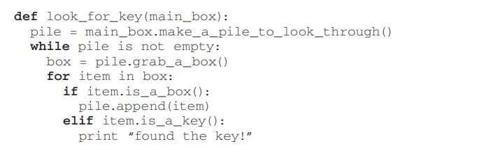
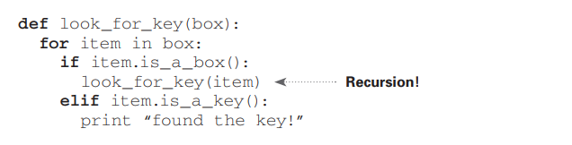

# Recursion

Aytaylik, siz buvingizning chodirini qazib o'tiryapsiz va sirli qulflangan chamadonga duch keldingiz.



Buvim sizga chamadonning kaliti shu boshqa qutida bo'lishi mumkinligini aytadi.



Ushbu qutida ko'proq qutilar mavjud, ular ichida ko'proq qutilar mavjud. Kalit qayerdadir qutida. Kalitni qidirish algoritmingiz qanday? O'qishni davom ettirishdan oldin algoritm haqida o'ylab ko'ring.

Mana bitta yondashuv



1. Ko'rish uchun qutilar to'plamini yarating.
2. Bir qutini oling va uni ko'rib chiqing.
3. Agar quti topsangiz, keyinroq ko'rib chiqish uchun uni qoziqqa qo'shing.
4. Agar kalit topsangiz, ish tugadi!
5. Takrorlang.

Mana muqobil yondashuv.



1. Qutini ko'rib chiqing.
2. Agar quti topsangiz, 1-bosqichga o'ting.
3. Agar kalit topsangiz, ish tugadi!

Qaysi yondashuv sizga osonroq tuyuladi? Birinchi yondashuv `while` tsiklidan foydalanadi. Qoziq bo'sh bo'lmasa-da, qutini oling va uni ko'rib chiqing:



### Python

```python
def look_for_key(main_box):
    pile = main_box.make_a_pile_to_look_through()
    while pile is not empty:
        box = pile.grab_a_box()
        for item in box:
            if item.is_a_box():
                pile.append(item)
            elif item.is_a_key():
                print "found the key!"
```

### Golang

```go
func lookForKey(mainBox *Box) {
    
    pile := mainbox.MakeAPileToLookThrough()

    for pile != nil {
        box := pile.GrapABox()
        for item := range box {
            if item.IsABox() {
                pile.Append(item)
            } else if item.IsAKey() {
                fmt.Println("found the key!")
            }
        }
    }
}
```

Ikkinchi usul rekursiyadan foydalanadi. Rekursiya - funksiya o'zini chaqiradigan joy. Mana psevdokodning ikkinchi usuli:



### Python

```python
def look_for_key(box):
    for item in box:
        if item.is_a_box():
            look_for_key(item) # <--- RECURSION
        elif item.is_a_key():
            print "found the key!"
```

### Golang

```go
func lookForKey(box *Box) {
    for item := range box {
        if item.IsABox() {
            lookForKey(item) // <--- RECURSION
        } else if item.IsAKey() {
            fmt.Println("found the key!")
        }
    }
}
```

Ikkala yondashuv ham bir xil narsani amalga oshiradi, ammo ikkinchi yondashuv men uchun aniqroq. Rekursiya yechimni aniqroq qilganda ishlatiladi. Rekursiyadan foydalanishning unumdorligi yo'q; aslida, looplar ba'zan ishlash uchun yaxshiroqdir. Menga Ley Kolduellning Stack Overflow haqidagi ushbu iqtiboslari yoqadi: "Looplar dasturingiz uchun unumdorlikni oshirishi mumkin. Rekursiya dasturchingiz uchun unumdorlikka erishishi mumkin. Vaziyatingizda qaysi biri muhimroq ekanini tanlang!" 1

Ko'pgina muhim algoritmlar rekursiyadan foydalanadi, shuning uchun kontseptsiyani tushunish muhimdir.

\


1\*   [link](http://stackoverflow.com/a/72694/139117)
