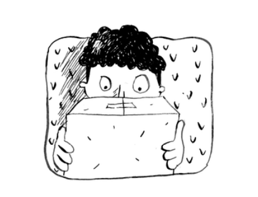

## Recap

* Rekursiya -- funksiya o'zini chaqirishi.

* Har bir rekursiv funksiya ikkita holatga ega: asosiy va rekursiv holat.

* Stek ikkita amaldan iborat: surish va ochish.

* Barcha funktsiya chaqiruvlari qo'ng'iroqlar to'plamiga o'tadi.

* Qo'ng'iroqlar to'plami juda katta bo'lishi mumkin, bu juda ko'p xotirani egallaydi

