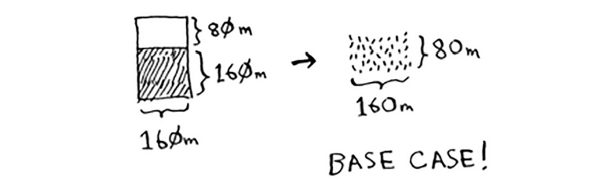

# Divide & conquer

D&C tushunish uchun biroz vaqt ketishi mumkin. Shunday qilib, biz uchta misol keltiramiz. Avval sizga vizual misolni ko'rsataman. Keyin men kamroq chiroyli, ammo osonroq bo'lgan kod misolini yarataman. Nihoyat, biz D&C dan foydalanadigan tezkor saralash algoritmini ko'rib chiqamiz. Aytaylik, siz yer uchastkasiga ega dehqonsiz


Siz bu fermani kvadrat maydonlarga teng taqsimlamoqchisiz. Siz uchastkalar imkon qadar katta bo'lishini xohlaysiz. Shunday qilib, bularning hech biri ishlamaydi.


Er uchastkasi uchun foydalanishingiz mumkin bo'lgan eng katta kvadrat hajmini qanday aniqlash mumkin? D&C strategiyasidan foydalaning! D&C algoritmlari rekursiv algoritmlardir. D&C yordamida muammoni hal qilish uchun ikkita qadam mavjud:

1. Asosiy korpusni aniqlang. Bu mumkin bo'lgan eng oddiy holat bo'lishi kerak.

2. Muammoni asosiy holatga aylanmaguncha taqsimlang yoki kamaytiring. Keling, ushbu muammoning echimini topish uchun D&C dan foydalanaylik. Foydalanishingiz mumkin bo'lgan eng katta kvadrat o'lchami nima?

Birinchidan, asosiy holatni aniqlang. Eng oson holat, agar bir tomon boshqa tomonning ko'pligi bo'lsa.


Faraz qilaylik, bir tomoni 25 metr (m), ikkinchi tomoni 50 m. Keyin siz foydalanishingiz mumkin bo'lgan eng katta quti 25 m × 25 m. Yerni bo'lish uchun sizga ikkita quti kerak.

Endi siz rekursiv holatni aniqlab olishingiz kerak. Bu yerda D&C keladi. D&C ga ko'ra, har bir rekursiv qo'ng'iroq bilan siz muammoingizni kamaytirishingiz kerak. Bu yerda muammoni qanday kamaytirish mumkin? Foydalanishingiz mumkin bo'lgan eng katta qutilarni belgilashdan boshlaylik.


U yerda ikkita 640 × 640 qutini joylashtirishingiz mumkin va hali ham bo'linadigan yer bor. Endi "Aha!" . Bo'lish uchun ferma segmenti qoldi. *Nega bu segmentga bir xil algoritmni qo'llamaysiz?*


Shunday qilib, siz bo'linishi kerak bo'lgan 1680 × 640 ferma bilan boshladingiz.
Ammo endi siz kichikroq segmentni bo'lishingiz kerak, 640 × 400. Agar siz ushbu o'lchamga mos keladigan eng katta qutini topsangiz, bu butun ferma uchun ishlaydigan eng katta quti bo'ladi. Siz muammoni 1680 × 640 fermadan 640 × 400 fermaga qisqartirdingiz!

> Evklid algoritmi
>
> "Agar siz ushbu o'lchamga mos keladigan eng katta qutini topsangiz, bu butun ferma uchun ishlaydigan eng katta quti bo'ladi." Agar bu bayonot nima uchun haqiqat ekanligi sizga aniq bo'lmasa, tashvishlanmang. Bu aniq emas. Afsuski, uning nima uchun ishlashining isboti bu kitobga kiritish uchun biroz uzoq, shuning uchun siz menga uning ishlayotganiga ishonishingiz kerak bo'ladi. Agar siz dalilni tushunmoqchi bo'lsangiz, Evklid algoritmiga qarang. Xon akademiyasi bu yerda yaxshi tushuntirishga ega: https://www.khanacademy.org/computing/computer-science/cryptography/modarithmetic/a/the-euclidean-algorithm.


Keling, yana bir xil algoritmni qo'llaymiz. 640 × 400 m fermadan boshlab, siz yaratishingiz mumkin bo'lgan eng katta quti 400 × 400 m.
Va bu sizni kichikroq segment bilan qoldiradi, 400 × 240 m


240 × 160 m o'lchamdagi *kichikroq* segmentni olish uchun siz unga quti chizishingiz mumkin.


Va keyin siz undan ham *kichikroq* segmentni olish uchun unga quti chizasiz



Hey, siz asosiy holatdasiz: 80 - 160 koeffitsienti. Agar siz ushbu segmentni qutilar yordamida ajratsangiz, sizda hech narsa qolmaydi!


Shunday qilib, asl ferma uchun siz foydalanishingiz mumkin bo'lgan eng katta uchastkaning o'lchami 80 × 80 m.


Xulosa qilish uchun D&C qanday ishlaydi:
1. Oddiy holatni asosiy holat sifatida aniqlang.
2. Muammoingizni qanday kamaytirishni aniqlang va asosiy holatga o'ting. D&C muammoni hal qilish uchun qo'llashingiz mumkin bo'lgan oddiy algoritm emas. Buning o'rniga, bu muammo haqida o'ylashning bir usuli. Yana bir misol keltiraylik.


Siz barcha raqamlarni qo'shishingiz va umumiy miqdorni qaytarishingiz kerak. Buni loop bilan qilish juda oson:

#### Python
```python
def sum(arr):
    total = 0
    for x in arr:
        total += x
    return total

print sum([1, 2, 3, 4])
```

#### Golang
```go
func sum(arr []int) int {
    total := 0
    for _, x := range arr {
        total += x
    }
    return total
}
```

Lekin buni rekursiv funktsiya bilan qanday qilasiz?

**1-qadam:** Asosiy holatni aniqlang. Siz olishingiz mumkin bo'lgan eng oddiy massiv nima? Eng oddiy holat haqida o'ylab ko'ring va keyin o'qing. Agar siz 0 yoki 1 elementli massivni olsangiz, buni umumlashtirish juda oson.


Shunday qilib, bu asosiy holat bo'ladi.


**2-qadam:** Har bir rekursiv qo'ng'iroq bilan bo'sh massivga yaqinlashishingiz kerak. Muammo hajmini qanday kamaytirish mumkin? Mana bir yo'l.


Bu xuddi shunday.


Ikkala holatda ham natija 12 ga teng. Lekin ikkinchi versiyada siz kichikroq massivni summa funksiyasiga o'tkazasiz. Ya'ni, muammoingiz hajmini kamaytirdingiz!

Sizning summa funksiyangiz shunday ishlashi mumkin.


Mana u harakatda.


Esingizda bo'lsin, rekursiya holatni kuzatib boradi.


>Maslahat
>
>Massivni o'z ichiga olgan rekursiv funktsiyani yozayotganda, asosiy holat ko'pincha bo'sh massiv yoki bitta elementli massiv bo'ladi. Agar qotib qolsangiz, avval buni sinab ko'ring


>Funktsional dasturlashning eng yuqori nuqtasi
>
>"Agar men buni halqa bilan osonlikcha bajara olsam, nega buni rekursiv qilishim kerak?" deb o'ylayotgandirsiz. Xo'sh, bu funktsional dasturlash haqida qisqacha ma'lumot! Haskell kabi funktsional dasturlash tillarida tsikllar yo'q, shuning uchun siz bunday funktsiyalarni yozish uchun rekursiyadan foydalanishingiz kerak. Agar siz rekursiyani yaxshi tushunsangiz, funktsional tillarni o'rganish osonroq bo'ladi.

Misol uchun, Haskellda yig'indi funksiyasini qanday yozishingiz mumkin:
```haskell
sum [] = 0 # Asosiy holat
summa (x:xs) = x + (sum xs) # Rekursiv holat
```
E'tibor bering, sizda funktsiya uchun ikkita ta'rif mavjud. Birinchi ta'rif asosiy registrni bosganingizda bajariladi. Ikkinchi ta'rif rekursiv holatda ishlaydi. Bu funksiyani Haskellda if iborasi yordamida ham yozishingiz mumkin:
```haskell  
summa arr = if arr == []
    then 0
    else (bosh arr) + (sum (dum arr))
```
Ammo birinchi ta'rifni o'qish osonroq. Haskell rekursiyadan ko'p foydalanganligi sababli, u rekursiyani osonlashtirish uchun shunga o'xshash barcha turdagi nozikliklarni o'z ichiga oladi. Agar siz rekursiyani yoqtirsangiz yoki yangi tilni o'rganishga qiziqsangiz, Haskellni tekshiring.

### EXERCISES
4.1 Avvalgi summa funksiyasi kodini yozing.

4.2 Ro'yxatdagi elementlar sonini hisoblash uchun rekursiv funksiyani yozing.

4.3 Ro'yxatdagi maksimal sonni toping.

4.4 1-bobdan ikkilik qidiruvni eslaysizmi? Bu ham bo'lish va zabt etish algoritmi. Ikkilik qidiruv uchun asosiy va rekursiv holatni topa olasizmi?