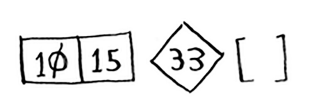

# Quicksort

Quicksort -- saralash algoritmidir. Bu selection sortdan ko'ra tezroq va real hayotda tez-tez ishlatiladi. Masalan, C standart kutubxonasida `qsort` deb nomlangan funksiya mavjud bo'lib, bu uning tezkor saralashni amalga oshirishidir. Quicksort shuningdek D&C dan foydalanadi.

Massivni saralash uchun tezkor saralashdan foydalanamiz. Saralash algoritmi qanday eng oddiy massivni boshqarishi mumkin (oldingi bo'limdagi maslahatimni eslang)? Xo'sh, ba'zi massivlarni umuman saralash shart emas.


Bo'sh massivlar va faqat bitta elementli massivlar asosiy holat bo'ladi. Siz shunchaki massivlarni avvalgidek qaytarishingiz mumkin - tartiblash uchun hech narsa yo'q:


#### Python
```python
def quicksort(array):
    if len(array) < 2:
        return array
```

#### Golang
```go
func quicksort(array []int) []int {
    if len(array) < 2 {
        return array
    }
}
```

Keling, kattaroq massivlarni ko'rib chiqaylik. Ikki elementli massivni saralash ham juda oson.


Uch elementli massiv haqida nima deyish mumkin?

Esda tuting, siz D&C dan foydalanyapsiz. Shunday qilib, siz asosiy holatga kelguningizcha ushbu massivni parchalashni xohlaysiz. Quicksort qanday ishlaydi. Birinchidan, massivdan elementni tanlang. Ushbu element `pivot` deb ataladi. 

Yaxshi pivotni qanday tanlash haqida keyinroq gaplashamiz. Aytaylik, massivdagi birinchi element pivotdir.

Endi pivotdan kichikroq elementlarni va pivotdan kattaroq elementlarni toping.


Bu qismlarga ajratish(`partitioning`) deb ataladi. Endi sizda bor:

• Pivotdan kichik barcha raqamlarning kichik massivi

• Aylanma

• Pivotdan kattaroq barcha raqamlarning kichik massivi

Ikki kichik massiv tartiblanmagan. Ular shunchaki bo'lingan. Ammo agar ular tartiblangan bo'lsa, butun massivni saralash juda oson bo'lar edi.



Agar pastki massivlar saralangan bo'lsa, siz shu kabi hamma narsani birlashtira olasiz - `left arrray + pivot + right array` - va siz tartiblangan massivga ega bo'lasiz. Bu holda, [10, 15] + [33] + [] = [10, 15, 33], bu tartiblangan massivdir.

Kichik massivlarni qanday saralaysiz? Xo'sh, Quicksort asosiy ishi allaqachon ikkita elementli (chap pastki massiv) va bo'sh massivlarni (o'ng pastki massiv) qanday saralashni biladi. Shunday qilib, agar siz ikkita kichik massivda Quicksort ni chaqirsangiz va natijalarni birlashtirsangiz, tartiblangan massivga ega bo'lasiz!

> quicksort([15, 10]) + [33] + quicksort([])
>
> [10, 15, 33] A sorted array

Bu har qanday pivot bilan ishlaydi. Aytaylik, buning o'rniga 15 ni tanladingiz.


Ikkala kichik massivda faqat bitta element mavjud va siz ularni qanday saralashni bilasiz. Shunday qilib, endi siz uchta elementdan iborat massivni qanday saralashni bilasiz. Mana qadamlar:

1. Pivotni tanlang.

2. Massivni ikkita kichik massivga bo'ling: pivotdan kichik elementlar va pivotdan kattaroq elementlar.

3. Ikki kichik massivda tezkor saralashni rekursiv chaqirish.

To'rt elementdan iborat massiv haqida nima deyish mumkin?


Aytaylik, siz yana pivot sifatida 33 ni tanladingiz.


Chapdagi massiv uchta elementga ega. Siz uchta elementdan iborat massivni qanday saralashni allaqachon bilasiz: unga rekursiv ravishda quicksort qo'ng'iroq qiling


Shunday qilib, siz to'rtta elementdan iborat massivni saralashingiz mumkin. Va agar siz to'rtta elementdan iborat massivni saralashingiz mumkin bo'lsa, besh elementli massivni saralashingiz mumkin. Nima sababdan? Aytaylik, sizda besh elementdan iborat ushbu massiv bor.


Qaysi pivotni tanlaganingizga qarab, ushbu massivni bo'lishning barcha usullari quyida keltirilgan.


E'tibor bering, ushbu kichik massivlarning barchasi 0 dan 4 gacha elementlarga ega. Va siz 0 dan 4 gacha elementlardan iborat massivni Quicksort yordamida qanday saralashni allaqachon bilasiz! Shunday qilib, qaysi pivotni tanlamasligingizdan qat'iy nazar, siz ikkita kichik massivda tezkor saralashni rekursiv chaqirishingiz mumkin.

Misol uchun, aylanma sifatida 3 ni tanladingiz deylik. Siz quyi massivlarda tezkor saralashni chaqirasiz.


Quyi massivlar saralanadi va keyin tartiblangan massivni olish uchun hamma narsani birlashtirasiz. Bu, hatto 5 ni pivot sifatida tanlasangiz ham ishlaydi.


Bu pivot sifatida har qanday element bilan ishlaydi. Shunday qilib, siz besh elementdan iborat massivni saralashingiz mumkin. Xuddi shu mantiqdan foydalanib, siz oltita elementdan iborat massivni tartiblashingiz mumkin va hokazo.

>### Induktiv dalillar
>
>Siz endigina induktiv dalillarni bilib oldingiz! Induktiv dalillar sizning algoritmingiz ishlashini isbotlashning bir usuli hisoblanadi. Har bir induktiv isbot ikki bosqichdan iborat: asosiy holat va induktiv holat. Tanish eshitildimi? Misol uchun, men zinapoyaning tepasiga ko'tarila olishimni isbotlamoqchiman deylik. Induktiv holatda, agar mening oyoqlarim zinapoyada bo'lsa, men oyoqlarimni keyingi pog'onaga qo'yishim mumkin. Shunday qilib, agar men 2-pog'onada bo'lsam, 3-bosqichga ko'tarila olaman. Bu induktiv holat. Asosiy holatda, men oyog'im 1-pog'onada ekanligini aytaman. Shuning uchun men bir vaqtning o'zida bir zinapoyaga ko'tarilib, butun zinapoyaga ko'tarilishi mumkin.
>
>Siz tez saralash uchun shunga o'xshash sabablardan foydalanasiz. Asosiy holatda, algoritm asosiy holat uchun ishlashini ko'rsatdim: 0 va 1 o'lchamdagi massivlar. Induktiv holatda, agar tezkor saralash 1 o'lchamdagi massiv uchun ishlasa, u 2 o'lchamli massiv uchun ishlashini ko'rsatdim. Va agar u 2 o'lchamli massivlar uchun ishlasa, u 3 o'lchamli massivlar uchun ishlaydi va hokazo. Keyin aytishim mumkinki, Quicksort har qanday o'lchamdagi barcha massivlar uchun ishlaydi. Men bu erda induktiv dalillarga chuqurroq kirmayman, lekin ular qiziqarli va D&C bilan birga ketadi.


Here's the code for quicksort:
```python
def quicksort(array):
    if len(array) < 2:
        return array # --> Base case: arrays with 0 or 1 element are already "sorted."
    else:
        pivot = array[0] # --> Recursive case
        
        less = [i for i in array[1:] if i <= pivot] # --> Sub-array of all the elements less than the pivot
        
        greater = [i for i in array[1:] if i > pivot] # --> Sub-array of all the elements greater than the pivot
        
        return quicksort(less) + [pivot] + quicksort(greater)

print quicksort([10, 5, 2, 3])
```

#### Golang
```golang
func quicksort(array []int) []int {
    if len(array) < 2 {
        return array
    } else {
        pivot = array[0]
        less := []int{}
        greater := []int{}
        for _, i := range array[1:] {
            if i <= pivot {
                less = append(less, i)
            } else {
                greater = append(greater, i)
            }
        }

        less = quicksort(less)
        greater = quicksort(greater)

        return append(append(less, pivot), greater...)

    }
}
```
