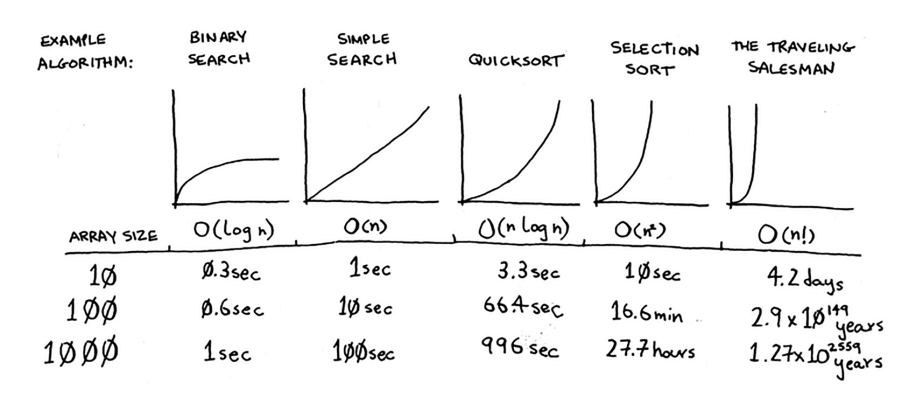
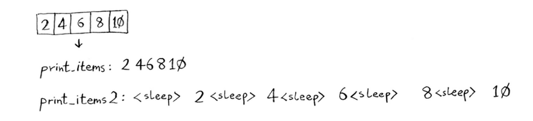
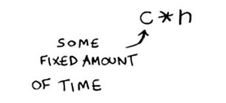
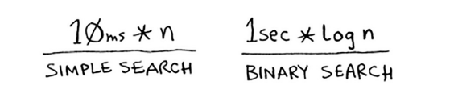
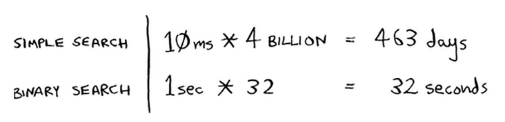
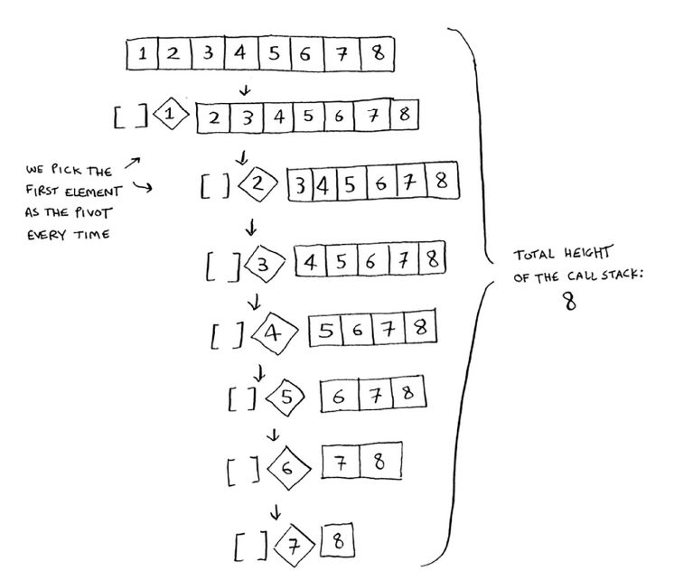
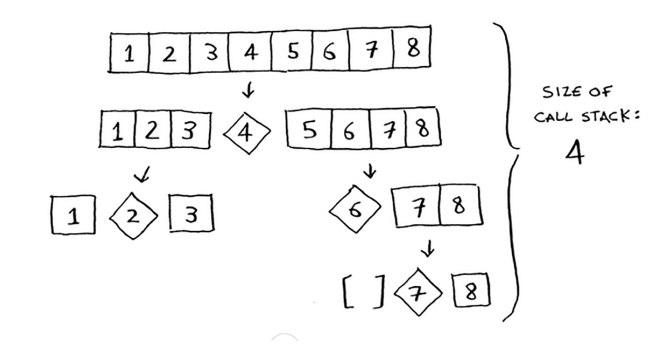
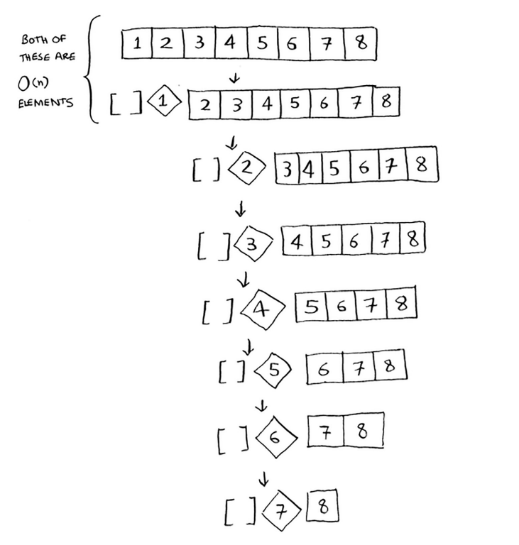
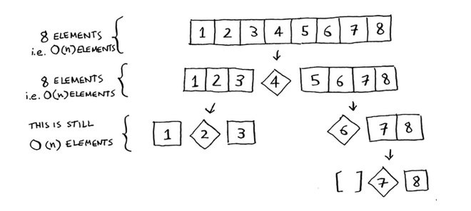
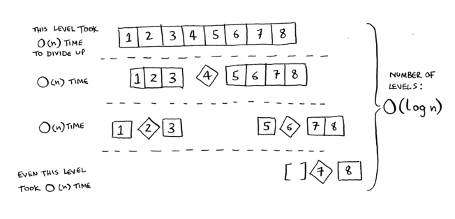

# Big O notation revisited

Quicksort noyobdir, chunki uning tezligi siz tanlagan pivotga bog'liq. Tez tartiblash haqida gapirishdan oldin, keling, eng keng tarqalgan Big O ish vaqtlarini yana ko'rib chiqaylik



Ushbu jadvaldagi misol vaqtlari, agar siz soniyada 10 ta operatsiyani bajarsangiz, taxminiy hisoblanadi. Ushbu grafiklar aniq emas - ular sizga bu ish vaqtlari qanchalik farq qilishini tushunish uchun mavjud. Aslida, sizning kompyuteringiz soniyada 10 dan ortiq operatsiyani bajarishi mumkin.

Har bir ish vaqti, shuningdek, biriktirilgan misol algoritmiga ega. 2-bobda bilib olgan saralash turini tekshiring. Bu O(n<sup>2</sup>). Bu juda sekin algoritm.

`Mergesort` deb ataladigan yana bir tartiblash algoritmi mavjud, bu O(n log n). Tezroq! `Quicksort` - bu qiyin ish. Eng yomon holatda, `quicksort` O(n<sup>2</sup>) vaqtni oladi.

Bu `selectionsort` kabi sekin! Lekin bu eng yomon holat. O'rtacha holatda, `quicksort` O(n log n) vaqtni oladi. Shunday qilib, siz hayron bo'lishingiz mumkin:

• Bu erda eng yomon va o'rtacha holat nimani anglatadi?

• `Quicksort` oʻrtacha O(n log n) boʻlsa, lekin `mergesort` har doim O(n log n) boʻlsa, nega birlashma tartiblashdan foydalanmaslik kerak? Tezroq emasmi?


### Merge sort vs. quicksort

Ro'yxatdagi har bir elementni chop etish uchun sizda oddiy funksiya bor deylik:


#### Python
```python
def print_items(list):
    for item in list:
        print item
```

#### Golang
```go
func print(items []int) {
    for _, item := range items {
        fmt.Println(item)
    }
}
```

Ushbu funktsiya ro'yxatdagi har bir elementni ko'zdan kechiradi va uni chop etadi. Chunki u butun roʻyxat boʻyicha bir marta aylanadi, bu funksiya O(n) vaqtida ishlaydi. Endi siz ushbu funktsiyani elementni chop etishdan oldin 1 soniya uxlab qoladigan tarzda o'zgartirdingiz deylik:

#### Python
```python
from time import sleep
def print_items2(list):
    for item in list:
        sleep(1)
        print item
```

#### Golang
```go
import "time"

func print(items []int) {
    for _, item := range items {
        time.Sleep(1 * time.Second)
        fmt.Println(item)
    }
}
```

Elementni chop etishdan oldin u 1 soniya pauza qiladi. Har ikkala funktsiyadan foydalangan holda beshta element ro'yxatini chop qilaylik.



Ikkala funktsiya ham ro'yxatda bir marta aylanadi, shuning uchun ikkalasi ham O(n) vaqti. Sizningcha, qaysi biri amalda tezroq bo'ladi? Menimcha, print_items ancha tezroq bo'ladi, chunki u elementni chop etishdan oldin 1 soniya pauza qilmaydi. Shunday qilib, Big O notatsiyasida ikkala funksiya ham bir xil tezlikda bo'lsa ham, print_items amalda tezroq. O(n) kabi Big O notasini yozganingizda, bu haqiqatan ham shuni anglatadi.



c - bu sizning algoritmingiz uchun belgilangan vaqt. U doimiy deb ataladi. Masalan, print_items uchun 10 millisekund * n, print_items2 uchun 1 soniya * n bo'lishi mumkin.

Siz odatda bu konstantani e'tiborsiz qoldirasiz, chunki agar ikkita algoritmda Big O vaqti har xil bo'lsa, doimiylik muhim emas. Masalan, ikkilik qidiruv va oddiy qidiruvni oling. Faraz qilaylik, ikkala algoritm ham shu doimiylarga ega edi.



Siz shunday deyishingiz mumkin: "Voy! Oddiy qidiruv 10 millisekundlik konstantaga ega, ammo ikkilik qidiruv 1 soniya doimiylikka ega. Oddiy qidiruv tezroq!" Aytaylik, siz 4 milliard elementdan iborat ro'yxatni qidiryapsiz. Mana vaqtlar.



Ko'rib turganingizdek, ikkilik qidiruv hali ham tezroq. Bu doimiylik umuman farq qilmadi. Ammo ba'zida doimiy o'zgarishlarga olib kelishi mumkin. Tezkor saralash va birlashtirish tartibi bunga misoldir. Quicksort birlashma tartiblashdan kichikroq konstantaga ega. Shunday qilib, agar ikkalasi ham O(n log n) vaqti bo'lsa, tezkor saralash tezroq bo'ladi. Va tezkor saralash amalda tezroq, chunki u eng yomon holatdan ko'ra o'rtacha holatga tez-tez to'g'ri keladi.

Xo'sh, endi siz hayron bo'lasiz: o'rtacha holat va eng yomon holat nima?

### Average case vs. worst case

Tezkor saralashning ishlashi ko'p jihatdan siz tanlagan pivotga bog'liq. Aytaylik, siz doimo birinchi elementni pivot sifatida tanlaysiz. Va siz allaqachon tartiblangan massiv bilan tezkor saralashni chaqirasiz. Quicksort kirish massivi allaqachon tartiblanganligini tekshirmaydi. Shunday qilib, u hali ham uni saralashga harakat qiladi.



Massivni qanday qilib ikkiga bo'lmasligingizga e'tibor bering. Buning o'rniga, pastki massivlardan biri har doim bo'sh. Shunday qilib, qo'ng'iroqlar to'plami juda uzoq. Buning o'rniga, siz doimo o'rta elementni pivot sifatida tanladingiz deylik. Endi qo'ng'iroqlar to'plamiga qarang.



Bu juda qisqa! Massivni har safar yarmiga bo'lganingiz uchun ko'p rekursiv qo'ng'iroqlarni amalga oshirishingiz shart emas. Siz asosiy ishni tezroq urasiz va qo'ng'iroqlar to'plami ancha qisqaroq.

Siz ko'rgan birinchi misol eng yomon stsenariy, ikkinchi misol esa eng yaxshi stsenariydir. Eng yomon holatda, stek hajmi O (n) dir. Eng yaxshi holatda, stek hajmi O (log n) dir. Endi stekdagi birinchi darajaga qarang. Pivot sifatida siz bitta elementni tanlaysiz, qolgan elementlar esa kichik massivlarga bo'linadi. Siz massivdagi barcha sakkiz elementga tegasiz. Shunday qilib, bu birinchi operatsiya O(n) vaqtini oladi. Siz qo'ng'iroqlar to'plamining ushbu darajasidagi barcha sakkiz elementga tegdingiz. Lekin, aslida, siz qo'ng'iroqlar to'plamining har bir darajasidagi O (n) elementlariga tegasiz.



Agar siz massivni boshqacha taqsimlasangiz ham, har safar O(n) elementlariga tegasiz.



Shunday qilib, har bir darajani bajarish uchun O (n) vaqt kerak bo'ladi.



Ushbu misolda O(log n) darajalari mavjud (buni aytishning texnik usuli "Qo'ng'iroqlar to'plamining balandligi O(log n)"). Va har bir daraja O(n) vaqtini oladi. Butun algoritm O(n) * O(log n) = O(n log n) vaqtni oladi. Bu eng yaxshi stsenariy. Eng yomon holatda, O(n) darajalari bor, shuning uchun algoritm O(n) * O(n) = O(n<sup>2</sup>) vaqtni oladi.

Xo'sh, taxmin qiling nima? Men sizga aytmoqchimanki, eng yaxshi holat ham o'rtacha ishdir. Agar siz har doim massivdagi tasodifiy elementni pivot sifatida tanlasangiz, tezkor saralash o'rtacha O(n log n) vaqtida yakunlanadi. Quicksort - bu eng tezkor tartiblash algoritmlaridan biri va bu D&C ning juda yaxshi namunasidir.

### EXERCISES
Ushbu operatsiyalarning har biri Big O notatsiyasida qancha vaqt oladi?

4.5 Massivdagi har bir elementning qiymatini chop etish.

4.6 Massivdagi har bir element qiymatini ikki barobarga oshirish.

4.7 Massivdagi faqat birinchi elementning qiymatini ikki baravar oshirish.

4.8 Massivdagi barcha elementlar bilan ko'paytirish jadvalini tuzish. Shunday qilib, agar sizning massivingiz [2, 3, 7, 8, 10] bo'lsa, avval har bir elementni 2 ga ko'paytirasiz, keyin har bir elementni 3 ga, keyin 7 ga ko'paytirasiz va hokazo.
