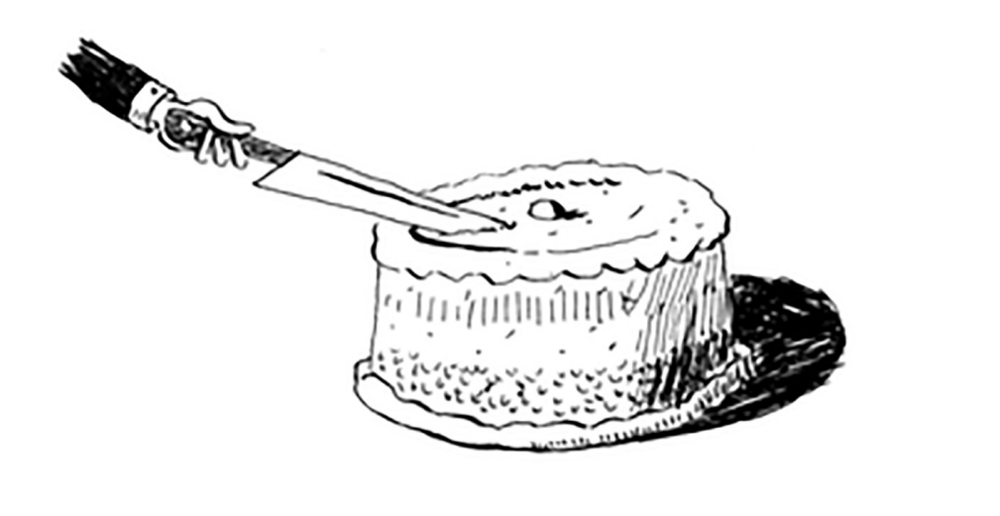

# Recap

• D&C muammoni kichikroq va kichikroq qismlarga ajratish orqali ishlaydi. Agar siz roʻyxatda D&C dan foydalanayotgan boʻlsangiz, asosiy holat boʻsh massiv yoki bitta elementli massiv boʻlishi mumkin.

• Agar siz quicksortni amalga oshirayotgan bo'lsangiz, pivot sifatida tasodifiy elementni tanlang. Quicksortning o'rtacha ish vaqti O(n log n)!

• Big O notatsiyasidagi konstanta ba'zan muhim bo'lishi mumkin. Shuning uchun quicksort mergesortga qaraganda tezroq.

• Ikkilik qidiruvga nisbatan oddiy qidiruv uchun konstanta deyarli hech qachon muhim emas, chunki roʻyxatingiz kattalashganda O(log n) O(n) ga qaraganda ancha tezroq boʻladi.

