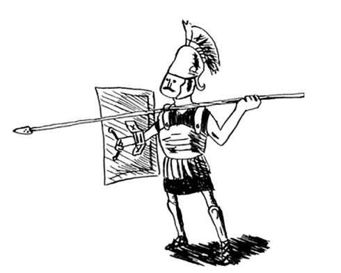

# Quicksort

* Siz bo'l va zabt etish haqida bilib olasiz. Ba'zan siz o'rgangan hech qanday algoritm bilan hal qilib bo'lmaydigan muammoga duch kelasiz. Yaxshi algoritmist bunday muammoga duch kelganida, ular shunchaki taslim bo'lmaydilar. Ular muammoni hal qilishda foydalanadigan, yechim topishga harakat qiladigan texnikalar bilan to'la asboblar qutisiga ega. Bo'l va zabt et - bu siz o'rganadigan birinchi umumiy texnikadir.

* Siz amaliyotda tez-tez ishlatiladigan tezkor saralash(**quicksort**) algoritmi haqida bilib olasiz. Quicksort bo'l va zabt etishdan foydalanadi.

Rekursiya haqida hamma narsani oxirgi bobda bilib oldingiz. Ushbu bob muammolarni hal qilish uchun yangi mahoratingizni ishlatishga qaratilgan. Biz muammolarni hal qilishning taniqli rekursiv usuli bo'lgan bo'l va zabt et (D&C) ni o'rganamiz. Ushbu bob haqiqatan ham algoritmlarning go'shtiga kiradi. Axir, algoritm faqat bitta turdagi muammolarni hal qila olsa, unchalik foydali emas. Buning o'rniga, D&C sizga muammolarni hal qilish haqida o'ylashning yangi usulini beradi. D&C asboblar qutingizdagi yana bir vositadir. Yangi muammoga duch kelganingizda, siz qotib qolishingiz shart emas. Buning o'rniga siz: "Agar men bo'l va zabt etsam, buni hal qila olamanmi?" Deb so'rashingiz mumkin.

Bobning oxirida siz birinchi asosiy D&C algoritmini bilib olasiz: tezkor tartiblash. Quicksort - bu saralash algoritmi va tanlashdan ko'ra tezroq (2-bobda o'rgangansiz). Bu oqlangan kodning yaxshi namunasidir.

