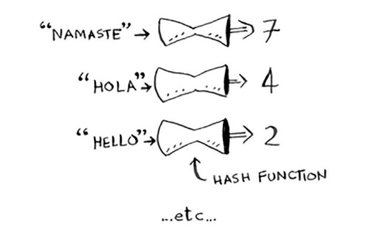
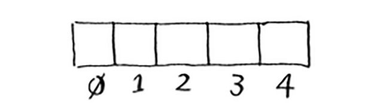
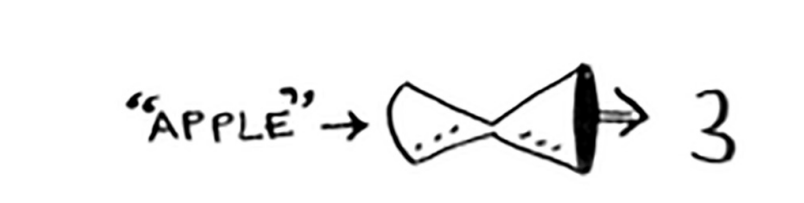
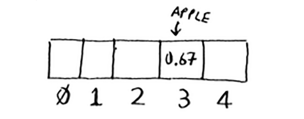
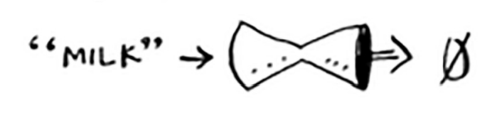
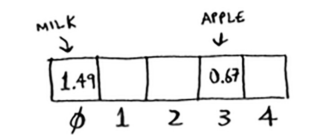
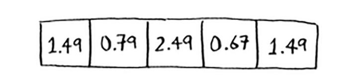
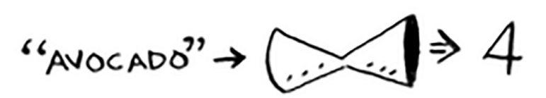
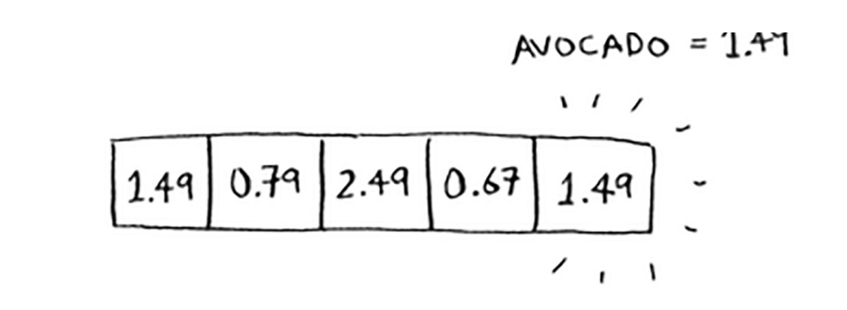

# Hash functions

Xesh funksiyasi bu funksiya bo'lib, unda siz satrni kiritasiz va siz raqamni qaytarasiz.



Texnik terminologiyada biz xesh funktsiyasi "satrlarni raqamlarga moslashtiradi" deb aytamiz. Siz satrni kiritganingizda qaysi raqamni olishning aniq namunasi yo'q deb o'ylashingiz mumkin. Lekin xesh funktsiyasi uchun ba'zi talablar mavjud:

• Bu izchil bo'lishi kerak. Misol uchun, siz "olma" ni qo'ydingiz va "4" ni qaytarib olasiz. Har safar "olma" ni qo'yganingizda "4" ni qaytarib olishingiz kerak. Busiz sizning xesh jadvalingiz ishlamaydi.

• Turli so'zlarni turli raqamlarga joylashtirishi kerak. Misol uchun, agar siz kiritgan har qanday so'z uchun har doim "1" ni qaytarsa, xesh funksiyasi yaxshi bo'lmaydi. Eng yaxshi holatda, har bir so'z boshqa raqamga mos kelishi kerak.

Shunday qilib, xesh funktsiyasi satrlarni raqamlarga moslashtiradi. Bu nimaga yaxshi? Xo'sh, siz uni "Maggie" ni yaratish uchun ishlatishingiz mumkin! 

Bo'sh massiv bilan boshlang:



Siz barcha narxlaringizni ushbu massivda saqlaysiz. Keling, olma narxini qo'shamiz. Xash funktsiyasiga "olma" ni boqing.



Xesh funksiyasi "3"ni chiqaradi. Demak, olma narxini massivda 3-indeksda saqlaylik



Keling, sut qo'shamiz. Xash funktsiyasiga "sut" ni soling.



Xesh funktsiyasi "0" ni aytadi. Keling, sut narxini 0 indeksida saqlaylik.



Davom eting va oxir-oqibat butun massiv narxlarga to'la bo'ladi.



Endi siz: "Hey, avakadoning narxi qancha?" Siz uni massivda qidirishingiz shart emas. Faqat "avokado" ni hash funktsiyasiga kiriting.



Bu sizga narx indeksi 4 da saqlanganligini aytadi. Va, albatta, bor.



Xesh funksiyasi narx qayerda saqlanishini aniq aytib beradi, shuning uchun siz umuman qidirishingiz shart emas! Bu ishlaydi, chunki

• Xesh funksiyasi nomni doimiy ravishda bir xil indeksga moslashtiradi. Har safar "avokado" ni qo'yganingizda, xuddi shu raqamni qaytarib olasiz. Shunday qilib, siz uni birinchi marta avakado narxini qayerda saqlashni topish uchun ishlatishingiz mumkin, keyin esa bu narxni qaerda saqlaganingizni topish uchun foydalanishingiz mumkin.

• Xesh funksiyasi turli qatorlarni turli indekslarga moslashtiradi. "Avokado" indeksi 4. "Sut" indeksi 0. Har bir narsa uning narxini saqlashingiz mumkin bo'lgan massivdagi boshqa uyaga xaritalanadi.

• Xesh funksiyasi massivingiz qanchalik katta ekanligini biladi va faqat haqiqiy indekslarni qaytaradi. Shunday qilib, agar sizning massivingiz 5 element bo'lsa, xesh funktsiyasi 100 ni qaytarmaydi ... bu massivdagi haqiqiy indeks bo'lmaydi.

Siz hozirgina "Maggie" ni yaratdingiz! Xesh funktsiyasi va massivni bir joyga qo'ying va siz `xesh jadvali` deb ataladigan ma'lumotlar strukturasiga ega bo'lasiz. Xesh-jadval bu siz o'rganadigan birinchi ma'lumotlar tuzilmasi bo'lib, uning orqasida qo'shimcha mantiq bor. Massivlar va ro'yxatlar to'g'ridan-to'g'ri xotiraga tushadi, ammo xesh jadvallari yanada oqilona. Ular elementlarni qaerga saqlashni oqilona aniqlash uchun xesh funksiyasidan foydalanadilar.

Xesh jadvallari, ehtimol siz o'rganadigan eng foydali murakkab ma'lumotlar tuzilmasi. Ular, shuningdek, xesh xaritalar(`hash map`), xaritalar(`map`), lug'atlar(`dictionary`) va assotsiativ massivlar(`associative arrays`) sifatida ham tanilgan. Va hash jadvallari tez! 2-bobdagi massivlar va bog'langan ro'yxatlar haqidagi muhokamaimizni eslaysizmi? Siz bir zumda massivdan elementni olishingiz mumkin. Va xesh jadvallari ma'lumotlarni saqlash uchun massivdan foydalanadi, shuning uchun ular bir xil darajada tezdir.

Ehtimol, siz hech qachon xesh jadvallarini o'zingiz qo'llashingiz shart emas. Har qanday yaxshi tilda hash-jadvallar uchun dastur mavjud. Pythonda xesh-jadvallar mavjud; ular lug'atlar(`dictionary`) deb ataladi.(Golangda `map`) Dict funktsiyasidan foydalanib, yangi xesh jadvalini yaratishingiz mumkin:

#### Python
```python
>>> book = dict()
```
#### Golang
```go
book := make(map[string]float32)
```


Kitob yangi xesh jadvalidir. Keling, kitobga ba'zi narxlarni qo'shamiz:

#### Python
```python
>>> book["apple"] = 0.67 # apple ning narxi 67 sent
>>> book["milk"] = 1.49 # sutning narxi 1.49 dollar
>>> book["avocado"] = 1.49 # avokadoning narxi 1.49 dollar
>>> print book
# {"avocado": 1.49, "apple": 0.67, "milk": 1.49}
```

#### Golang
```go
book["apple"] = 0.67 // apple ning narxi 67 sent
book["milk"] = 1.49 // sutning narxi 1.49 dollar
book["avocado"] = 1.49 // avokadoning narxi 1.49 dollar
fmt.Println(book)
// map[apple:0.67 avocado:1.49 milk:1.49]
```

Juda oson! Endi avakadoning narxini so'raymiz:

#### Python
```python
>>> print book["avocado"] #1.49 The price of an avocado
```
#### Golang
```go
fmt.Println(book["avocado"]) // 1.49 The price of an avocado
```

Xesh-jadvalda kalitlar va qiymatlar mavjud. Kitob xeshida mahsulot nomlari kalit, ularning narxi esa qiymat hisoblanadi. Xesh-jadval kalitlarni qiymatlar bilan taqqoslaydi. Keyingi bo'limda siz hash jadvallari haqiqatan ham foydali bo'lgan ba'zi misollarni ko'rasiz.

#### EXERCISES
Xesh funktsiyalari uchun bir xil kirish uchun doimiy ravishda bir xil chiqishni qaytarish muhimdir. Agar ular yo'q bo'lsa, siz uni hash jadvaliga qo'yganingizdan keyin uni topa olmaysiz! Ushbu xesh funksiyalaridan qaysi biri mos keladi?

5.1 f(x) = 1 ```--> Barcha kirishlar uchun "1" ni qaytaradi```

5.2 f(x) = rand() ```--> Har safar tasodifiy sonni qaytaradi```

5.3 f(x) = next_empty_slot() ```--> Xesh-jadvaldagi keyingi bo`sh joyning indeksini qaytaradi```

5.4 f(x) = len(x) ```--> Indeks sifatida satr uzunligidan foydalanadi```

