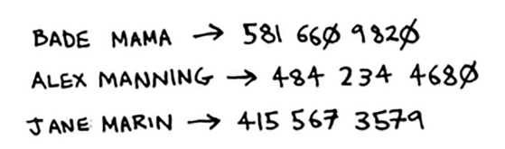

# Use cases

Xesh jadvallari hamma joyda qo'llaniladi. Ushbu bo'lim sizga bir nechta foydalanish holatlarini ko'rsatadi.

##  Using hash tables for lookups


Telefoningizda o'rnatilgan qulay telefon kitobi mavjud.
Har bir ismda u bilan bog'langan telefon raqami mavjud



Aytaylik, siz shunday telefon kitobini yaratmoqchisiz. Siz odamlarning ismlarini telefon raqamlari bilan taqqoslayapsiz. Telefon kitobingiz quyidagi funksiyalarga ega boʻlishi kerak:

• Shaxsning ismini va u bilan bog'langan telefon raqamini qo'shing.

• Shaxsning ismini kiriting va shu nom bilan bog'langan telefon raqamini oling.

Bu hash jadvallari uchun mukammal foydalanish holati! Xesh jadvallari siz xohlagan vaqtda ajoyib

• Bir narsadan boshqa narsaga xaritani yarating
• Biror narsani qidiring

Telefon kitobini yaratish juda oson. Birinchidan, yangi hash jadvalini yarating:

#### Python
```python
>>> phone_book = dict()
```

#### Golang
```go
phone_book := make(map[string]string)
```

Aytgancha, Python-da yangi xesh-jadval yaratish uchun yorliq mavjud. Siz ikkita jingalak qavsdan foydalanishingiz mumkin:

```python
>>> phone_book = {} #Same as phone_book = dict()
```

Keling, ushbu telefon kitobiga ba'zi odamlarning telefon raqamlarini qo'shamiz:

#### Python
```python
>>> phone_book[“jenny”] = 8675309
>>> phone_book[“emergency”] = 911
```

#### Golang
```go
phone_book["jenny"] = "8675309"
phone_book["emergency"] = "911"
```

Hammasi shu! Endi siz Jenni telefon raqamini topmoqchisiz deylik. Faqat kalitni xeshga o'tkazing:


#### Python
```python
>>> print phone_book["jenny"]
# 8675309 Jenny's phone number
```

#### Golang
```go
fmt.Println(phone_book["jenny"])
// 8675309 Jenny's phone number
```

Tasavvur qiling-a, siz buni o'rniga massiv yordamida qilishingiz kerak edi. Buni qanday qilgan bo'lardingiz? Xesh-jadvallar bir elementdan ikkinchisiga munosabatni modellashtirishni osonlashtiradi. Xesh-jadvallar ancha kengroq miqyosda qidirish uchun ishlatiladi. Misol uchun, siz http://adit.io kabi veb-saytga kirdingiz deylik. Sizning kompyuteringiz adit.io ni IP manzilga tarjima qilishi kerak.


Siz kiradigan har qanday veb-sayt uchun manzil IP manzilga tarjima qilinishi kerak.


Voy, veb-manzilni IP-manzil bilan taqqoslaysizmi? Xesh-jadvallar uchun mukammal foydalanish holatiga o'xshaydi! Ushbu jarayon DNS rezolyutsiyasi deb ataladi. Xesh jadvallari bu funksiyani ta'minlashning bir usuli hisoblanadi

## Preventing duplicate entries
Aytaylik, siz ovoz berish kabinasini boshqaryapsiz. Tabiiyki, har bir kishi bir marta ovoz berishi mumkin. Ular ilgari ovoz bermaganiga qanday ishonch hosil qilasiz? Kimdir ovoz berish uchun kelganida, siz uning to'liq ismini so'raysiz. Keyin siz uni ovoz berganlar ro'yxati bilan taqqoslaysiz.


Agar ularning ismi ro'yxatda bo'lsa, u allaqachon ovoz bergan - ularni chiqarib tashlang! Aks holda, siz ularning nomini ro'yxatga qo'shasiz va ovoz berishga ruxsat berasiz. Aytaylik, ko'p odamlar ovoz berish uchun kelgan va ovoz berganlar ro'yxati juda katta.


Har safar kimdir ovoz berish uchun kelganida, ular allaqachon ovoz berganligini bilish uchun ushbu ulkan ro'yxatni skanerlashingiz kerak. Ammo yaxshiroq yo'l bor: hashdan foydalaning! Birinchidan, ovoz bergan odamlarni kuzatib borish uchun hash qiling:

#### Python
```python
>>> voted = {}
```

#### Golang
```go
voted := make(map[string]bool)
```

Kimdir yangi ovoz berish uchun kelganida, u allaqachon xeshga kiritilganligini tekshiring:

#### Python
```python
>>> value = voted.get("tom")
```

#### Golang
```go
value := voted["tom"]
```

Get funktsiyasi, agar "tom" xesh jadvalida bo'lsa, qiymatni qaytaradi. Aks holda, u None ni qaytaradi. Kimdir allaqachon ovoz berganligini tekshirish uchun undan foydalanishingiz mumkin!


Mana kod:

#### Python
```python
voted = {}
def check_voter(name):
    if voted.get(name):
        print "kick them out!"
    else:
        voted[name] = True
        print "let them vote!"
```
#### Golang
```go
voted := make(map[string]bool)
func check_voter(name string) {
    if voted[name] {
        fmt.Println("kick them out!")
    } else {
        voted[name] = true
        fmt.Println("let them vote!")
    }
}
```
Tom birinchi marta ichkariga kirganida, "ularga ovoz berishlariga ruxsat bering!" Keyin Mayk ichkariga kiradi va unda "o'zlariga ovoz berishlariga ruxsat bering!" Keyin Mayk ikkinchi marta borishga harakat qiladi va u "ularni haydab yuboring!"

Esingizda bo'lsin, agar siz ushbu nomlarni ovoz berganlar ro'yxatida saqlagan bo'lsangiz, bu funksiya oxir-oqibat sekinlashadi, chunki u butun ro'yxat bo'ylab oddiy qidiruvni amalga oshirishi kerak edi. Lekin siz ularning ismlarini xesh-jadvalda saqlayapsiz va xesh-jadval sizga bu odamning ismi xesh-jadvalda bor yoki yo'qligini darhol aytib beradi. Xesh jadvali yordamida dublikatlarni tekshirish juda tez.

## Using hash tables as a cache


Bitta oxirgi foydalanish holati: keshlash. Agar siz veb-saytda ishlasangiz, keshlash haqida avvalroq eshitgan bo'lishingiz mumkin.
Mana fikr. Siz facebook.com saytiga tashrif buyurdingiz deylik:

1. Siz Facebook serveriga so'rov yuborasiz.
2. Server bir soniya o'ylaydi va sizga yuborish uchun veb-sahifani taklif qiladi.
3. Siz veb-sahifa olasiz


Masalan, Facebookda server sizga ko'rsatish uchun do'stlaringizning barcha harakatlarini to'plashi mumkin. Barcha harakatlarni to'plash va sizga ko'rsatish uchun bir necha soniya kerak bo'ladi. Bu bir necha soniya foydalanuvchi sifatida uzoq vaqt kabi his qilishi mumkin. Siz "Nega Facebook bu qadar sekin ishlayapti?" deb o'ylashingiz mumkin. Boshqa tomondan, Facebook serverlari millionlab odamlarga xizmat qilishi kerak va bu bir necha soniya ular uchun qo'shiladi. Facebook serverlari ushbu veb-saytlarning barchasiga xizmat ko'rsatish uchun juda ko'p ishlamoqda. Facebook-ni tezroq qilish va uning serverlari bir vaqtning o'zida kamroq ish qilishning bir usuli bormi?

Aytaylik, sizning jiyaningiz bor, u sizdan sayyoralar haqida so'raydi. "Mars Yerdan qanchalik uzoqda?" "Oy qancha masofada?" "Yupiter qancha masofada?" Har safar siz Google orqali qidirib, unga javob berishingiz kerak. Bir necha daqiqa vaqt oladi. Aytaylik, u har doim "Oy qancha uzoqlikda?" deb so'radi. Tez orada siz Oy 238 900 mil uzoqlikda ekanligini eslaysiz. Siz buni Googleda qidirishingiz shart emas ... shunchaki eslab, javob berasiz. Keshlash shunday ishlaydi: veb-saytlar ma'lumotlarni qayta hisoblash o'rniga eslab qoladi.

Agar siz Facebook-ga kirgan bo'lsangiz, siz ko'rgan barcha kontent faqat siz uchun mo'ljallangan. Har safar facebook.com saytiga kirganingizda, uning serverlari sizni qaysi kontentga qiziqtirayotgani haqida o'ylashlari kerak. Lekin agar siz Facebook'ga kirmagan bo'lsangiz, login sahifasini ko'rasiz. Hamma bir xil kirish sahifasini ko'radi. Facebookdan qayta-qayta bir xil so'rashadi: "Men tizimdan chiqqanimda bosh sahifani bering." Shunday qilib, u bosh sahifa qanday ko'rinishini aniqlash uchun serverni ishlashini to'xtatadi. Buning o'rniga, u bosh sahifa qanday ko'rinishini eslab qoladi va uni sizga yuboradi.


Bu keshlash deb ataladi. Uning ikkita afzalligi bor:

• Siz Yerdan Oygacha bo'lgan masofani yodlaganingizdek, veb-sahifani ancha tezroq olasiz. Keyingi safar jiyaningiz sizdan so'rasa, Google'ga kirish shart emas. Siz darhol javob berishingiz mumkin.

• Facebook kamroq ish qilishi kerak.

Keshlash - bu narsalarni tezroq qilishning keng tarqalgan usuli. Barcha yirik veb-saytlar keshlashdan foydalanadi. Va bu ma'lumotlar xeshda keshlangan!

Facebook shunchaki bosh sahifani keshlash emas. Shuningdek, u Haqida sahifasini, Kontakt sahifasini, Shartlar va boshqa ko'p narsalarni keshlaydi. Shunday qilib, u sahifaning URL manzilidan sahifa ma'lumotlariga xaritalashni talab qiladi.


Facebookdagi sahifaga tashrif buyurganingizda, u avval sahifa xeshda saqlanganligini tekshiradi.   


Bu kodda:

#### Python
```python
cache = {}
def get_page(url):
    if cache.get(url):
        return cache[url] # <-- Returns cached data
    else:
        data = get_data_from_server(url)
        cache[url] = data # <-- Saves this data in your cache first
        return data
```
Bu yerda, agar URL keshda bo'lmasa, serverni ishlashga majbur qilasiz. Ma'lumotni qaytarishdan oldin, siz uni keshda saqlaysiz. Keyingi safar kimdir ushbu URL manzilini so'rasa, server bu ishni bajarish o'rniga keshdan ma'lumotlarni yuborishingiz mumkin.

## Recap
Xulosa qilib aytadigan bo'lsak, xeshlar yaxshi

• Bir narsadan boshqa narsaga munosabatlarni modellashtirish

• Dublikatlarni filtrlash

 • Serveringizni ishlashga majburlash o'rniga ma'lumotlarni keshlash/esda saqlash