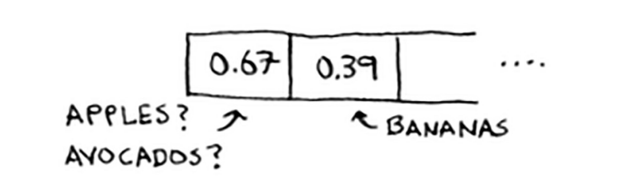

# Collisions

Yuqorida aytib o'tganimdek, ko'pchilik tillarda hash jadvallari mavjud. O'zingizni qanday yozishni bilishingiz shart emas. Shunday qilib, men hash-jadvallarning ichki qismlari haqida juda ko'p gapirmayman. Lekin siz hali ham ishlash haqida qayg'urasiz! Xesh-jadvallarning ishlashini tushunish uchun birinchi navbatda to'qnashuvlar nima ekanligini tushunishingiz kerak. Keyingi ikki bo'lim to'qnashuvlar va ishlashni o'z ichiga oladi. Birinchidan, men sizga oq yolg'on gapirdim. Men sizga xesh funksiyasi har doim turli kalitlarni massivdagi turli slotlarga joylashtirishini aytdim.

Aslida, buni amalga oshiradigan hash funktsiyasini yozish deyarli mumkin emas. Oddiy misol keltiraylik. Aytaylik, sizning massivingizda 26 ta slot mavjud.

Va sizning xesh funksiyangiz juda oddiy: u massivdagi nuqtani alifbo tartibida belgilaydi

Ehtimol, siz allaqachon muammoni ko'rishingiz mumkin. Siz olma narxini xashingizga qo'ymoqchisiz. Siz birinchi o'rinni tayinlaysiz. Keyin siz bananlarning narxini hashga qo'ymoqchisiz. Siz ikkinchi o'rinni tayinlaysiz. Hammasi juda yaxshi ketmoqda! Ammo endi siz avakado narxini xashingizga qo'ymoqchisiz. Sizga yana birinchi slot tayinlanadi.

Oh yo'q! Olmalarda allaqachon bu uy bor! Nima qilsa bo'ladi? Bu to'qnashuv deb ataladi: ikkita kalit bir xil uyaga tayinlangan. Bu muammo.

Agar siz avakadolarning narxini o'sha uyaga saqlasangiz, olma narxini qayta yozasiz. Keyin kimdir olma narxini so'rasa, o'rniga avakado narxini oladi! To'qnashuvlar yomon va siz ular atrofida ishlashingiz kerak. To'qnashuvlar bilan kurashishning turli xil usullari mavjud. Eng oddiyi: agar bir nechta tugmalar bir xil uyaga mos tushsa, o'sha uyaga bog'langan ro'yxatni boshlang.

Ushbu misolda "olma" va "avokado" ikkalasi ham bir xil uyaga mos keladi. Shunday qilib, siz o'sha uyada bog'langan ro'yxatni boshlaysiz. Agar siz bananlarning narxini bilishingiz kerak bo'lsa, u hali ham tez. Agar siz olma narxini bilishingiz kerak bo'lsa, u biroz sekinroq. "Olma" ni topish uchun ushbu bog'langan ro'yxatni qidirishingiz kerak. Agar bog'langan ro'yxat kichik bo'lsa, unchalik muhim emas - siz uchta yoki to'rtta elementni qidirishingiz kerak. Aytaylik, siz oziq-ovqat do'konida ishlaysiz, u erda faqat A harfi bilan boshlanadigan mahsulotlar sotiladi.

Hey, bir daqiqa kuting! Butun xesh-jadval bitta slotdan tashqari butunlay bo'sh. Va bu uyaning ulkan bog'langan ro'yxati bor! Ushbu xesh jadvalidagi har bir element bog'langan ro'yxatda. Boshlash uchun hamma narsani bog'langan ro'yxatga qo'yish kabi yomon. Bu sizning hash jadvalingizni sekinlashtiradi. 

Bu erda ikkita dars bor:

• Sizning hash funksiyangiz juda muhim. Xesh funksiyangiz barcha kalitlarni bitta uyaga joylashtirdi. Ideal holda, sizning xesh funksiyangiz kalitlarni butun xesh bo'ylab teng ravishda xaritaga kiritadi.

• Agar bog'langan ro'yxatlar uzun bo'lsa, bu sizning xesh jadvalingizni ancha sekinlashtiradi. Agar siz yaxshi hash funktsiyasidan foydalansangiz, ular uzoqqa cho'zilmaydi!

Hash funktsiyalari muhim ahamiyatga ega. Yaxshi hash funktsiyasi sizga juda kam to'qnashuvlarni beradi. Xo'sh, qanday qilib yaxshi hash funktsiyasini tanlaysiz? Bu keyingi bo'limda keladi!