# Performance

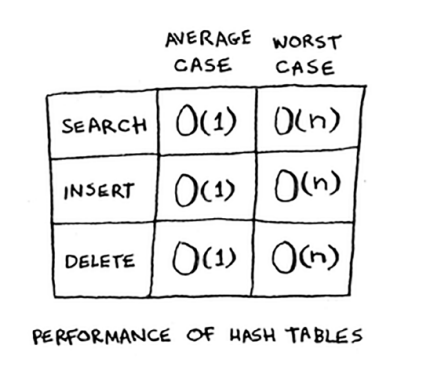

Siz bu bobni oziq-ovqat do'konida boshlagansiz. Siz darhol mahsulot narxini beradigan biror narsa qurmoqchi edingiz. Xo'sh, hash jadvallari juda tez. O'rtacha holatda, xesh jadvallari hamma narsa uchun O (1) ni oladi. O(1) doimiy vaqt deyiladi. Siz ilgari doimiy vaqtni ko'rmagansiz. Bu darhol degani emas. Bu shuni anglatadiki, xesh jadvali qanchalik katta bo'lishidan qat'i nazar, olingan vaqt bir xil bo'lib qoladi. Masalan, oddiy qidiruv chiziqli vaqtni olishini bilasiz.

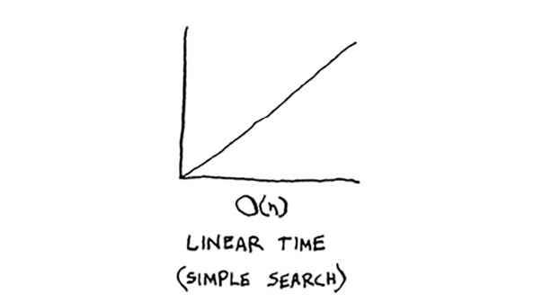

Ikkilik qidiruv tezroq - bu log vaqtini oladi:

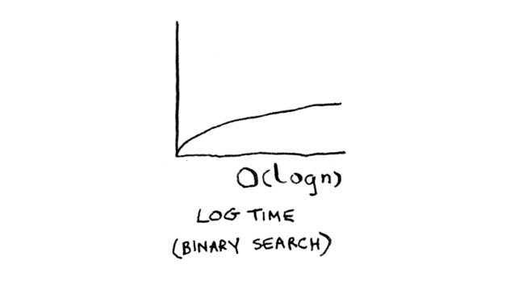

Xesh jadvalida biror narsani qidirish doimiy vaqtni oladi.

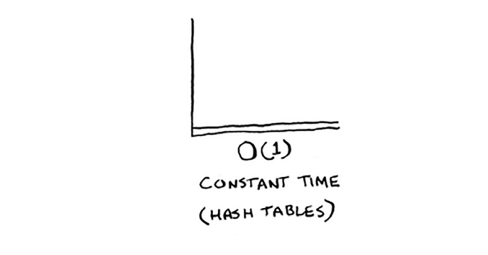

Bu qanday tekis chiziq ekanligini ko'rdingizmi? Bu shuni anglatadiki, sizning xesh-jadvalingizda 1 element yoki 1 milliard element bo'lishi muhim emas - xesh jadvalidan biror narsa olish bir xil vaqtni oladi. Aslida, siz ilgari doimiy vaqtni ko'rgansiz. Massivdan elementni olish doimiy vaqtni oladi. Sizning massivingiz qanchalik katta ekanligi muhim emas; elementni olish uchun bir xil vaqt kerak bo'ladi. O'rtacha holatda, hash jadvallari juda tez.

Eng yomon holatda, xesh jadvali hamma narsa uchun O(n) - chiziqli vaqtni oladi, bu haqiqatan ham sekin. Keling, xesh-jadvallarni massivlar va ro'yxatlar bilan taqqoslaylik.

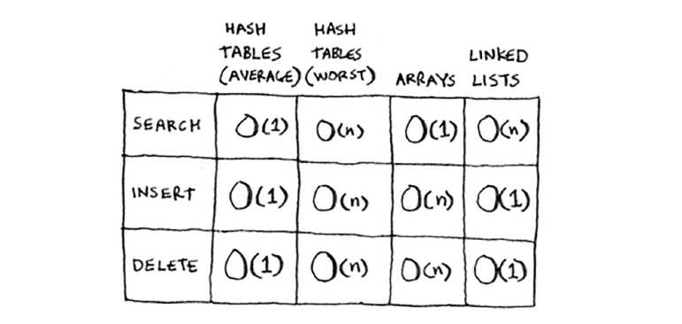

Xesh jadvallari uchun o'rtacha holatga qarang. Xesh-jadvallar qidirishda massivlar kabi tezdir (indeks bo'yicha qiymat olish). Va ular qo'shish va o'chirishda bog'langan ro'yxatlar kabi tezdir. Bu ikki dunyoning eng yaxshisi! Ammo eng yomon holatda, xesh jadvallari bularning barchasida sekin. Shunday qilib, xesh jadvallari bilan eng yomon ko'rsatkichlarga erishmasligingiz muhim. Va buning uchun siz to'qnashuvlardan qochishingiz kerak. To'qnashuvlarning oldini olish uchun sizga kerak

* Kam yuklanish omili

* Yaxshi hash funksiyasi

> Note
>
> Keyingi bo'limni boshlashdan oldin, buni o'qish shart emasligini bilib oling. Men hash jadvalini qanday amalga oshirish haqida gapiraman, lekin buni hech qachon o'zingiz qilishingiz shart emas. Qaysi dasturlash tilidan foydalanmasligingizdan qatʼiy nazar, oʻrnatilgan xesh-jadvallar ilovasiga ega boʻladi. Siz oʻrnatilgan xesh-jadvaldan foydalanishingiz mumkin va uning ishlashi yaxshi boʻladi deb taxmin qilishingiz mumkin. Keyingi bo'lim sizga kaput ostida ko'rinish beradi.

## Load factor
Xesh jadvalining yuk koeffitsientini hisoblash oson.

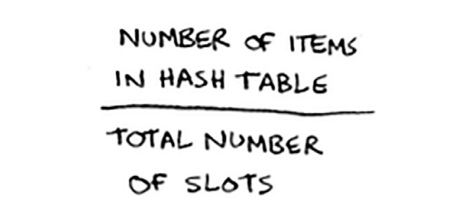

Xesh-jadvallar saqlash uchun massivdan foydalanadi, shuning uchun siz massivdagi band bo'lgan uyalar sonini hisoblaysiz. Misol uchun, bu xesh-jadvalda 2/5 yoki 0,4 yuk koeffitsienti mavjud.

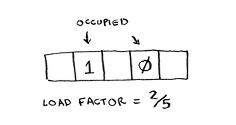

Ushbu hash jadvalining yuklanish omili nima?

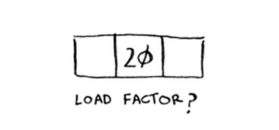

Agar siz 1/3 desangiz, siz haqsiz. Yuk koeffitsienti xesh jadvalingizda qancha bo'sh joy qolganligini o'lchaydi.

Aytaylik, siz 100 ta mahsulotning narxini xesh jadvalingizda saqlashingiz kerak va hash jadvalingizda 100 ta uy bor. Eng yaxshi holatda, har bir element o'z uyasiga ega bo'ladi.

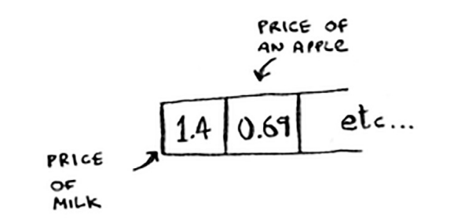

Bu xesh-jadvalning yuklanish koeffitsienti 1 ga teng. Xesh-jadvalingizda atigi 50 ta uyasi bo'lsa-chi? Keyin uning yuk koeffitsienti 2 ga teng. Har bir element o'z uyasiga ega bo'lishining iloji yo'q, chunki u erda etarli slot yo'q! Yuklash koeffitsienti 1 dan katta bo'lsa, sizda massivdagi slotlardan ko'ra ko'proq elementlar borligini anglatadi. Yuk koeffitsienti o'sishni boshlagandan so'ng, siz hash jadvalingizga ko'proq bo'sh joy qo'shishingiz kerak. Bu o'lchamni o'zgartirish deb ataladi. Misol uchun, sizda juda to'la bo'lgan bu xesh-jadvalingiz bor deylik.

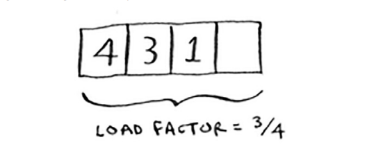

Ushbu xesh-jadval hajmini o'zgartirishingiz kerak. Avval siz kattaroq yangi massiv yaratasiz. Asosiy qoida ikki barobar katta massiv yasashdir.

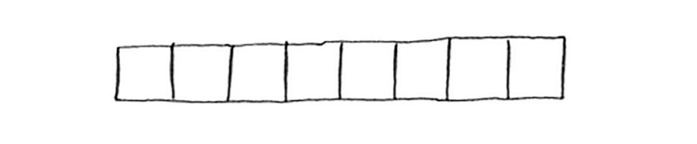

Endi siz ushbu elementlarning barchasini hash funktsiyasidan foydalanib, ushbu yangi xesh jadvaliga qayta kiritishingiz kerak:

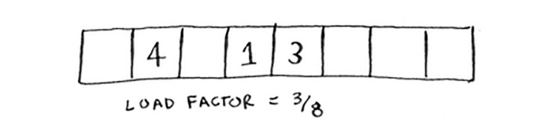

Ushbu yangi jadval 3/8 yuk koeffitsientiga ega. Juda yaxshi! Pastroq yuk koeffitsienti bilan siz kamroq to'qnashuvlarga ega bo'lasiz va stolingiz yaxshiroq ishlaydi. Yaxshi asosiy qoida - yuk koeffitsienti 0,7 dan katta bo'lsa, o'lchamini o'zgartirish. Siz shunday deb o'ylayotgandirsiz: "Bu biznes hajmini o'zgartirish juda ko'p vaqtni oladi!" Va siz haqsiz. O'lchamini o'zgartirish qimmat va siz tez-tez o'zgartirishni xohlamaysiz. Biroq, o'rtacha hisoblangan, xesh-jadvallar o'lchamini o'zgartirish bilan ham O (1) ni oladi.

## A good hash function
Yaxshi xesh funksiyasi massivdagi qiymatlarni teng taqsimlaydi.

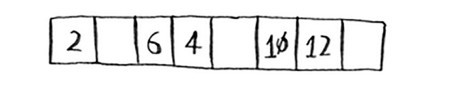

Yomon xesh funktsiyasi qiymatlarni birlashtiradi va ko'plab to'qnashuvlarni keltirib chiqaradi.

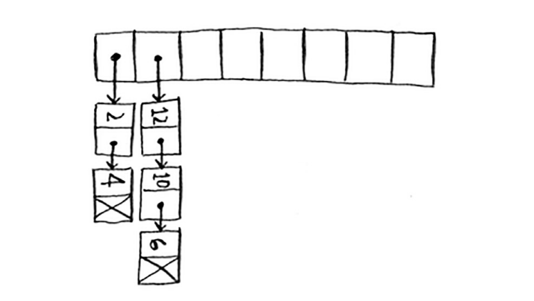

Yaxshi hash funktsiyasi nima?
Bu siz hech qachon tashvishlanmasligingiz kerak bo'lgan narsa - katta soqolli keksa erkaklar (va ayollar) qorong'i xonalarda o'tirishadi va bu haqda tashvishlanadilar. Agar chindan ham qiziqsangiz, SHA funksiyasini qidiring (oxirgi bobda uning qisqacha tavsifi mavjud). Buni hash funksiyasi sifatida ishlatishingiz mumkin.

#### EXERCISES
Xesh funksiyalari yaxshi taqsimlanishi muhim. Ular ob'ektlarni iloji boricha kengroq xaritalashlari kerak. Eng yomon holat barcha elementlarni xesh jadvalidagi bir xil uyaga joylashtiradigan xesh funksiyasi. Aytaylik, sizda satrlar bilan ishlaydigan ushbu to'rtta xesh funksiyasi mavjud:

* Barcha kirish uchun "1" ni qaytaring.

* Indeks sifatida satr uzunligidan foydalaning.

* Indeks sifatida satrning birinchi belgisidan foydalaning. Shunday qilib, a bilan boshlangan barcha satrlar birgalikda xeshlanadi va hokazo.
* Har bir harfni tub songa keltiring: a = 2, b = 3, c = 5, d = 7, e = 11 va hokazo. Satr uchun xesh funksiyasi xesh hajmiga mos keladigan barcha belgilar yig'indisidir. Misol uchun, agar sizning xesh o'lchamingiz 10 bo'lsa va satr "sumka" bo'lsa, indeks 3 + 2 + 17% 10 = 22% 10 = 2.

Ushbu misollarning har biri uchun qaysi hash funktsiyalari yaxshi taqsimlashni ta'minlaydi? Xesh-jadval o'lchami 10 slotni nazarda tuting.

* 5.5 Telefon kitobi, bu erda kalitlar nomlar va qiymatlar telefon raqamlari. Ismlar quyidagicha: Ester, Ben, Bob va Dan.
* 5.6 Batareya hajmidan quvvatgacha bo'lgan xaritalash. O'lchamlari A, AA, AAA va AAAA.
* 5.7 Kitob nomlaridan mualliflarga xaritalash. Sarlavhalar: Maus, Fun Home va Watchmen.