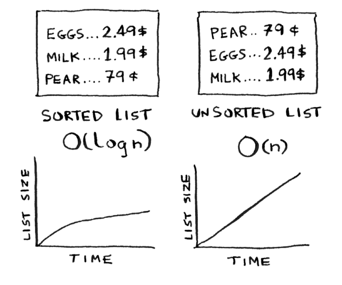

# Hash tables

• Siz eng foydali asosiy ma'lumotlar tuzilmalaridan biri bo'lgan xesh-jadvallar haqida bilib olasiz. Xesh jadvallari ko'p foydalanishga ega; bu bob umumiy foydalanish holatlarini qamrab oladi.

• Siz xesh-jadvallarning ichki qismlari haqida bilib olasiz: amalga oshirish, to'qnashuvlar va xesh funktsiyalari. Bu sizga hash jadvalining ishlashini qanday tahlil qilishni tushunishga yordam beradi

Aytaylik, siz oziq-ovqat do'konida ishlaysiz. Xaridor mahsulot sotib olayotganda, siz kitobdan narxni izlashingiz kerak. Agar kitob alifbosiz bo'lsa, `olma` uchun har bir satrni ko'rib chiqish sizga uzoq vaqt talab qilishi mumkin. Siz har bir satrga qarashingiz kerak bo'lgan 1-bobdan boshlab oddiy qidiruvni amalga oshirasiz. Bunga qancha vaqt ketishini eslaysizmi? Vaqtida. Agar kitob alifbo tartibida bo'lsa, olma narxini topish uchun ikkilik qidiruvni amalga oshirishingiz mumkin. Bu faqat O (log n) vaqtini oladi.

Eslatib oʻtamiz, O(n) va O(log n) vaqtlari oʻrtasida katta farq bor! Aytaylik, siz sekundiga kitobning 10 satrini ko'rib chiqishingiz mumkin. Mana, oddiy qidiruv va ikkilik qidiruv sizni qancha vaqt oladi.

Ikkilik qidiruv juda tez ekanligini allaqachon bilasiz. Ammo kassir sifatida kitobdagi narsalarni qidirish, hatto kitob tartiblangan bo'lsa ham, og'riqdir. Kitobdagi narsalarni qidirayotganingizda, mijozning bug'lanishini his qilishingiz mumkin. Sizga haqiqatan ham kerak bo'lgan narsa - barcha ismlar va narxlarni yodlab olgan do'st. Keyin hech narsa qidirishingiz shart emas: siz undan so'raysiz va u sizga darhol javobni aytadi.

Sizning do'stingiz Meggi kitob qanchalik katta bo'lishidan qat'i nazar, har qanday mahsulot uchun O(1) vaqt ichida narxni berishi mumkin. U ikkilik qidiruvdan ham tezroq.

Qanday ajoyib inson! Qanday qilib "Maggie" ni olish mumkin? Keling, ma'lumotlar tuzilmasi shlyapalarini kiyaylik. Siz hozirgacha ikkita ma'lumotlar tuzilmasini bilasiz: massivlar va ro'yxatlar (men steklar haqida gapirmayman, chunki siz stekdagi biror narsani "qidira olmaysiz"). Siz ushbu kitobni massiv sifatida amalga oshirishingiz mumkin.

Massivdagi har bir element haqiqatda ikkita elementdan iborat: biri mahsulot turining nomi, ikkinchisi esa narx. Agar siz ushbu massivni nomi bo'yicha saralasangiz, unda elementning narxini topish uchun ikkilik qidiruvni amalga oshirishingiz mumkin. Shunday qilib, siz elementlarni O (log n) vaqtida topishingiz mumkin. Lekin siz O (1) vaqtida narsalarni topmoqchisiz. Ya'ni, siz "Maggie" qilishni xohlaysiz. Bu erda xesh-funksiyalar keladi.
