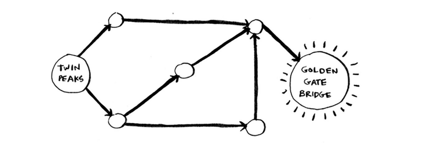

# Introduction to graph

Aytaylik, siz San-Frantsiskodasiz va siz Twin Peaksdan Oltin darvoza ko'prigigacha borishni xohlaysiz. Siz u erga avtobusda, eng kam o'tkazmalar soni bilan borishni xohlaysiz. Mana sizning variantlaringiz.

Eng kam qadamlar bilan yo'lni topish algoritmingiz qanday?

Xo'sh, u erga bir qadamda bora olasizmi? Bu yerda siz bir qadamda borishingiz mumkin bo'lgan barcha joylar.

Ko'prik ta'kidlanmagan; u erga bir qadamda etib bo'lmaydi. Ikki qadamda u erga bora olasizmi?

Shunga qaramay, ko'prik yo'q, shuning uchun siz ikki qadamda ko'prikka borolmaysiz.
Uch qadam haqida nima deyish mumkin?

Aha! Endi Oltin darvoza ko'prigi paydo bo'ladi. Shunday qilib, bu marshrut yordamida Twin Peaksdan ko'prikka borish uchun uch qadam kerak.

Sizni ko'prikka olib boradigan boshqa yo'llar ham bor, lekin ular uzoqroq (to'rt qadam). Algoritm ko'prikka eng qisqa yo'l uch qadam uzunligini aniqladi. Ushbu turdagi muammo eng qisqa yo'l muammosi deb ataladi. Siz har doim eng qisqa narsani topishga harakat qilasiz. Bu do'stingizning uyiga boradigan eng qisqa yo'l bo'lishi mumkin. Bu shaxmat o'yinida mat qilish uchun eng kichik harakatlar soni bo'lishi mumkin. Eng qisqa yo'l muammosini hal qilish algoritmi kenglikdan birinchi qidirish deb ataladi.

Egizak cho'qqilardan Oltin darvoza ko'prigiga qanday borishni aniqlash uchun ikkita qadam mavjud:

1. Masalani grafik sifatida modellashtiring.
2. Kenglik-birinchi qidiruv yordamida muammoni hal qiling.

Keyinchalik men qanday grafiklar ekanligini ko'rib chiqaman. Keyin men kengroq qidiruvga batafsilroq kirishaman.