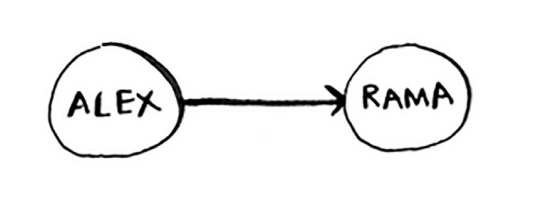
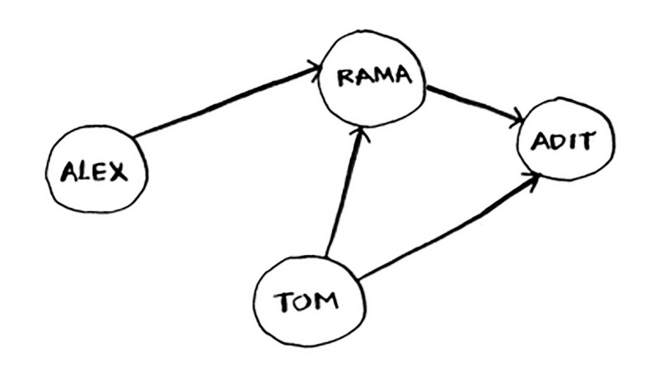
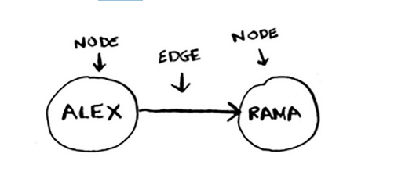

# What is a graph?

Grafik ulanishlar to'plamini modellashtiradi. Misol uchun, siz va do'stlaringiz poker o'ynayapsiz deylik va siz kimga pul qarzdorligini modellashtirishni xohlaysiz. Mana shunday deyishingiz mumkin: "Aleks Ramadan qarzdor".

To'liq grafik shunday ko'rinishi mumkin

Aleks Ramadan, Tom Aditdan qarzdor va hokazo. Har bir grafik tugun va qirralardan iborat.

Hammasi shu! Grafiklar tugun va qirralardan iborat. Tugun ko'plab boshqa tugunlarga bevosita ulanishi mumkin. Bu tugunlar uning qo'shnilari deb ataladi. Ushbu grafikda Rama Aleksning qo'shnisi. Adit Aleksning qo'shnisi emas, chunki ular bevosita bog'lanmagan. Ammo Adit Rama va Tomning qo'shnisi. 

Grafiklar turli xil narsalarning bir-biri bilan qanday bog'lanishini modellashtirish usulidir. Keling, birinchi navbatda kenglikdagi qidiruvni amalda ko'rib chiqaylik.