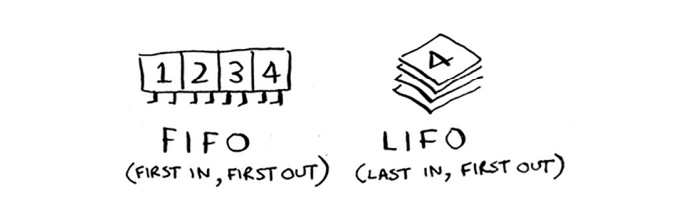

# Breadth-first search

Biz 1-bobda qidiruv algoritmini ko'rib chiqdik: ikkilik qidiruv. Birinchi bo'lib qidiruv - bu boshqa turdagi qidiruv algoritmi: grafiklar bo'yicha ishlaydi. U ikki turdagi savollarga javob berishga yordam beradi:

* 1-savol turi: A tugunidan B tuguniga yo'l bormi?

* 2-savol turi: A tugunidan B tuguniga eng qisqa yo'l nima?

Siz Twin Peaksdan Oltin Darvoza ko'prigigacha bo'lgan eng qisqa yo'lni hisoblaganingizda bir marta kenglik bo'yicha birinchi qidiruvni ko'rgansiz. Bu 2-turdagi savol edi: "Eng qisqa yo'l nima?" Endi algoritmni batafsil ko'rib chiqaylik. Siz 1-turdagi savolni berasiz: "Yo'l bormi?"

Aytaylik, siz mango fermasining mag'rur egasisiz. Siz mangolaringizni sotadigan mango sotuvchisini qidiryapsiz. Siz Facebookda mango sotuvchisiga ulanganmisiz? Xo'sh, siz do'stlaringiz orqali qidirishingiz mumkin.

Bu qidiruv juda oddiy. Birinchidan, qidirish uchun do'stlar ro'yxatini tuzing.
Endi ro'yxatdagi har bir odamga boring va u kishi mango sotadimi yoki yo'qligini tekshiring.

Aytaylik, sizning do'stlaringizdan hech biri mango sotuvchisi emas. Endi siz do'stlaringizning do'stlari orqali qidirishingiz kerak.

Har safar ro'yxatdan kimnidir qidirsangiz, uning barcha do'stlarini ro'yxatga qo'shing.

Shunday qilib, siz nafaqat do'stlaringizni, balki ularning do'stlarini ham qidirasiz. Esingizda bo'lsin, maqsad tarmog'ingizda bitta mango sotuvchisini topishdir. Shunday qilib, agar Elis mango sotuvchisi bo'lmasa, siz uning do'stlarini ham ro'yxatga qo'shasiz. Bu degani, siz oxir-oqibat uning do'stlarini, keyin esa ularning do'stlarini va hokazolarni qidirasiz. Ushbu algoritm yordamida siz mango sotuvchisiga duch kelguningizcha butun tarmog'ingizni qidirasiz. Ushbu algoritm kenglikdagi birinchi qidiruvdir.

## Finding the shortes path

Xulosa qilib aytadigan bo'lsak, bular siz uchun birinchi navbatdagi qidiruvga javob beradigan ikkita savol:

* 1-savol turi: A tugunidan B tuguniga yo'l bormi? (Tarmog'ingizda mango sotuvchisi bormi?)

* 2-savol turi: A tugunidan B tuguniga eng qisqa yo'l nima? (Eng yaqin mango sotuvchisi kim?)

1-savolga qanday javob berishni ko'rdingiz; endi 2-savolga javob berishga harakat qilaylik. Siz eng yaqin mango sotuvchisini topa olasizmi? Misol uchun, sizning do'stlaringiz birinchi darajali aloqalar va ularning do'stlari ikkinchi darajali aloqalardir.

Birinchi darajali ulanishni ikkinchi darajali ulanishga, ikkinchi darajali ulanishni uchinchi darajali ulanishga va hokazolarni afzal ko'rasiz. Shunday qilib, siz mango sotuvchisi bo'lgan birinchi darajali aloqangiz yo'qligiga ishonch hosil qilishdan oldin hech qanday ikkinchi darajali ulanishlarni qidirmasligingiz kerak. Xo'sh, kenglikdagi birinchi qidiruv buni allaqachon qiladi! Kenglik-birinchi qidiruv qanday ishlaydi, qidiruv boshlang'ich nuqtadan chiqadi. Shunday qilib, siz ikkinchi darajali ulanishlardan oldin birinchi darajali ulanishlarni tekshirasiz. Pop viktorina: kim birinchi bo'lib tekshiriladi, Klermi yoki Anujmi? Javob: Kler birinchi darajali, Anuj ikkinchi darajali aloqadir. Shunday qilib, Kler Anujdan oldin tekshiriladi.

Buni ko'rishning yana bir usuli - birinchi darajali ulanishlar ikkinchi darajali ulanishlardan oldin qidiruv ro'yxatiga qo'shiladi.

Siz shunchaki ro'yxatni pastga tushing va odamlarning har biri mango sotuvchisi yoki yo'qligini tekshiring. Birinchi darajali ulanishlar ikkinchi darajali ulanishlardan oldin qidiriladi, shuning uchun sizga eng yaqin mango sotuvchisini topasiz. Kenglik-birinchi qidiruv nafaqat A dan B gacha bo'lgan yo'lni, balki eng qisqa yo'lni ham topadi. E'tibor bering, bu faqat odamlarni ular qo'shilgan tartibda qidirsangiz ishlaydi. Ya'ni, Kler ro'yxatga Anujdan oldin qo'shilgan bo'lsa, Klerni Anujdan oldin qidirish kerak. Agar siz Anujni Klerdan oldin qidirsangiz va ikkalasi ham mango sotuvchisi bo'lsa nima bo'ladi? Xo'sh, Anuj ikkinchi darajali kontakt, Kler esa birinchi darajali kontakt. Siz tarmog'ingizda sizga eng yaqin bo'lmagan mango sotuvchisiga duch kelasiz. Shunday qilib, siz odamlarni ular qo'shilgan tartibda qidirishingiz kerak. Buning uchun ma'lumotlar strukturasi mavjud: u `navbat` deb ataladi. 

## Queues

Navbat haqiqiy hayotda bo'lgani kabi ishlaydi. Aytaylik, siz do'stingiz bilan avtobus bekatida navbatga turasiz. Agar siz undan oldin navbatda bo'lsangiz, birinchi navbatda avtobusga o'tirasiz. Navbat xuddi shunday ishlaydi. Navbatlar steklarga o'xshaydi. Navbatdagi tasodifiy elementlarga kira olmaysiz. Buning o'rniga, faqat ikkita operatsiya mavjud, `navbatga qo'yish` va `navbatdan chiqarish`.

Agar siz ikkita elementni ro'yxatga qo'shsangiz, siz qo'shgan birinchi element ikkinchi elementdan oldin navbatdan chiqariladi. Buni qidiruv ro'yxati uchun ishlatishingiz mumkin! Roʻyxatga birinchi boʻlib qoʻshilgan odamlar navbatdan chiqariladi va birinchi navbatda qidiriladi.

`Queue` `FIFO` ma'lumotlar strukturasi deb ataladi: Birinchi kir, birinchi chiqadi. Bundan farqli o'laroq, `Stack` `LIFO` ma'lumotlar strukturasidir: Oxirgi kirish, birinchi chiqish.

Navbat qanday ishlashini bilganingizdan so'ng, keling, birinchi navbatda qidiruvni amalga oshiraylik!

#### EXERCISES
Yechimni topish uchun ushbu grafiklarning har birida birinchi navbatda kenglikdagi qidiruv algoritmini ishga tushiring.

6.1 Eng qisqa yo'lning boshidan oxirigacha uzunligini toping.

6.2 "Kabina" dan "bat"gacha bo'lgan eng qisqa yo'lning uzunligini toping.

