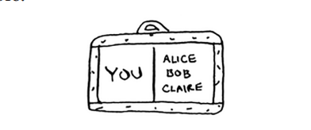
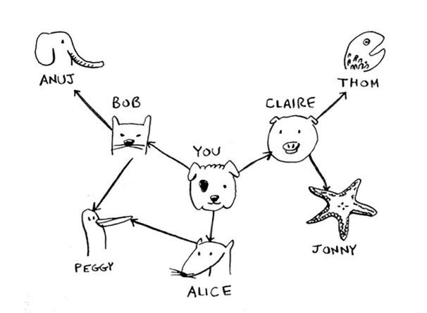
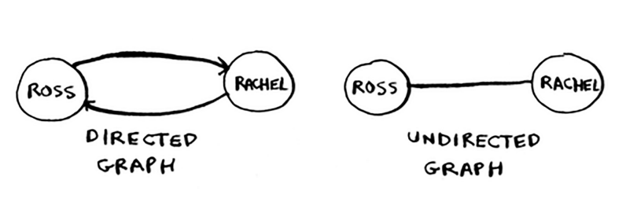

# Implementing the graph

Birinchidan, grafikni kodda amalga oshirishingiz kerak. Grafik bir nechta tugunlardan iborat. Va har bir tugun qo'shni tugunlarga ulanadi. "Siz -> bob" kabi munosabatlarni qanday ifodalaysiz? Yaxshiyamki, siz munosabatlarni ifodalash imkonini beruvchi ma'lumotlar strukturasini bilasiz: xesh jadvali! Esda tutingki, xesh-jadval kalitni qiymat bilan taqqoslash imkonini beradi. Bunday holda, siz tugunni uning barcha qo'shnilari bilan taqqoslashni xohlaysiz.



Buni Pythonda qanday yozishingiz mumkin:

#### Python
```python
graph = {}
graph["you"] = ["alice", "bob", "claire"]
```

#### Golang
```go
graph := make(map[string][]string)
graph["you"] = []string{"alice", "bob", "claire"}
```

E'tibor bering, "siz" massiv bilan ko'rsatilgan. Shunday qilib, ["siz"] grafigi sizga "siz" ning barcha qo'shnilari qatorini beradi. 

Grafik - bu tugunlar va qirralarning bir to'plami, shuning uchun Python-da grafika ega bo'lish uchun kerak bo'lgan narsa shu. Bu kabi kattaroq grafik haqida nima deyish mumkin?



Bu Python kodi kabi:

#### Python
```python
graph = {}
graph["you"] = ["alisa", "bob", "claire"]
graph["bob"] = ["anuj", "peggy"]
graph["alisa"] = ["peggy"]
graph["claire"] = ["thom", "jonny"]
graph["anuj"] = []
graph["peggy"] = []
graph["thom"] = []
graph["jonny"] = []
```

#### Golang
```go
graph := make(map[string][]string)
graph["you"] = []string{"alice", "bob", "claire"}
graph["bob"] = []string{"anuj", "peggy"}
graph["alice"] = []string{"peggy"}
graph["claire"] = []string{"thom", "jonny"}
graph["anuj"] = []string{}
graph["peggy"] = []string{}
graph["thom"] = []string{}
graph["jonny"] = []string{}
```
Pop viktorina: kalit/qiymat juftlarini qaysi tartibda kiritishingiz muhimmi?
Yozsangiz muhimmi

#### Python
```python
graph["claire"] = ["thom", "jonny"]
graph["anuj"] = []

```

#### Golang
```go
graph["claire"] = []string{"thom", "jonny"}
graph["anuj"] = []string{}
```

o'rniga

#### Python
```python
graph["anuj"] = []
graph["claire"] = ["thom", "jonny"]
```

#### Golang
```go
graph["anuj"] = []string{}
graph["claire"] = []string{"thom", "jonny"}
```

Oldingi bobga qayting. Javob: Bu muhim emas. Xesh jadvallarida buyurtma yo'q, shuning uchun kalit/qiymat juftlarini qaysi tartibda qo'shishingiz muhim emas.

Anuj, Peggi, Tom va Jonnining qo'shnilari yo'q. Ularning o'qlari ularga ishora qiladi, lekin ulardan boshqasiga o'qlar yo'q. Bu `yo'naltirilgan grafik` deb ataladi - munosabatlar faqat bitta yo'ldir. Shunday qilib, Anuj Bobning qo'shnisi, lekin Bob Anujning qo'shnisi emas. Yo'naltirilmagan grafikda hech qanday o'q yo'q va ikkala tugun bir-birining qo'shnisidir. Masalan, bu grafiklarning ikkalasi ham teng.

