# Implementing the algorithm

Xulosa qilib aytganda, amalga oshirish qanday ishlaydi.

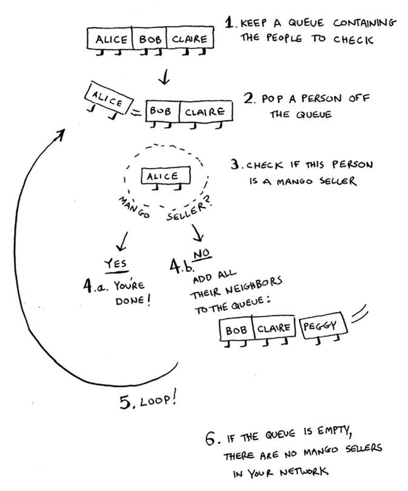

> Note
>
> Navbatlarni yangilashda men enqueue va dequeue atamalaridan foydalanaman. Push va pop atamalariga ham duch kelasiz. Push deyarli har doim navbat bilan bir xil, pop esa har doim dequeue bilan bir xil bo'ladi

Boshlash uchun navbat qo'ying. Pythonda buning uchun (double ended queue) ikki tomonlama navbat (`deque`) funksiyasidan foydalanasiz:

#### Python

```python
from collections import deque
search_queue = deque() # Creates a new queue
search_queue += graph["you"] #Adds all of your neighbors to the search queue
```

#### Golang

```go
search_queue := []string{} // Creates a new queue
search_queue = append(search_queue, graph["you"]...) //Adds all of your neighbors to the search queue
```
Esingizda bo'lsin, `graph["siz"]` sizga barcha qo'shnilaringiz ro'yxatini beradi, masalan, `["alice", "bob", "claire"]`. Bularning barchasi qidiruv navbatiga qo'shiladi.


Qolganlarini ko'rib chiqaylik:

#### Python

```python
while search_queue: #While the queue isn't empty
    person = search_queue.popleft() # ...grabs the first person off the queue
    if person_is_seller(person): #Checks whether the person is a mango seller
        print person + " is a mango seller!" #Yes, they're a mango seller.
        return True
    else:
        search_queue += graph[person] #No. They aren't. Add all of this person's friends to the search queue.
return False #If you reached here, no one in the queue was a mango seller.
```

#### Golang
```go

for len(search_queue) > 0 { //While the queue isn't empty
    person := search_queue[0] // ...grabs the first person off the queue
    search_queue = search_queue[1:]
    if person_is_seller(person) { //Checks whether the person is a mango seller
        fmt.Println(person + " is a mango seller!") //Yes, they're a mango seller.
        return true
    } else {
        search_queue = append(search_queue, graph[person]...) //No. They aren't. Add all of this person's friends to the search queue.
    }
}
```

Yakuniy narsa: kimdir mango sotuvchisi ekanligini aytish uchun sizga hali ham `person_is_seller` funksiyasi kerak. Mana bittasi:

#### Python
```python
def person_is_seller(name):
    return name[-1] == 'm'
```

#### Golang
```go
func person_is_seller(name string) bool {
    return name[len(name)-1] == 'm'
}
```

Bu funksiya shaxs ismi m harfi bilan tugashini tekshiradi. Agar shunday bo'lsa, ular mango sotuvchisi. Buni qilishning ahmoqona usuli, lekin bu misol uchun shunday bo'ladi. Keling, birinchi bo'lib qidiruvni amalda ko'rib chiqaylik.

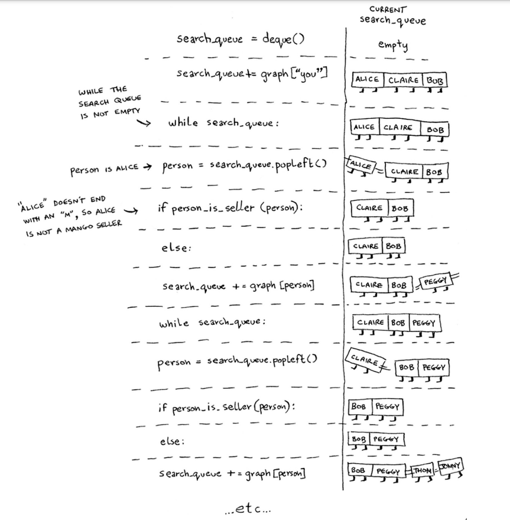

Va hokazo. Algoritm ikkalasiga qadar davom etadi
• Mango sotuvchisi topildi, yoki
• Navbat bo'sh bo'ladi, bu holda mango sotuvchisi yo'q.

Elis va Bob do'stlarini baham ko'rishadi: Peggi. Shunday qilib, Peggi ikki marta navbatga qo'shiladi: bir marta Elisning do'stlarini qo'shsangiz va yana Bobning do'stlarini qo'shsangiz. Qidiruv qatorida ikkita Peggy topasiz.

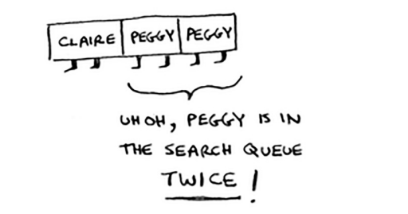

Ammo siz Peggini mango sotuvchisi yoki yo'qligini bilish uchun faqat bir marta tekshirishingiz kerak. Agar siz uni ikki marta tekshirsangiz, keraksiz, qo'shimcha ish qilyapsiz. Shunday qilib, biror kishini qidirganingizdan so'ng, uni qidirilgan deb belgilashingiz kerak va uni qayta qidirmasligingiz kerak.

Agar buni qilmasangiz, siz ham cheksiz tsiklga tushib qolishingiz mumkin. Aytaylik, mango sotuvchisi grafigi shunday edi.

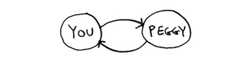

Boshlash uchun, qidiruv navbati barcha qo'shnilaringizni o'z ichiga oladi.

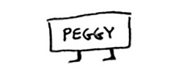

Endi siz Peggyni tekshiring. U mango sotuvchisi emas, shuning uchun siz uning barcha qo'shnilarini qidiruv navbatiga qo'shasiz.

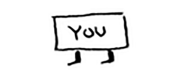

Keyin o'zingizni tekshiring. Siz mango sotuvchisi emassiz, shuning uchun siz barcha qo'shnilaringizni qidirish navbatiga qo'shasiz.


Va hokazo. Bu cheksiz tsikl bo'ladi, chunki qidiruv navbati sizdan Peggigacha davom etadi.

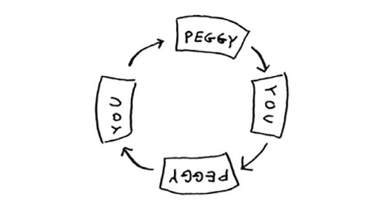

Biror kishini tekshirishdan oldin, u allaqachon tekshirilmaganligiga ishonch hosil qilish muhimdir. Buning uchun siz allaqachon tekshirgan odamlar ro'yxatini saqlaysiz.

Buni hisobga olgan holda kenglikdagi birinchi qidiruv uchun yakuniy kod:

#### Python
```python
def search(name):
    search_queue = deque()
    search_queue += graph[name]
    searched = [] # This array is how you keep track of which people you've searched before.
    while search_queue:
        person = search_queue.popleft()
        if not person in searched: # Only search this person if you haven't already searched them
            if person_is_seller(person):
                print person + " is a mango seller!"
                return True
            else:
                search_queue += graph[person]
                searched.append(person) # Marks this person as searched
        return False
search("you")
```

#### Golang
```go
func search(name string) bool {
    search_queue := []string{}
    search_queue = append(search_queue, graph[name]...)
    searched := []string{} // This array is how you keep track of which people you've searched before.
    for len(search_queue) > 0 {
        person := search_queue[0]
        search_queue = search_queue[1:]
        if !contains(searched, person) { // Only search this person if you haven't already searched them
            if person_is_seller(person) {
                fmt.Println(person + " is a mango seller!")
                return true
            } else {
                search_queue = append(search_queue, graph[person]...)
                searched = append(searched, person) // Marks this person as searched
            }
        }
    }
    return false
}
```

Ushbu kodni o'zingiz ishga tushirishga harakat qiling. Balki person_is_seller funksiyasini yanada mazmunliroqqa oʻzgartirib koʻring va u siz kutgan narsani chop etishini tekshiring.

## Running time

Agar siz butun tarmog'ingizda mango sotuvchisini qidirsangiz, bu siz har bir chekkaga ergashishingizni anglatadi (esda tutingki, chekka o'q yoki bir kishidan boshqasiga ulanishdir). Shunday qilib, ish vaqti kamida O (qirralar soni). Shuningdek, qidiruv uchun har bir odamning navbatini saqlab turasiz. Bir kishini navbatga qo'shish doimiy vaqtni oladi: O(1). Buni har bir kishi uchun qilish jami O (odamlar soni) ni oladi. Kenglik bo'yicha birinchi qidiruv O (odamlar soni + qirralarning soni) ni oladi va u odatda O(V+E) shaklida yoziladi (cho'qqilar soni uchun V, qirralarning soni uchun E).

### EXERCISES

Mana mening ertalabki tartibimning kichik grafigi.

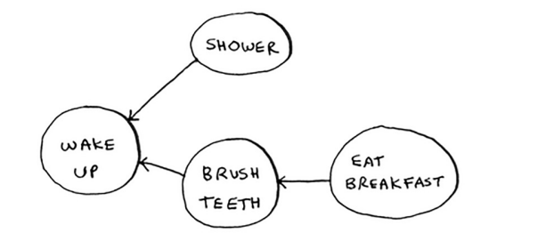

Bu sizga tishlarimni yuvmagunimcha nonushta qila olmasligimni aytadi. Shunday qilib, "nonushta qilish" "tishlarni cho'tkasi" ga `bog'liq`. Boshqa tomondan, dush qabul qilish tishlarimni yuvishga bog'liq emas, chunki men tishlarimni yuvishdan oldin dush olishim mumkin. Ushbu grafikdan siz ertalabki tartibimni bajarishim kerak bo'lgan tartiblar ro'yxatini tuzishingiz mumkin:

1. Uyg'oning.

2. Dush.

3. Tishlarni tozalang.

4. Nonushta qiling.

E'tibor bering, "dush" ni ko'chirish mumkin, shuning uchun bu ro'yxat ham amal qiladi:

1. Uyg'oning.

2. Tishlarni tozalang.

3. Dush.

4. Nonushta qiling.

6.3 Ushbu uchta ro'yxat uchun har birining haqiqiy yoki noto'g'ri ekanligini belgilang.

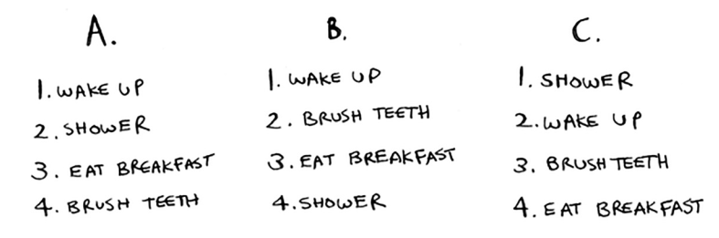

6.4 Mana kattaroq grafik. Ushbu grafik uchun to'g'ri ro'yxat tuzing.

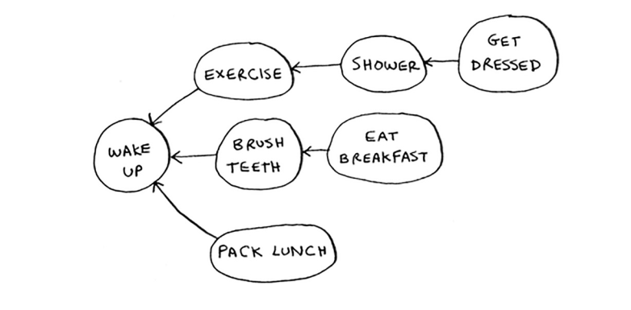

Aytish mumkinki, bu ro'yxat qaysidir ma'noda tartiblangan. Agar A vazifasi B vazifasiga bog'liq bo'lsa, A vazifasi keyinroq ro'yxatda ko'rsatiladi. Bu `topologik tartib` deb ataladi va bu grafikdan tartiblangan ro'yxatni yaratish usulidir. Aytaylik, siz to'yni rejalashtirmoqdasiz va bajarilishi kerak bo'lgan vazifalarga to'la katta grafik bor - va siz qaerdan boshlashni bilmayapsiz. Grafikni `topologik` tarzda tartiblashingiz va bajariladigan vazifalar ro'yxatini tartibda olishingiz mumkin.


Aytaylik, sizda oilaviy daraxt bor.

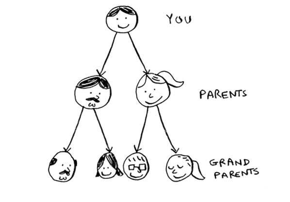

Bu grafik, chunki sizda tugunlar (odamlar) va qirralar mavjud. Qirralar tugunlarning ota-onalariga ishora qiladi. Ammo barcha qirralar pastga tushadi - oila daraxtining chekkasi yuqoriga qaragan bo'lishi mantiqiy emas! Bu ma'nosiz bo'lar edi - sizning dadangiz bobongizning dadasi bo'la olmaydi!

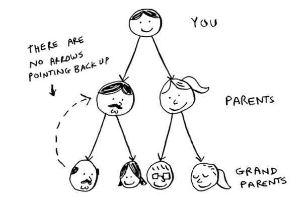

Bu `daraxt` deyiladi. Daraxt - bu grafikning maxsus turi bo'lib, uning qirralari hech qachon orqaga ishora qilmaydi.

6.5 Quyidagi grafiklardan qaysi biri ham daraxtlardir?

