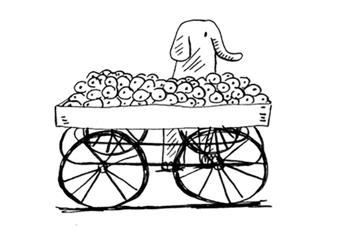

# Recap

• Kenglik boʻyicha birinchi qidiruv sizga A dan B gacha yoʻl bor-yoʻqligini bildiradi.

• Agar yo'l bo'lsa, kenglikdan birinchi bo'lib qidiruv eng qisqa yo'lni topadi.

• Agar sizda "eng qisqa X ni toping" kabi muammo bo'lsa, muammoingizni grafik sifatida modellashtirishga harakat qiling va hal qilish uchun birinchi navbatda kenglikdagi qidiruvdan foydalaning.

• Yo'naltirilgan grafikda strelkalar mavjud va munosabatlar o'q yo'nalishi bo'yicha bo'ladi (rama -> adit "rama aditdan qarzdor" degan ma'noni anglatadi).

• Yo'naltirilmagan grafiklarda o'qlar yo'q va munosabatlar har ikki tomonga ham boradi (ross - rachel "ross dated rachel va rachel dated ross" degan ma'noni anglatadi).

• Navbatlar FIFO (birinchi kirsa, birinchi chiqadi).

• Stacklar LIFO (oxirgi kirish, birinchi chiqish).

• Odamlarni qidiruv ro'yxatiga qo'shilgan tartibda tekshirishingiz kerak, shuning uchun qidiruv ro'yxati navbat bo'lishi kerak. Aks holda, siz eng qisqa yo'lni olmaysiz.

• Biror kishini tekshirganingizdan so'ng, uni boshqa tekshirmasligingizga ishonch hosil qiling. Aks holda, siz cheksiz tsiklga tushib qolishingiz mumkin.

