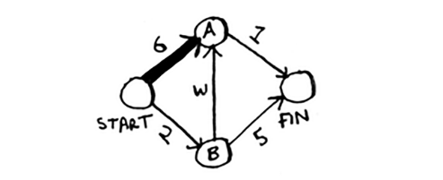
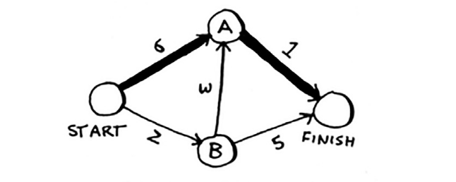

# Working with Dijkstra's algorithm

Keling, ushbu grafik bilan qanday ishlashini ko'rib chiqaylik.

Har bir segmentda bir necha daqiqada sayohat vaqti bor. Eng qisqa vaqt ichida boshidan oxirigacha borish uchun siz Dijkstra algoritmidan foydalanasiz.

Agar siz ushbu grafikda birinchi bo'lib qidiruvni amalga oshirsangiz, eng qisqa yo'lni olasiz.

Ammo bu yo'l 7 daqiqa davom etadi. Keling, ko'rib chiqaylik, siz kamroq vaqt talab qiladigan yo'lni topa olasizmi? Dijkstra algoritmiga to'rtta qadam bor:

1. "Eng arzon" tugunni toping. Bu siz eng kam vaqt ichida kirishingiz mumkin bo'lgan tugun.

2. Ushbu tugunning qo'shnilarining xarajatlarini yangilang. Bu bilan nimani nazarda tutayotganimni tez orada tushuntiraman.

3. Grafikdagi har bir tugun uchun buni bajarmaguningizcha takrorlang.

4. Yakuniy yo'lni hisoblang.

**1-qadam**: Eng arzon tugunni toping. Siz boshida turibsiz, A tuguniga yoki B tuguniga o'tish kerakmi, deb o'ylaysiz. Har bir tugunga borish uchun qancha vaqt ketadi?

A tuguniga 6 daqiqa, B tuguniga esa 2 daqiqa ketadi. Qolgan tugunlarni siz hali bilmaysiz. Hali marraga yetib borish uchun qancha vaqt ketishini bilmasligingiz sababli, siz cheksizlikni qo'yasiz (nega buni tez orada tushunasiz). B tugun - eng yaqin tugun ... u 2 daqiqa uzoqlikda.

**2-qadam**: B tugunining barcha qo'shnilariga qancha vaqt ketishini B tugunining chetiga qarab hisoblang.

Hey, siz A tuguniga qisqaroq yo'lni topdingiz! Ilgari A tuguniga yetib borish uchun 6 daqiqa vaqt ketadi.

Ammo agar siz B tugunidan o'tsangiz, atigi 5 daqiqa davom etadigan yo'l bor!

B ning qo'shnisi uchun qisqaroq yo'lni topsangiz, uning narxini yangilang. Bunday holda siz topdingiz

• A ga qisqaroq yo'l (6 daqiqadan 5 daqiqagacha)

• Marraga qisqaroq yo'l (cheksizlikdan 7 daqiqagacha)

**3-qadam**: takrorlang!

**Yana 1-qadam**: Eng kam vaqt ketadigan tugunni toping. Siz B tugunini bajardingiz, shuning uchun A tugunida keyingi eng kichik vaqt hisobi mavjud.

**Yana 2-qadam**: A tugunining qo'shnilari uchun xarajatlarni yangilang.

Voy, hozir marraga yetib borish uchun 6 daqiqa kerak!

Siz har bir tugun uchun Dijkstra algoritmini ishga tushirdingiz (tugun tugun uchun uni ishga tushirishingiz shart emas). Bu vaqtda, bilasiz

* B tuguniga borish uchun 2 daqiqa vaqt ketadi.

* A tuguniga borish uchun 5 daqiqa vaqt ketadi.

* Marraga yetib borish uchun 6 daqiqa vaqt ketadi.

Men oxirgi bosqichni, oxirgi yo'lni hisoblab, keyingi bo'lim uchun saqlayman. Hozircha men sizga oxirgi yo'l nima ekanligini ko'rsataman.

Kenglikdagi birinchi qidiruv buni eng qisqa yo'l deb topa olmasdi, chunki u uchta segmentga ega. Va ikkita segmentda boshidan oxirigacha borishning bir usuli bor.

Oxirgi bobda siz ikkita nuqta orasidagi eng qisqa yo'lni topish uchun kenglik-birinchi qidiruvdan foydalangansiz. O'sha paytda "eng qisqa yo'l" eng kam segmentli yo'lni anglatardi. Ammo Dijkstra algoritmida siz har bir segmentga raqam yoki vazn berasiz. Keyin Dijkstra algoritmi eng kichik umumiy og'irlikdagi yo'lni topadi.

Xulosa qilib aytganda, Dijkstra algoritmi to'rt bosqichdan iborat:
1. Eng arzon tugunni toping. Bu siz eng kam vaqt ichida kirishingiz mumkin bo'lgan tugun.

2. Ushbu tugunning qo'shnilariga arzonroq yo'l bor-yo'qligini tekshiring. Agar shunday bo'lsa, ularning xarajatlarini yangilang.

3. Grafikdagi har bir tugun uchun buni bajarmaguningizcha takrorlang.

4. Yakuniy yo'lni hisoblang. (Keyingi bo'limda keladi!)