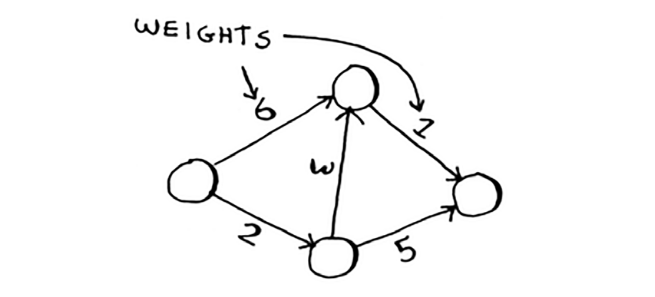
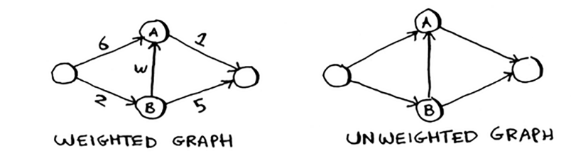
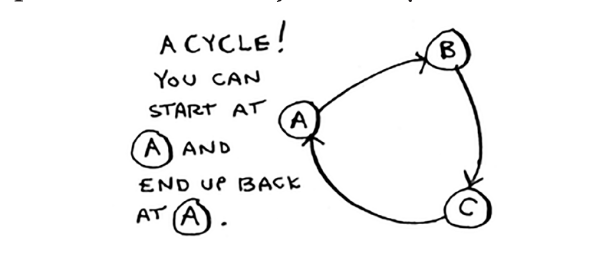
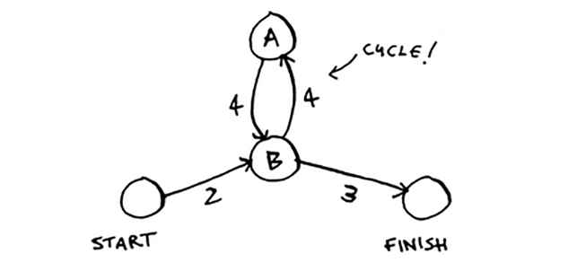
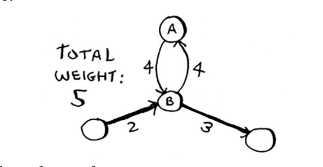
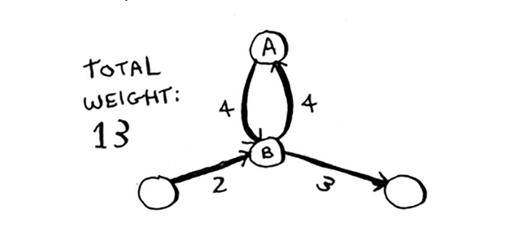
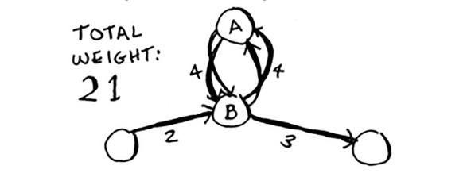
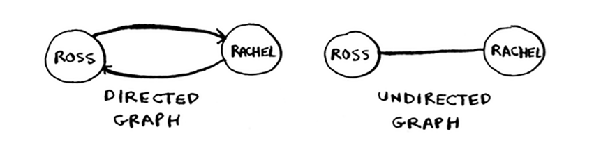
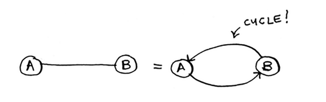

# Terminology

Men sizga Dijkstra algoritmining yana bir nechta misollarini ko'rsatmoqchiman. Lekin avval ba'zi atamalarga aniqlik kiritib o'tsam.

Dijkstra algoritmi bilan ishlaganingizda, grafikning har bir chetida u bilan bog'langan raqam mavjud. Bu `og'irliklar` deb ataladi.

Og'irliklari bo'lgan grafik `vaznli grafik` deb ataladi. Og'irliklari bo'lmagan grafik `og'irliksiz grafik` deyiladi.

Og'irlanmagan grafikdagi eng qisqa yo'lni hisoblash uchun birinchi navbatda `kenglik qidiruvidan` foydalaning. Og'irlangan grafikdagi eng qisqa yo'lni hisoblash uchun `Dijkstra algoritmidan` foydalaning. Grafiklarda `tsikllar` ham bo'lishi mumkin. Tsikl shunday ko'rinadi.

Bu siz tugundan boshlashingiz, aylanib o'tishingiz va xuddi shu tugunda tugashingiz mumkinligini anglatadi. Aytaylik, siz ushbu grafikda tsikli bo'lgan eng qisqa yo'lni topishga harakat qilyapsiz.

Tsiklga amal qilish mantiqiy bo'ladimi? Xo'sh, siz tsikldan qochadigan yo'ldan foydalanishingiz mumkin.

Yoki siz tsiklni kuzatishingiz mumkin.

Siz har qanday holatda ham A tuguniga kelasiz, lekin tsikl ko'proq og'irlik qo'shadi. Agar xohlasangiz, tsiklni ikki marta kuzatishingiz mumkin.

Ammo har safar tsiklni kuzatib borganingizda, siz umumiy vaznga faqat 8 qo'shasiz. Shunday qilib, tsiklni kuzatish sizga hech qachon eng qisqa yo'lni bermaydi.

Va nihoyat, 6-bobdagi yo'naltirilgan va yo'naltirilmagan grafiklar haqidagi suhbatimizni eslaysizmi?

Yo'naltirilmagan grafik ikkala tugun bir-biriga ishora qilishini anglatadi. Bu tsikl!

Yo'naltirilmagan grafik bilan har bir chekka yana bir tsikl qo'shadi. Dijkstra algoritmi faqat qisqacha `DAG` deb ataladigan `yo'naltirilgan asiklik grafiklar` bilan ishlaydi.