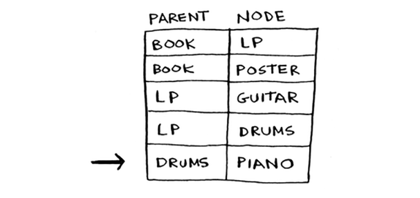

# Trading for a piano

Terminologiya yetarli, keling, boshqa misolni ko'rib chiqaylik! Bu Rama. Rama musiqa kitobini pianinoga almashtirmoqchi.

"Men sizga kitobingiz uchun bu afishani beraman", deydi Aleks. "Bu mening sevimli guruhim Destroyerning posteri. Yoki men sizga kitobingiz uchun Rik Astlining noyob LP va yana 5 dollarni beraman". "Oh, men LP-da juda ajoyib qo'shiq borligini eshitganman", deydi Emi. "Men sizga gitara yoki barabanni afisha yoki LP uchun almashtiraman."

"Men gitara chalishni orzu qilardim!" - deb xitob qiladi Betxoven. "Hey, men senga pianinoni Emining biron bir narsasiga almashtiraman." 

Mukammal! Bir oz pul bilan Rama pianino kitobidan haqiqiy pianinoga aylana oladi. Endi u bu savdolarni amalga oshirish uchun eng kam pulni qanday sarflashni aniqlashi kerak. Keling, unga nima taklif qilinganini chizamiz.

Ushbu grafikda tugunlar Rama savdo qilishi mumkin bo'lgan barcha narsalardir. Qirralardagi og'irliklar - bu savdoni amalga oshirish uchun to'lashi kerak bo'lgan pul miqdori. Shunday qilib, u afishani gitara uchun 30 dollarga yoki LPni gitara uchun 15 dollarga almashtirishi mumkin. Rama eng kam xamir sarflaydigan kitobdan pianinogacha bo'lgan yo'lni qanday aniqlaydi? Deykstraning algoritmi qutqarish uchun! Esingizda bo'lsin, Dijkstra algoritmi to'rt bosqichdan iborat. Ushbu misolda siz barcha to'rt bosqichni bajarasiz, shuning uchun siz oxirida yakuniy yo'lni ham hisoblaysiz.

Boshlashdan oldin, sizga ba'zi sozlash kerak. Har bir tugun uchun xarajatlar jadvalini tuzing. Tugunning narxi - unga borish qanchalik qimmat.

Algoritm davom etar ekan, siz ushbu jadvalni yangilab turasiz. Yakuniy yo'lni hisoblash uchun ushbu jadvalda `ota-ona ustuni` ham kerak.

Tez orada bu ustun qanday ishlashini ko'rsataman. Algoritmni boshlaylik.

`1-qadam`: Eng arzon tugunni toping. Bu holda, afisha eng arzon savdo hisoblanadi, 0 dollar. Afishada savdo qilishning arzonroq usuli bormi? Bu juda muhim nuqta, shuning uchun bu haqda o'ylab ko'ring. Ramaga afishani $0 dan kamroq narxda oladigan bir qator savdolarni ko'ra olasizmi? Tayyor bo'lgach, o'qing. Javob: Yo'q. *Chunki afisha Rama erishishi mumkin bo'lgan eng arzon tugundir, uni arzonroq qilishning hech qanday usuli yo'q*. Bu erda unga qarashning boshqa usuli. Aytaylik, siz uydan ishga ketyapsiz.

Agar siz maktab tomon yo'lni tutsangiz, bu 2 daqiqa davom etadi. Agar siz park tomon yo'lni tutsangiz, bu 6 daqiqa davom etadi. Istirohat bog'iga boradigan yo'lni bosib, maktabga 2 daqiqadan kamroq vaqt ichida borishingiz mumkinmi? Bu mumkin emas, chunki parkga borish uchun 2 daqiqadan ko'proq vaqt ketadi. Boshqa tomondan, siz parkga tezroq yo'l topa olasizmi? Ha.

Bu Dijkstra algoritmining asosiy g'oyasi: *Grafikingizdagi eng arzon tugunga qarang. Ushbu tugunga borishning arzonroq usuli yo'q*!

Musiqa misoliga qaytish. Plakat eng arzon savdo hisoblanadi.

`2-qadam`: Qo'shnilariga borish uchun qancha vaqt kerakligini aniqlang (xarajat).

Jadvalda sizda bas gitara va baraban uchun narxlar bor. Ularning qiymati siz afishadan o'tganingizda o'rnatildi, shuning uchun afisha ularning ota-onasi sifatida o'rnatiladi. Ya'ni, bas gitaraga o'tish uchun siz afishaning chetiga ergashasiz va barabanlar uchun ham xuddi shunday.

`Yana 1-qadam`: LP - 5 dollardan keyingi eng arzon tugun.

`Yana 2-qadam`: Barcha qo'shnilarining qiymatlarini yangilang.

Hey, siz baraban va gitara narxini yangiladingiz! Bu shuni anglatadiki, LP dan chetga chiqib, baraban va gitaraga borish arzonroq. Shunday qilib, siz LPni ikkala asbob uchun yangi ota-ona sifatida o'rnatdingiz.

Bass gitara keyingi eng arzon buyumdir. Qo'shnilarini yangilang.

Mayli, gitarani pianinoga almashtirib, nihoyat pianino narxiga ega bo'ldingiz. Shunday qilib, siz gitarani ota-ona sifatida o'rnatdingiz. Nihoyat, oxirgi tugun, baraban to'plami.

Rama pianino uchun baraban to'plamini almashish orqali pianinoni yanada arzonroqqa olishi mumkin. `Shunday qilib, eng arzon savdo to'plami Ramaga 35 dollar turadi`. Endi, men va'da qilganimdek, yo'lni aniqlab olishingiz kerak. Hozirgacha eng qisqa yo'l 35 dollarga tushishini bilasiz, lekin yo'lni qanday aniqlash mumkin? Boshlash uchun, `pianino` uchun ota-onaga qarang.

Pianinoning ota-onasi sifatida baraban bor. Bu degani, Rama pianino uchun barabanlarni almashtiradi. Shunday qilib, siz ushbu chekkaga ergashasiz.

Keling, chekkalarni qanday kuzatib borishingizni ko'rib chiqaylik. Pianinoning ota-onasi sifatida baraban bor.

Barabanlar esa LP ga ega.

Shunday qilib, Rama LPni barabanlarga almashtiradi. Va, albatta, u kitobni LP uchun almashtiradi. Ota-onaga orqaga ergashsangiz, endi siz to'liq yo'lga egasiz.

Mana, Rama qilish kerak bo'lgan savdolar seriyasi.

Hozirgacha men `eng qisqa` yo'l atamasini tom ma'noda ishlatib kelmoqdaman: ikkita joy yoki ikki kishi orasidagi eng qisqa yo'lni hisoblash. Umid qilamanki, bu misol sizga eng qisqa yo'l jismoniy masofa haqida bo'lishi shart emasligini ko'rsatdi. Bu biror narsani minimallashtirish haqida bo'lishi mumkin. Bu holatda Rama o'zi sarflagan pul miqdorini minimallashtirishni xohladi. Rahmat, Dijkstra!