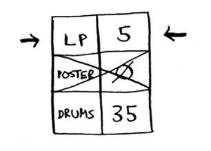

# Negative-weight edges

Savdo misolida Aleks kitobni ikkita narsaga almashtirishni taklif qildi.

Aytaylik, Sara LPni afishaga almashtirishni taklif qiladi va u `Ramaga qo'shimcha 7 dollar beradi`. Bu savdoni amalga oshirish uchun Rama hech narsa talab qilmaydi; Buning o'rniga u 7 dollarni qaytarib oladi. Buni grafikda qanday ko'rsatgan bo'lardingiz?

LP dan afishagacha bo'lgan chekka salbiy vaznga ega! Agar bu savdoni amalga oshirsa, Rama 7 dollar oladi. Endi Ramada afishaga borishning ikki yo'li bor.

Shunday qilib, ikkinchi savdoni amalga oshirish mantiqiy - Rama shu tarzda 2 dollar oladi! Endi, esingizda bo'lsa, Rama afishani barabanga almashtirishi mumkin. Uning ikkita yo'li bor.

Ikkinchi yo'l unga 2 dollarga arzonroq turadi, shuning uchun u bu yo'lni tanlashi kerak, to'g'rimi? Xo'sh, taxmin qiling nima? Agar siz ushbu grafikda Dijkstra algoritmini ishlatsangiz, Rama noto'g'ri yo'ldan boradi. U uzoqroq yo'lni bosib o'tadi. *Agar manfiy og'irlikdagi qirralaringiz bo'lsa, siz Dijkstra algoritmidan foydalana olmaysiz*. Salbiy og'irlikdagi qirralar algoritmni buzadi. Keling, Dijkstra algoritmini ishga tushirganingizda nima bo'lishini ko'rib chiqaylik. Birinchidan, xarajatlar jadvalini tuzing.

Keyinchalik, eng arzon tugunni toping va uning qo'shnilari uchun xarajatlarni yangilang. Bunday holda, afisha eng kam xarajatli tugun hisoblanadi. Shunday qilib, Dijkstra algoritmiga ko'ra, *afishaga kirishning $ 0 to'lashdan ko'ra arzonroq usuli yo'q* (bu noto'g'ri ekanligini bilasiz!). Yaxshiyamki, uning qo'shnilari uchun xarajatlarni yangilaymiz.

OK, barabanlarning narxi hozir 35 dollar.
Keling, qayta ishlanmagan keyingi eng arzon tugunni olaylik.

Qo'shnilari uchun xarajatlarni yangilang.

Siz afisha tugunini allaqachon qayta ishlagansiz, lekin uning narxini yangilayapsiz. Bu katta qizil bayroq. Tugunni qayta ishlaganingizdan so'ng, bu tugunga borishning arzonroq usuli yo'qligini anglatadi. Ammo siz afishaga arzonroq yo'l topdingiz! Barabanlarning qo'shnilari yo'q, shuning uchun algoritmning oxiri. Mana, yakuniy xarajatlar.

Barabanga borish uchun 35 dollar turadi. Siz atigi 33 dollar turadigan yo'l borligini bilasiz, ammo Dijkstra algoritmi uni topa olmadi. Dijkstra algoritmi siz poster tugunini qayta ishlayotganingiz uchun bu tugunga tezroq yetib borishning iloji yo'q deb taxmin qildi. Agar sizda salbiy og'irlikdagi qirralar bo'lmasa, bu taxmin ishlaydi. Shunday qilib, *siz Dijkstra algoritmi bilan salbiy og'irlikdagi qirralardan foydalana olmaysiz*. Agar siz manfiy og'irlikdagi qirralarga ega bo'lgan grafikdagi eng qisqa yo'lni topmoqchi bo'lsangiz, buning uchun algoritm mavjud! Bu *Bellman-Ford algoritmi* deb ataladi. Bellman-Ford ushbu kitobning doirasiga kirmaydi, lekin siz Internetda ba'zi ajoyib tushuntirishlarni topishingiz mumkin.