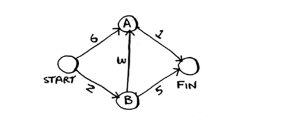

# Implementation

Keling, Dijkstra algoritmini kodda qanday amalga oshirishni ko'rib chiqaylik. Mana misol uchun men foydalanadigan grafik.



Ushbu misolni kodlash uchun sizga uchta hash-jadval kerak bo'ladi.


Algoritm rivojlanishi bilan siz xarajatlar va ota-onalarning xesh jadvallarini yangilaysiz. Birinchidan, siz grafikni amalga oshirishingiz kerak. Siz 6-bobdagi kabi xesh jadvalidan foydalanasiz:

#### Python
```python
grafik = {}
```

#### Golang
```go
grafik := make(map[string]map[string]int)
```

Oxirgi bobda siz tugunning barcha qo'shnilarini xesh jadvalida saqladingiz, masalan:

#### Python
```python
grafik ["you"] = ["alisa", "bob", "claire"]
```

#### Golang
```go
grafik["you"] = map[string]int{"alisa": 2, "bob": 2, "claire": 5}
```

Ammo bu safar siz qo'shnilarni saqlashingiz kerak va qo'shniga borish xarajatlari. Misol uchun, Startning ikkita qo'shnisi bor, A va B.

Ushbu qirralarning og'irliklarini qanday ifodalaysiz? Nima uchun boshqa hash jadvalidan foydalanmaslik kerak?

#### Python
```python
graph["start"] = {}
graph["start"]["a"] = 6
graph["start"]["b"] = 2
```

#### Golang
```go
graph["start"] = map[string]int{}
graph["start"]["a"] = 6
graph["start"]["b"] = 2
```


Demak, graph["start"] hash-jadvaldir. Siz barcha qo'shnilarni olishingiz mumkin

Shunday boshlang:
```
>>> grafikni chop etish ["start"].keys()
["a", "b"]
```
Boshidan Agacha va boshidan B gacha chekka bor. Agar bu qirralarning og'irliklarini topmoqchi bo'lsangiz-chi?
```
>>> grafikni chop etish["start"]["a"]
2
>>> grafikni chop etish["start"]["b"]
6
```

Keling, qolgan tugunlarni va ularning qo'shnilarini grafikga qo'shamiz:

```
graph["a"] = {}
graph["a"]["fin"] = 1
graph["b"] = {}
graph["b"]["a"] = 3
graph["b"]["fin"] = 5
graph["fin"] = {}     <- Tugatish tugunining qo'shnilari yo'q.
```

To'liq grafik xesh jadvali shunday ko'rinadi.


Keyin har bir tugun uchun xarajatlarni saqlash uchun hash jadvali kerak. 

Tugunning `narxi` bu tugunga boshidan qancha vaqt ketishini anglatadi. Bilasizmi, "Start"dan "B" tuguniga 2 daqiqa ketadi. "A" tuguniga yetib borish uchun 6 daqiqa vaqt ketishini bilasiz (garchi siz kamroq vaqt talab qiladigan yo'lni topishingiz mumkin). Siz tugatishga qancha vaqt ketishini bilmaysiz. Agar siz hali ham narxni bilmasangiz, siz cheksizlikni qo'yasiz. Pythonda *`cheksizlikni`* ifodalay olasizmi? Ma'lum bo'lishicha, siz:

```
infinity = float("inf")
```

Xarajatlar jadvalini tuzish uchun kod:

```
infinity = float("inf")
costs = {}
costs["a"] = 6
costs["b"] = 2
costs["fin"] = infinity
```

Ota-onalar uchun yana bir hash-jadval kerak:


Ota-onalar uchun xesh jadvalini yaratish uchun kod:

#### Python
```python
parents = {}
parents["a"] = "start"
parents["b"] = "start"
parents["fin"] = None
```

#### Golang
```go
parents := make(map[string]string)
parents["a"] = "start"
parents["b"] = "start"
parents["fin"] = ""
```

Va nihoyat, siz qayta ishlagan barcha tugunlarni kuzatib borish uchun massiv kerak, chunki tugunni bir necha marta qayta ishlashingiz shart emas:

#### Python
```python
processed = []
```

#### Golang
```go
processed := []string{}
```
Hammasi shu. Endi algoritmni ko'rib chiqaylik.


Men sizga avval kodni ko'rsataman va keyin u orqali o'ting. Mana kod:


#### Python

```python
node = find_lowest_cost_node(costs) # Find the lowest-cost node that you haven't processed yet.
while node is not None: #If you've processed all the nodes, this while loop is done.
    cost = costs[node]
    neighbors = graph[node]
    for n in neighbors.keys(): # Go through all the neighbors of this node.
        new_cost = cost + neighbors[n] # If it’s cheaper to get to this neighbor
        if costs[n] > new_cost: # by going through this node …
            costs[n] = new_cost # … update the cost for this node.
            parents[n] = node # This node becomes the new parent for this neighbor.
    processed.append(node) # Mark the node as processed.
    node = find_lowest_cost_node(costs) # Find the next node to process, and loop.
```

#### Golang
```go
node := findLowestCostNode(costs) // Find the lowest-cost node that you haven't processed yet.
for node != "" { // If you've processed all the nodes, this while loop is done.
    cost := costs[node]
    neighbors := graph[node]
    for n := range neighbors { // Go through all the neighbors of this node.
        newCost := cost + neighbors[n] // If it’s cheaper to get to this neighbor
        if costs[n] > newCost { // by going through this node …
            costs[n] = newCost // … update the cost for this node.
            parents[n] = node // This node becomes the new parent for this neighbor.
        }
    }
    processed = append(processed, node) // Mark the node as processed.
    node = findLowestCostNode(costs) // Find the next node to process, and loop.
}

```

Bu Pythondagi Dijkstra algoritmi! Men sizga funksiya kodini keyinroq ko'rsataman. Birinchidan, ushbu `find_lowest_cost_node` algoritm kodini amalda ko'rib chiqaylik.

Eng past narxga ega tugunni toping.


Ushbu tugunning narxini va qo'shnilarini oling.


Qo'shnilar orasidan o'ting.


Har bir tugunning narxi bor. Narx - bu tugunga boshidan qancha vaqt ketishi. Bu yerda siz Start > A tugun o'rniga Start > B tugun > A tuguniga o'tsangiz, A tuguniga qancha vaqt ketishini hisoblayapsiz.


Keling, ushbu xarajatlarni taqqoslaylik.


Siz A tuguniga qisqaroq yo'lni topdingiz! Narxni yangilang.


Yangi yo'l B tugunidan o'tadi, shuning uchun B ni yangi ota-ona sifatida belgilang.


OK, siz tsiklning yuqori qismiga qaytdingiz. Keyingi qo'shnisi Finish tugunidir.


Agar siz B tugunidan o'tsangiz, marraga qancha vaqt ketadi?


7 daqiqa davom etadi. Oldingi narx cheksiz daqiqalar edi va 7 daqiqa undan kamroq.


Finish tugunining yangi narxini va yangi ota-onani o'rnating.


OK, siz B tugunining barcha qoʻshnilari uchun xarajatlarni yangiladingiz. Uni qayta ishlangan deb belgilang.


Qayta ishlash uchun keyingi tugunni toping.


A tugunining narxini va qo'shnilarini oling.


A tugunining faqat bitta qo'shnisi bor: Finish tugun.


Hozirda Finish tuguniga borish uchun 7 daqiqa vaqt ketadi. Agar siz A tugunidan o'tsangiz, u erga qancha vaqt ketadi?


A tugunidan Finish ga borish tezroq! Narx va ota-onani yangilaymiz.


Barcha tugunlarni qayta ishlaganingizdan so'ng, algoritm tugadi. Umid qilamanki, ko'rsatma sizga algoritmni biroz yaxshiroq tushunishga yordam berdi. `find_lowest_cost_node` funksiyasi yordamida eng arzon tugunni topish juda oson. Bu kodda:

#### Python
```python
def find_lowest_cost_node(costs):
    lowest_cost = float("inf")
    lowest_cost_node = None
    for node in costs: # Go through each node.
        cost = costs[node]
        if cost < lowest_cost and node not in processed: # If it's the lowest cost so far and hasn't been processed yet …
            lowest_cost = cost # … set it as the new lowest-cost node.
            lowest_cost_node = node
    return lowest_cost_node
```

#### EXERCISES

7.1 Ushbu grafiklarning har birida boshidan oxirigacha bo'lgan eng qisqa yo'lning og'irligi qancha?

