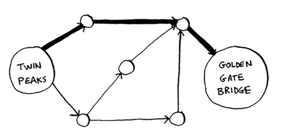
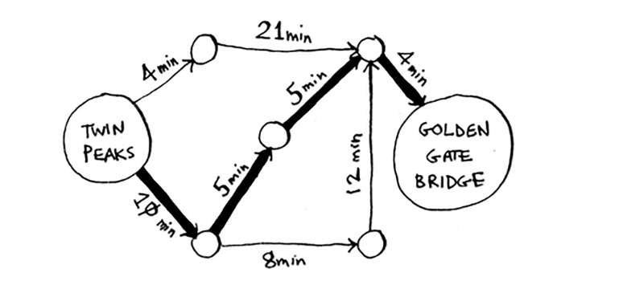

# Dijkstra's algorithm

• Biz grafiklarni muhokama qilishni davom ettiramiz va siz vaznli grafiklar haqida bilib olasiz: ba'zi qirralarga ko'proq yoki kamroq og'irlik berish usuli.

• Siz Dijkstra algoritmini o'rganasiz, bu sizga "Xga eng qisqa yo'l nima?"ss degan savolga javob berishga imkon beradi. vaznli grafiklar uchun.

• Siz Dijkstra algoritmi ishlamaydigan grafiklardagi sikllar haqida bilib olasiz.

Oxirgi bobda siz A nuqtadan B nuqtaga o'tish yo'lini aniqladingiz.

Bu eng tezkor yo'l bo'lishi shart emas. Bu eng qisqa yo'l, chunki u eng kam sonli segmentlarga ega (uch segment). Ammo siz ushbu segmentlarga sayohat vaqtlarini qo'shsangiz, deylik. Endi siz tezroq yo'l borligini ko'rasiz.

Oxirgi bobda birinchi boʻlib qidiruvdan foydalangansiz. Kenglik-birinchi qidiruv sizga eng kam segmentli yo'lni topadi (birinchi grafik bu erda ko'rsatilgan). Buning o'rniga eng tez yo'lni xohlasangiz nima bo'ladi (ikkinchi grafik)? Buni `Dijkstra algoritmi` deb ataladigan boshqa algoritm yordamida `eng tez` bajarishingiz mumkin.