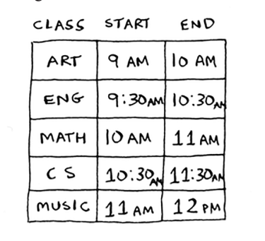
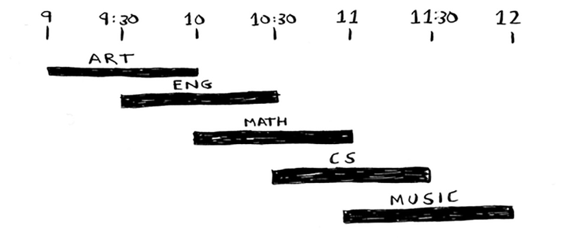
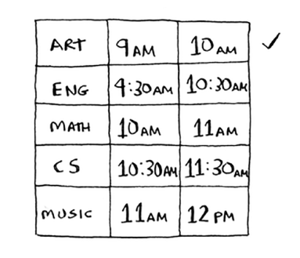
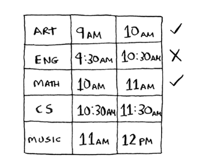
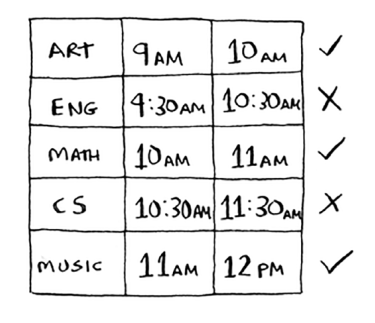
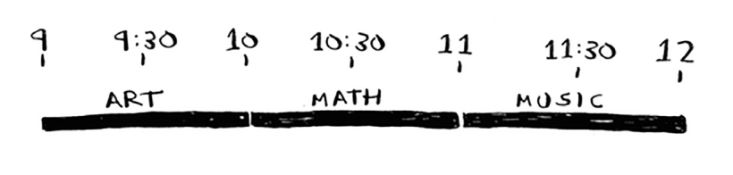

# The classrooom scheduling problem

Aytaylik, sizning sinfingiz bor va bu yerda imkon qadar ko'proq dars o'tkazmoqchisiz. Siz darslar ro'yxatini olasiz.

Siz bu sinflarning `barchasini` u erda ushlab turolmaysiz, chunki ularning ba'zilari bir-biriga mos keladi.

Siz ushbu sinfda imkon qadar ko'proq dars o'tkazmoqchisiz. Mumkin bo'lgan eng katta darslar to'plamiga ega bo'lish uchun qanday darslar to'plamini o'tkazishni qanday tanlaysiz?

Bu qiyin muammoga o'xshaydi, to'g'rimi? Aslida, algoritm juda oson, u sizni hayratda qoldirishi mumkin. Bu qanday ishlaydi:

1. Eng tez tugaydigan sinfni tanlang. Bu siz ushbu sinfda o'tadigan birinchi darsdir.

2. Endi siz birinchi darsdan keyin boshlanadigan sinfni tanlashingiz kerak. Shunga qaramay, eng tez tugaydigan sinfni tanlang. Bu siz o'tadigan ikkinchi sinf.

Buni qilishda davom eting va siz javob olasiz! Keling, sinab ko'raylik. San'at tezroq, soat 10:00 da tugaydi, shuning uchun siz tanlagan darslardan biri.

Endi sizga soat 10:00 dan keyin boshlanadigan va tezroq tugaydigan keyingi dars kerak.

Ingliz tili o'chirildi, chunki u San'atga zid keladi, lekin matematika ishlaydi.
Nihoyat, CS Matematikaga zid keladi, lekin Musiqa ishlaydi.

Shunday qilib, siz ushbu sinfda o'tadigan uchta sinfdir.

Ko'pchilik menga bu algoritm oson ko'rinishini aytadi. Bu juda aniq, shuning uchun noto'g'ri bo'lishi kerak. Ammo bu ochko'z algoritmlarning go'zalligi: ular oson! Ochko'zlik algoritmi oddiy: har bir qadamda optimal harakatni tanlang. Bunday holda, har safar sinfni tanlaganingizda, eng tez tugaydigan sinfni tanlaysiz. Texnik nuqtai nazardan: `har bir qadamda siz mahalliy optimal yechimni tanlaysiz` va oxir-oqibat global miqyosda optimal yechim bilan qolasiz. Ishoning yoki ishonmang, bu oddiy algoritm ushbu rejalashtirish muammosiga optimal yechim topadi! 

Shubhasiz, ochko'z algoritmlar har doim ham ishlamaydi. Lekin ularni yozish oson! Keling, boshqa misolni ko'rib chiqaylik.