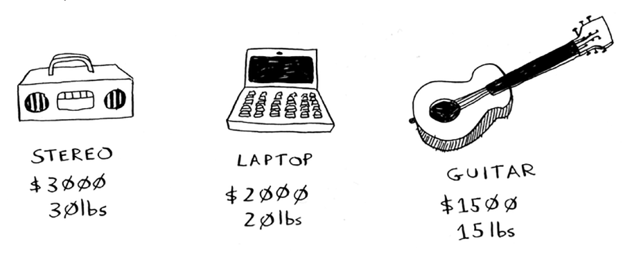
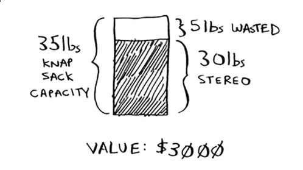
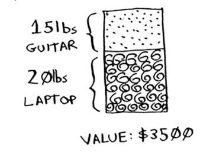

# The knapsack problem

Aytaylik, siz ochko'z o'g'risiz. Siz do'konda sumkangiz bor va siz o'g'irlashingiz mumkin bo'lgan barcha narsalar mavjud. Ammo siz faqat sumkangizga sig'adigan narsalarni olishingiz mumkin. Yukxalta 35 funtni sig'dira oladi.

  Siz sumkangizga qo'ygan narsalaringizning qiymatini maksimal darajada oshirishga harakat qilyapsiz. Siz qanday algoritmdan foydalanasiz?

Yana ochko'zlik strategiyasi juda oddiy:

1. Yukxaltangizga mos keladigan eng qimmat narsani tanlang.

2. Yukxaltangizga mos keladigan keyingi eng qimmat narsani tanlang. Va hokazo. 

Bu vaqtdan tashqari, u ishlamaydi! Misol uchun, siz o'g'irlashingiz mumkin bo'lgan uchta narsa bor deylik.

Sizning yukxaltangiz 35 kilogramm narsalarni sig'dira oladi. Stereo tizim eng qimmat, shuning uchun siz uni o'g'irlaysiz. Endi sizda boshqa hech narsa uchun joy yo'q.

Sizda 3000 dollarlik mahsulot bor. Lekin kuting! Agar siz uning o'rniga noutbuk va gitara tanlagan bo'lsangiz, 3500 dollarlik o'lja olishingiz mumkin edi!

Shubhasiz, ochko'z strategiya bu erda sizga optimal echimni bermaydi. Ammo bu sizni juda yaqinlashtiradi. Keyingi bobda men to'g'ri echimni qanday hisoblashni tushuntiraman. Ammo agar siz savdo markazida o'g'ri bo'lsangiz, siz mukammallikka ahamiyat bermaysiz. "Juda yaxshi" etarli darajada yaxshi.

Mana bu ikkinchi misoldan xulosa: ba'zida mukammallik yaxshilikning dushmanidir. Ba'zan sizga muammoni juda yaxshi hal qiladigan algoritm kerak bo'ladi. Va bu erda ochko'z algoritmlar porlaydi, chunki ular yozish uchun oddiy va odatda juda yaqin.

#### EXERCISES

* 8.1 Siz mebel kompaniyasida ishlaysiz va siz butun mamlakat bo'ylab mebel jo'natishingiz kerak. Yuk mashinangizni qutilar bilan o'rashingiz kerak. Barcha qutilar turli o'lchamlarga ega va siz har bir yuk mashinasida foydalanadigan joyni maksimal darajada oshirishga harakat qilyapsiz. Bo'sh joyni kengaytirish uchun qutilarni qanday tanlaysiz? Ochko'z strategiyani o'ylab toping. Bu sizga optimal yechimni beradimi?

* 8.2 Siz Evropaga ketyapsiz va sizda hamma narsani ko'rish uchun etti kuningiz bor. Siz har bir elementga ball qiymatini belgilaysiz (uni qancha ko'rishni xohlaysiz) va qancha vaqt ketishini hisoblaysiz. Turganingizda qanday qilib umumiy ballni maksimal darajada oshirishingiz mumkin (ko'rishni xohlagan barcha narsalarni ko'rish)? Ochko'z strategiyani o'ylab toping. Bu sizga optimal yechimni beradimi?

Keling, oxirgi misolni ko'rib chiqaylik. Bu ochko'z algoritmlar mutlaqo zarur bo'lgan misoldir.