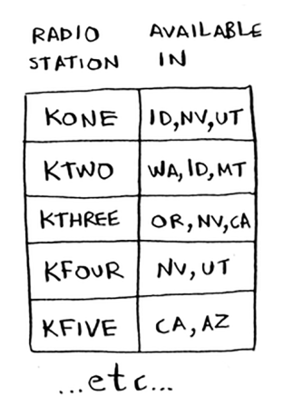
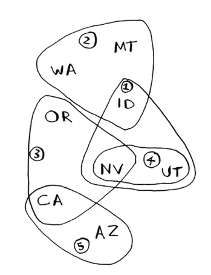
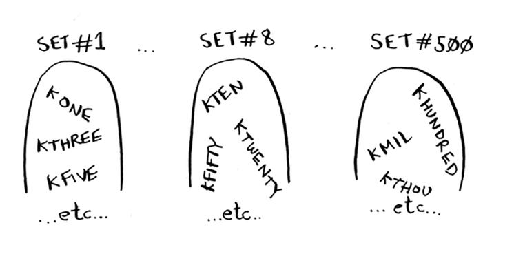
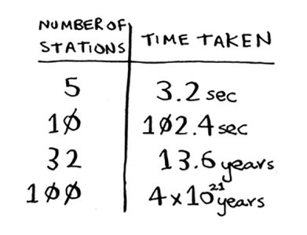
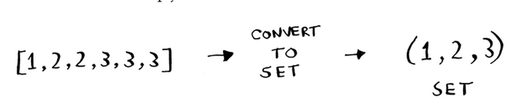
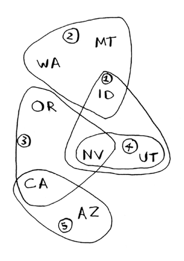
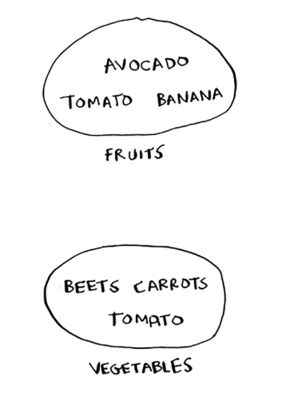
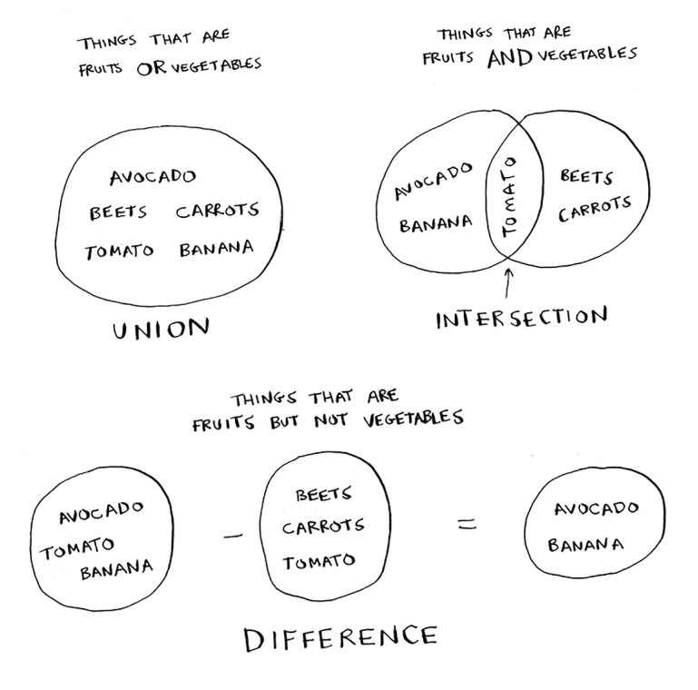
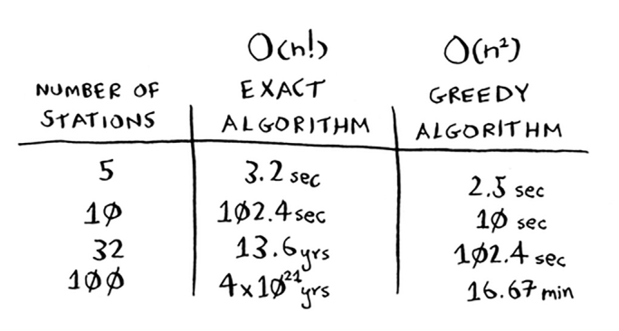

# The set-covering problem

Siz radio ko'rsatuvini boshlayapsiz deylik. Siz barcha 50 shtatdagi tinglovchilarga murojaat qilmoqchisiz. Barcha tinglovchilarga erishish uchun qaysi stantsiyalarda o'ynashni hal qilishingiz kerak. Har bir stantsiyada bo'lish pul talab qiladi, shuning uchun siz o'ynagan stantsiyalar sonini kamaytirishga harakat qilyapsiz. Sizda stantsiyalar ro'yxati bor.

Har bir stantsiya hududni qamrab oladi va u erda bir-birining ustiga chiqadi. 



Barcha 50 shtatni qamrab oladigan eng kichik stantsiyalar to'plamini qanday aniqlash mumkin? Oson tuyuladi, shunday emasmi? Bu juda qiyin ekan. Buni qanday qilish kerak: 



1. Har bir mumkin boʻlgan stansiyalar toʻplamini sanab oʻting. Bu `quvvat to'plami` deb ataladi. 2^n ta mumkin boʻlgan kichik toʻplamlar mavjud.



2. Ulardan barcha 50 shtatni qamrab oluvchi eng kam sonli stansiyalarni tanlang.

Muammo shundaki, barcha mumkin bo'lgan stansiyalar to'plamini hisoblash uchun ko'p vaqt talab etiladi. Bu O(2^n) vaqtni oladi, chunki 2^n stantsiya mavjud. Agar sizda 5 dan 10 tagacha stantsiyalar mavjud bo'lsa, buni qilish mumkin. Ammo bu erdagi barcha misollar bilan, agar sizda juda ko'p narsa bo'lsa, nima bo'lishini o'ylab ko'ring. Agar sizda ko'proq stantsiya bo'lsa, bu ko'proq vaqt talab etadi. Aytaylik, siz soniyada 10 ta kichik to'plamni hisoblashingiz mumkin.

Buni `etarlicha tez hal qiladigan algoritm yo'q`! Siz nima qila olasiz?



## Approximation algorithms

Qutqarish uchun ochko'z algoritmlar! Mana, juda yaqin keladigan ochko'z algoritm:

1. Hali qamrab olinmagan eng ko'p shtatlarni qamrab oladigan stantsiyani tanlang. Agar stantsiya allaqachon qamrab olingan ba'zi shtatlarni qamrab olsa, yaxshi bo'ladi.

2. Barcha holatlar qoplanmaguncha takrorlang.

Bu `taxminiy algoritm` deb ataladi. Aniq echimni hisoblashda juda ko'p vaqt talab etiladi, taxminiy algoritm ishlaydi. Taxminlovchi algoritmlar tomonidan baholanadi

* Ular qanchalik tez
* Ularning optimal yechimga qanchalik yaqinligi

Ochko'z algoritmlar yaxshi tanlovdir, chunki ularni o'ylab topish oson emas, balki bu oddiylik ular odatda tez ishlaydi. Bunday holda, ochko'zlik algoritmi `O (n ^ 2)` vaqtida ishlaydi, bu erda n - radiostantsiyalar soni.

Keling, ushbu muammo kodda qanday ko'rinishini ko'rib chiqaylik.

### Code for setup

Ushbu misol uchun men oddiy narsalarni saqlash uchun shtatlar va stansiyalarning kichik to'plamidan foydalanmoqchiman.

Birinchidan, qamrab olmoqchi bo'lgan davlatlar ro'yxatini tuzing:

#### Python
```python
states_needed = set(["mt", "wa", "or", "id", "nv", "ut", "ca", "az"]) # You pass an array in, and it gets converted to a set.
```

#### Golang
```go
states_needed = []string{"mt", "wa", "or", "id", "nv", "ut", "ca", "az"} // You pass an array in, and it gets converted to a set.
```

Buning uchun men to'plamdan foydalandim. To'plam ro'yxatga o'xshaydi, bundan tashqari har bir element to'plamda faqat bir marta ko'rsatilishi mumkin. `Toʻplamlarda dublikat boʻlishi mumkin emas`. Misol uchun, sizda ushbu ro'yxat bor edi deylik:

```
>>> arr = [1, 2, 2, 3, 3, 3]
```

Va siz uni to'plamga aylantirdingiz:

```
>>> set(arr)
set([1, 2, 3])
```

1, 2 va 3 to'plamda faqat bir marta paydo bo'ladi.



Shuningdek, siz tanlagan stantsiyalar ro'yxati kerak. Buning uchun hashdan foydalanishni tanladim:

#### Python

```python
stations = {}
stations["kone"] = set(["id", "nv", "ut"])
stations["ktwo"] = set(["wa", "id", "mt"])
stations["kthree"] = set(["or", "nv", "ca"])
stations["kfour"] = set(["nv", "ut"])
stations["kfive"] = set(["ca", "az"])
```

#### Golang
```go
stations = map[string]map[string]struct{}{
    "kone": {"id", "nv", "ut"},
    "ktwo": {"wa", "id", "mt"},
    "kthree": {"or", "nv", "ca"},
    "kfour": {"nv", "ut"},
    "kfive": {"ca", "az"},
}
```
Kalitlar stansiya nomlari, qiymatlar esa ular qamrab olgan holatlardir. Shunday qilib, ushbu misolda kone stantsiyasi Aydaho, Nevada va Yuta shtatlarini qamrab oladi. Barcha qiymatlar ham to'plamdir. Har bir narsani to'plamga aylantirish hayotingizni osonlashtiradi, buni tez orada ko'rasiz.

Nihoyat, siz foydalanadigan so'nggi stantsiyalar to'plamini ushlab turish uchun sizga biror narsa kerak bo'ladi:



#### Python
```python
final_stations = set()
```

#### Golang
```go
final_stations = []string{}
```

### Calculating the answer
Endi siz qaysi stantsiyalardan foydalanishingizni hisoblashingiz kerak. O'ngdagi rasmga qarang va qaysi stantsiyalardan foydalanish kerakligini taxmin qila olasizmi yoki yo'qligini bilib oling.

Bir nechta to'g'ri echim bo'lishi mumkin. Siz har bir stantsiyani bosib o'tishingiz va eng ko'p ochilgan shtatlarni qamrab oladigan stantsiyani tanlashingiz kerak. Men buni `best_station` deb nomlayman:

#### Python
```python
best_station = None
states_covered = set()
for station, states_for_station in stations.items():
```

#### Golang
```go
best_station = ""
states_covered = []string{}
for station, states_for_station := range stations.items() {

}
```

`states_covered` - bu stansiya qamrab olgan, hali qamrab olinmagan barcha shtatlarning to'plami. `For` tsikli har bir stantsiyani aylanib o'tishga imkon beradi va qaysi stantsiya eng yaxshi ekanligini ko'rishga imkon beradi. `For` tsiklining tanasini ko'rib chiqaylik:

#### Python
```python
    covered = states_needed & states_for_station
    if len(covered) > len(states_covered): # New syntax! This is called a set intersection.
        best_station = station
        states_covered = covered
```

#### Golang
```go
    covered := states_needed & states_for_station
    if len(covered) > len(states_covered): // New syntax! This is called a set intersection.
        best_station = station
        states_covered = covered
```

Bu erda kulgili ko'rinadigan chiziq bor:

```
covered = states_needed & states_for_station
```

Nima gaplar?

#### Sets
Aytaylik, sizda mevalar to'plami bor.
Sizda sabzavotlar to'plami ham bor.



Ikkita to'plamingiz bo'lsa, ular bilan qiziqarli narsalarni qilishingiz mumkin.

Bu erda siz to'plamlar bilan qilishingiz mumkin bo'lgan ba'zi narsalar.



• To'plam birlashmasi "ikkala to'plamni birlashtirish" degan ma'noni anglatadi.

• To'plamning kesishishi "ikkala to'plamda ko'rsatilgan narsalarni toping" degan ma'noni anglatadi (bu holda faqat pomidor).

• To'plamdagi farq "bir to'plamdagi narsalarni boshqa to'plamdagi elementlardan ayirish" degan ma'noni anglatadi.

Masalan:

```python
>>> fruits = set(["avocado", "tomato", "banana"])
>>> vegetables = set(["beets", "carrots", "tomato"])
>>> fruits | vegetables # This is a set union.
set(["avocado", "beets", "carrots", "tomato", "banana"])
>>> fruits & vegetables # This is a set intersection.
set(["tomato"])
>>> fruits - vegetables # This is a set difference.
set(["avocado", "banana"])
>>> vegetables - fruits # What do you think this will do?
```

Xulosa qilish uchun:
* To'plamlar ro'yxatlarga o'xshaydi, faqat to'plamlarda dublikat bo'lishi mumkin emas.

* To'plamlarda birlashma, kesishish va farq kabi qiziqarli amallarni bajarishingiz mumkin

#### Back to the code

Keling, asl misolga qaytaylik.
Bu o'rnatilgan kesishma:

#### Python
```python
covered = states_needed & states_for_station
```

#### Golang
```go
covered := states_needed & states_for_station
```

`covered` shtatlar to'plami bo'lib, har ikkala `shtatlarda_kerakli` va `stansiyalarda_shtatlarda` bo'lgan. Bu stansiya `qamrab olgan` ochilmagan holatlar to'plami shunday qoplangan! Keyin bu stantsiya joriy `best_stationdan` ko'proq shtatlarni qamrab olishini tekshirasiz:

#### Python
```python
if len(covered) > len(states_covered):
    best_station = station
    states_covered = covered
```

#### Golang
```go
if len(covered) > len(states_covered):
    best_station = station
    states_covered = covered
```

Agar shunday bo'lsa, bu stansiya yangi `best_station` hisoblanadi. Nihoyat, for tsikli tugagandan so'ng, siz `best_station` ni stansiyalarning yakuniy ro'yxatiga qo'shasiz:

#### Python
```python
final_stations.add(best_station)
```

#### Golang
```go
final_stations = append(final_stations, best_station)
```

Shuningdek, states_needed-ni yangilashingiz kerak. Ushbu stantsiya ba'zi shtatlarni qamrab olganligi sababli, bu shtatlar endi kerak emas:

```
states_needed -= states_covered
```

Va `states_needed` bo'sh bo'lguncha tsiklni bajarasiz. Mana tsikl uchun to'liq kod:

#### Python
```python
while states_needed:
    best_station = None
    states_covered = set()
    for station, states in stations.items():
        covered = states_needed & states
        if len(covered) > len(states_covered):
            best_station = station
            states_covered = covered
states_needed -= states_covered
final_stations.add(best_station)
```

#### Golang
```go
for states_needed := range stations {
    best_station := ""
    states_covered := []string{}
    for station, states := range stations {
        covered := states_needed & states
        if len(covered) > len(states_covered) {
            best_station = station
            states_covered = covered
        }
    }
}
states_needed -= states_covered
final_stations = append(final_stations, best_station)
```

Nihoyat, `final_stations` chop etishingiz mumkin va siz buni ko'rishingiz kerak:

```
>>> print final_stations
set(["ktwo", "kthree", "kone", "kfive"])
```

Siz kutganingiz shumi? 1, 2, 3 va 5-stansiyalar oʻrniga siz 2, 3, 4 va 5-stansiyalarni tanlashingiz mumkin edi.
aniq algoritmga ochko'z algoritm.



#### EXERCISES
Ushbu algoritmlarning har biri uchun bu ochko'z algoritmmi yoki yo'qligini ayting.

8.3 Tez tartiblash

8.4 Kenglik-birinchi qidiruv

8.5 Deykstra algoritmi
