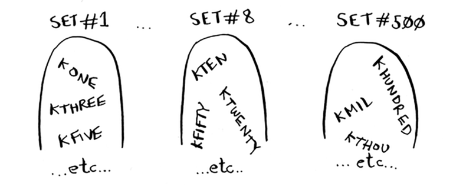
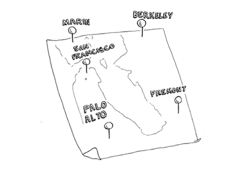
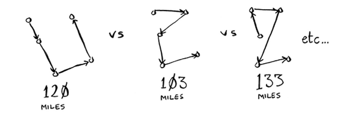

# NP-complete problems

To'plamni qoplash muammosini hal qilish uchun siz barcha mumkin bo'lgan to'plamlarni hisoblashingiz kerak edi.

Ehtimol, sizga 1-bobdagi sayohatchi sotuvchi muammosi eslatilgandir. Ushbu muammoda sotuvchi besh xil shaharga tashrif buyurishi kerak.

Va u uni barcha beshta shaharga olib boradigan eng qisqa yo'lni aniqlashga harakat qilmoqda. Eng qisqa marshrutni topish uchun avval barcha mumkin bo'lgan marshrutni hisoblashingiz kerak.

Beshta shahar uchun qancha marshrutni hisoblashingiz kerak?

