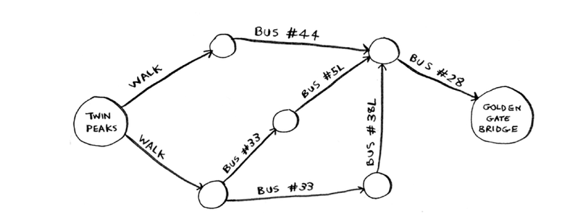

# Traveling salesperson, step by step

Kichikdan boshlaylik. Aytaylik, sizda faqat ikkita shahar bor. Tanlash uchun ikkita yo'nalish mavjud.

> Xuddi shu yo'nalishmi yoki boshqachami?
> 
> Bu bir xil yo'l bo'lishi kerak deb o'ylashingiz mumkin. Axir, SF > Marin Marin > SF bilan bir xil masofa emasmi? Majburiy emas. Ba'zi shaharlarda (masalan, San-Fransiskoda) bir tomonlama ko'chalar juda ko'p, shuning uchun siz kelgan yo'lingizga qaytolmaysiz. Magistral yo'lga chiqish yo'lini topish uchun yo'ldan 1 yoki 2 mil nariga borishingiz kerak bo'lishi mumkin.
Shunday qilib, bu ikki yo'nalish bir xil bo'lishi shart emas.

"Sayohatchi sotuvchi muammosida siz qaysi shahardan boshlashingiz kerak?" Deb hayron bo'lishingiz mumkin. Masalan, men sayohatchi sotuvchiman deylik. Men San-Fransiskoda yashayman va yana to'rtta shaharga borishim kerak. San-Fransisko mening boshlang'ich shahrim bo'lardi.

Ammo ba'zida boshlang'ich shahar belgilanmagan. Aytaylik, siz FedEx bo'lib, Bay hududiga paketni yetkazib bermoqchisiz. Paket Chikagodan Bay hududidagi 50 ta FedEx manzillaridan biriga olib ketilmoqda. Keyin bu paket yuk mashinasida ketadi, u turli joylarga paketlarni etkazib beradi. Qaysi manzilga uchish kerak? Bu erda boshlanish joyi noma'lum. Optimal yo'lni hisoblash va sayohatchi sotuvchi uchun joylashishni boshlash sizga bog'liq.

Ikkala versiyaning ishlash muddati bir xil. Biroq, agar aniq boshlanish shahri bo'lmasa, bu osonroq misol, shuning uchun men o'sha versiya bilan boraman.

Ikki shahar = ikkita mumkin bo'lgan yo'nalish.

#### 3 ta shahar
Endi siz yana bitta shahar qo'shdingiz deylik. Qancha mumkin bo'lgan yo'nalishlar mavjud?

Agar siz Berkli shahridan boshlasangiz, tashrif buyuradigan yana ikkita shaharingiz bor

Jami oltita marshrut mavjud, har bir shahar uchun ikkitadan boshlashingiz mumkin.

Shunday qilib, uchta shahar = oltita mumkin bo'lgan yo'nalish.

#### 4 ta shahar
Keling, boshqa shaharni, Fremontni qo'shamiz. Endi siz Fremontdan boshladingiz deylik.

Fremontdan boshlab oltita mumkin bo'lgan yo'nalish mavjud. Va hey! Ular siz ilgari hisoblagan oltita marshrutga juda o'xshaydi, o'shanda sizda bor-yo'g'i uchta shahar bor edi. Endi barcha yo'nalishlarda qo'shimcha shahar bor, Fremont! Bu erda naqsh mavjud. Aytaylik, sizda to'rtta shahar bor va siz Fremont shahrini tanlaysiz. Uchta shahar qoldi. Va bilasizki, agar uchta shahar bo'lsa, bu shaharlar orasida olti xil yo'nalish mavjud. Agar siz Fremontdan boshlasangiz, oltita mumkin bo'lgan yo'nalish mavjud. Boshqa shaharlardan birida ham boshlashingiz mumkin.

To'rtta mumkin bo'lgan boshlang'ich shahar, har bir boshlang'ich shahar uchun oltita mumkin bo'lgan yo'nalish = 4 * 6 = 24 ta mumkin bo'lgan yo'nalish.

Shaklni ko'ryapsizmi? Har safar yangi shahar qo'shsangiz, hisoblashingiz kerak bo'lgan yo'nalishlar sonini oshirasiz.

Oltita shahar uchun nechta mumkin bo'lgan yo'nalish mavjud? Agar siz 720 ni taxmin qilgan bo'lsangiz, siz haqsiz. 7 shahar uchun 5 040, 8 shahar uchun 40 320.

Bu `faktorial funktsiya` deb ataladi (bu haqda 3-bobda o'qishni eslaysizmi?). Shunday qilib, 5! = 120. Aytaylik, sizda 10 ta shahar bor. Qancha mumkin bo'lgan yo'nalishlar mavjud? 10! = 3 628 800. 10 ta shahar uchun 3 `milliondan` ortiq mumkin bo'lgan marshrutlarni hisoblashingiz kerak. Ko'rib turganingizdek, mumkin bo'lgan yo'nalishlar soni juda tez ko'payadi! Shu sababli, agar sizda ko'p shaharlar bo'lsa, sayohatchi-sotuvchi muammosi uchun "to'g'ri" yechimni hisoblash mumkin emas.

Sayohatchi-sotuvchi muammosi va to'plamni qoplash muammosi ikkalasida ham umumiy narsa bor: siz har qanday yechimni hisoblab chiqasiz va eng kichik/eng qisqasini tanlaysiz. Bu muammolarning ikkalasi ham `NP-to'liqdir`.

> Approximating 
>
> Sayohatchi sotuvchi uchun yaxshi taxminiy algoritm nima? Qisqa yo'lni topadigan oddiy narsa. O'qishdan oldin javob topa olasizmi yoki yo'qligini bilib oling.
> 
> Men buni qanday qilardim: o'zboshimchalik bilan boshlang'ich shaharni tanlang. Keyin, har safar sotuvchi tashrif buyurish uchun keyingi shaharni tanlashi kerak bo'lganda, ular eng yaqin tashrif buyurilmagan shaharni tanlaydilar. Aytaylik, ular Marin shahridan boshlanadi.
>
> 
>
> Umumiy masofa: 71 milya. Ehtimol, bu eng qisqa yo'l emas, lekin u hali ham juda qisqa.

Mana NP-to'liqligining qisqacha izohi: ba'zi muammolarni hal qilish juda qiyin. Sayohatchi sotuvchi va to'plamni qoplash muammosi ikkita misoldir. Ko'pgina aqlli odamlar bu muammolarni tezda hal qiladigan algoritm yozish mumkin emas deb o'ylashadi.
## How do you tell if a problem is NP-complete?

Yunus o'zining fantastik futbol jamoasi uchun o'yinchilarni tanlamoqda. U xohlagan qobiliyatlar ro'yxatiga ega: yaxshi himoyachi, yaxshi orqaga yugurish, yomg'irda yaxshi, bosim ostida yaxshi va hokazo. Unda har bir o'yinchi ba'zi qobiliyatlarni bajaradigan o'yinchilar ro'yxati bor.

Yunusga uning barcha imkoniyatlarini to'ldiradigan jamoa kerak va jamoa hajmi cheklangan. «Bir soniya kutib turing», deb tushunadi Yunus. "Bu to'plamni qamrab oladigan muammo!"

Yunus o'z jamoasini yaratish uchun xuddi shu taxminiy algoritmdan foydalanishi mumkin:

1. Hali bajarilmagan qobiliyatlarni eng ko'p bajaradigan o'yinchini toping.

2. Jamoa barcha qobiliyatlarni bajarmaguncha takrorlang (yoki sizda jamoada bo'sh joy qolmaydi).

NP-to'liq muammolar hamma joyda namoyon bo'ladi! Siz hal qilmoqchi bo'lgan muammo NP-to'liq yoki yo'qligini bilish juda yoqimli. O'sha paytda siz uni mukammal hal qilishga urinishni to'xtatib, uning o'rniga taxminiy algoritm yordamida hal qilishingiz mumkin. Lekin siz ustida ishlayotgan muammo NP-to'liq yoki yo'qligini aytish qiyin. Odatda hal qilish oson bo'lgan muammo va NP-to'liq muammo o'rtasida juda kichik farq bor. Misol uchun, oldingi boblarda men eng qisqa yo'llar haqida ko'p gapirganman. A nuqtadan B nuqtaga o'tishning eng qisqa yo'lini qanday hisoblashni bilasiz.

Ammo agar siz bir nechta nuqtalarni bog'laydigan eng qisqa yo'lni topmoqchi bo'lsangiz, bu sayohatchi-sotuvchi muammosi, ya'ni NP-to'liq. Qisqa javob: siz ishlayotgan muammo NP-to'liq yoki yo'qligini aniqlashning oson yo'li yo'q. Mana bir nechta sovg'alar:

• Algoritmingiz bir nechta elementlar bilan tez ishlaydi, lekin ko'proq elementlar bilan haqiqatan ham sekinlashadi.

• "X ning barcha kombinatsiyalari" odatda NP to'liq muammosiga ishora qiladi.

• X ning "har qanday mumkin bo'lgan versiyasini" hisoblashingiz kerakmi, chunki uni kichikroq kichik muammolarga ajrata olmaysizmi? NP-to'liq bo'lishi mumkin.

• Agar muammoingiz ketma-ketlikni o'z ichiga olsa (masalan, sayohatchi sotuvchi kabi shaharlar ketma-ketligi) va uni hal qilish qiyin bo'lsa, u NP-to'liq bo'lishi mumkin.

• Agar muammoingiz to'plam bilan bog'liq bo'lsa (masalan, radiostansiyalar to'plami) va uni hal qilish qiyin bo'lsa, u NP tugallangan bo'lishi mumkin.

• Muammoingizni to'plam muammosi yoki sayohatchi-sotuvchi muammosi sifatida qayta ko'rsata olasizmi? Keyin sizning muammoingiz, albatta, NP-to'liqdir.

#### EXERCISES
8.6 Pochtachi 20 ta uyga yetkazib berishi kerak. U barcha 20 ta uyga boradigan eng qisqa yo'lni topishi kerak. Bu NP-to'liq muammomi?

8.7 Odamlar to'plamidagi eng katta guruhni topish (klik - bu bir-birini taniydigan odamlar to'plami). Bu NP-to'liq muammomi?

8.8 Siz AQSh xaritasini yaratyapsiz va siz qo'shni shtatlarni turli ranglar bilan bo'yashingiz kerak. Ikki qo'shni davlat bir xil rangga ega bo'lmasligi uchun sizga kerak bo'lgan ranglarning minimal sonini topishingiz kerak. Bu NP-to'liq muammomi?