# The knapsack problem
Keling, 8-bobdagi yukxalta muammosini qayta ko'rib chiqaylik. Siz 4 funt yuk ko'tara oladigan yukxalta bilan o'g'risiz.

Sizda yukxalta ichiga qo'yishingiz mumkin bo'lgan uchta narsa bor.

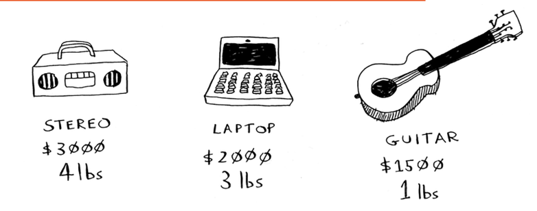

Maksimal pul qiymatiga ega bo'lgan tovarlarni o'g'irlash uchun qanday narsalarni o'g'irlash kerak?

## The simple solution
Eng oddiy algoritm bu: siz barcha mumkin bo'lgan tovarlar to'plamini sinab ko'rasiz va sizga eng ko'p qiymat beradigan to'plamni topasiz.

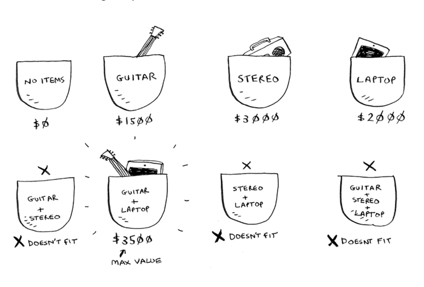

Bu ishlaydi, lekin u juda sekin. 3 ta element uchun siz 8 ta mumkin bo'lgan to'plamni hisoblashingiz kerak. 4 ta element uchun siz 16 ta to'plamni hisoblashingiz kerak. Siz qo'shgan har bir element bilan hisoblashingiz kerak bo'lgan to'plamlar soni ikki baravar ko'payadi! Bu algoritm O(2^n) vaqtni oladi, bu juda va juda sekin.

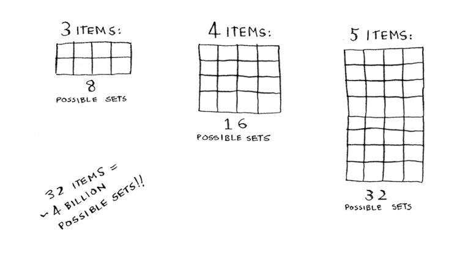

Bu har qanday o'rtacha miqdordagi tovarlar uchun amaliy emas. 8-bobda siz `taxminiy` yechimni qanday hisoblashni ko'rdingiz. Bu yechim optimal yechimga yaqin bo'ladi, lekin u optimal yechim bo'lmasligi mumkin. Xo'sh, optimal echimni qanday hisoblash mumkin?

## Dynamic programming
Javob: Dinamik dasturlash bilan! Keling, bu erda dinamik dasturlash algoritmi qanday ishlashini ko'rib chiqaylik. Dinamik dasturlash kichik muammolarni hal qilishdan boshlanadi va katta muammolarni hal qilish uchun tuziladi. Yukxalta muammosi uchun siz kichikroq sumkalar (yoki "sub-saplar") muammosini hal qilishdan boshlaysiz va keyin asl muammoni hal qilishga harakat qilasiz.

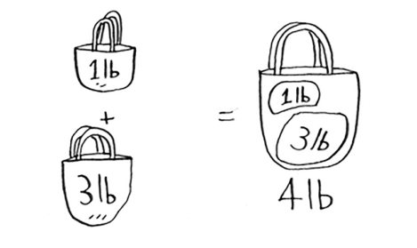

`Dinamik dasturlash - bu qiyin tushuncha, shuning uchun uni darhol qabul qilmasangiz, tashvishlanmang`. Biz ko'plab misollarni ko'rib chiqamiz. 

Avval sizga algoritmni amalda ko'rsatishdan boshlayman. Bir marta amalda ko'rganingizdan so'ng, sizda juda ko'p savollar bo'ladi! Men har bir savolga javob berishga harakat qilaman.

Har bir dinamik dasturlash algoritmi griddan boshlanadi. Mana yukxalta muammosi uchun panjara.

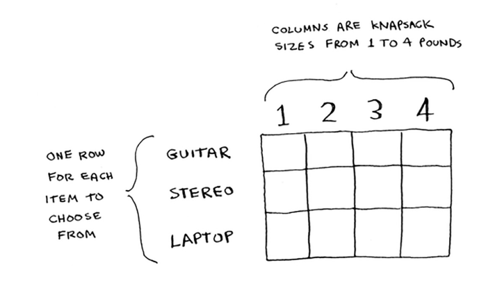

To'r satrlari elementlar, ustunlar esa 1 funtdan 4 funtgacha bo'lgan yukxalta og'irliklaridir. Sizga bu ustunlarning barchasi kerak, chunki ular pastki sumkalarning qiymatlarini hisoblashda yordam beradi. To'r bo'sh boshlanadi. Siz to'rning har bir katakchasini to'ldirasiz. To'r to'ldirilgandan so'ng, siz ushbu muammoga javob olasiz! Iltimos, kuzatib boring. O'zingizning katakchangizni yarating, biz uni birgalikda to'ldiramiz.

#### Gitara qatori
Men sizga ushbu to'rni hisoblashning aniq formulasini keyinroq ko'rsataman. Keling, avval ko'rib chiqaylik. Birinchi qatordan boshlang.

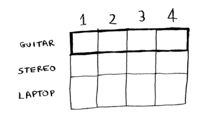

Bu `gitara` qatori, ya'ni siz gitarani yukxalta ichiga joylashtirishga harakat qilyapsiz. Har bir kamerada oddiy qaror bor: siz gitara o'g'irlaysizmi yoki yo'qmi? Esingizda bo'lsin, siz o'g'irlash uchun sizga eng katta qiymat beradigan narsalarni topishga harakat qilyapsiz.

Birinchi kamerada 1 funt sig'imli yukxalta bor. Gitara ham 1 funt, ya'ni u yukxalta ichiga sig'adi! Shunday qilib, bu katakning qiymati 1500 dollarni tashkil etadi va unda gitara bor.

Keling, katakchani to'ldirishni boshlaylik.

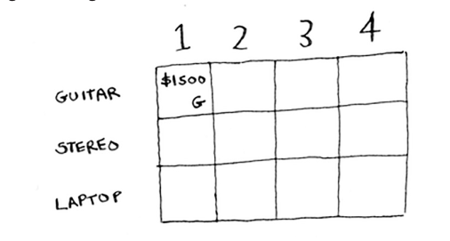

Shunga o'xshab, to'rdagi har bir katak o'sha nuqtada sumkaga mos keladigan barcha narsalar ro'yxatini o'z ichiga oladi.

Keling, keyingi katakchani ko'rib chiqaylik. Bu yerda sizda 2 funt sig'imli yukxalta bor. Xo'sh, gitara, albatta, u erga sig'adi!

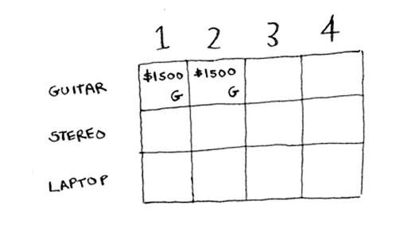

Bu qatordagi qolgan hujayralar uchun ham xuddi shunday. Esingizda bo'lsin, bu birinchi qator, shuning uchun sizda `faqat` gitara tanlashingiz mumkin. Siz qolgan ikkita narsani hozir o'g'irlash mumkin emas deb o'ylaysiz.

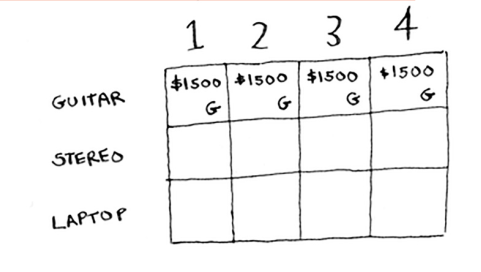

Bu vaqtda, ehtimol siz chalkashib ketgansiz. Muammo 4 lb yukxalta haqida gap ketganda, nega buni 1 funt, 2 funt va hokazo sig'imli sumkalar uchun qilyapsiz? Dinamik dasturlash kichik muammodan boshlanib, katta muammoga olib keladi, deb aytganimni eslaysizmi? Siz bu yerda katta muammoni hal qilishga yordam beradigan kichik muammolarni hal qilyapsiz. O'qing va hamma narsa aniqroq bo'ladi.

Ushbu nuqtada sizning to'ringiz shunday ko'rinishi kerak.

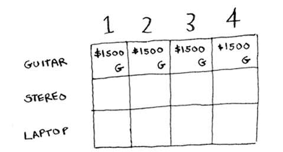

Esingizda bo'lsin, siz yukxalta qiymatini maksimal darajada oshirishga harakat qilyapsiz. *Bu qator shu maksimal uchun joriy eng yaxshi taxminni ifodalaydi*. Shunday qilib, hozirda, ushbu qatorga ko'ra, agar sizda 4 funt sig'imli yukxalta bo'lsa, u erga qo'yishingiz mumkin bo'lgan maksimal qiymat 1500 dollarni tashkil qiladi.

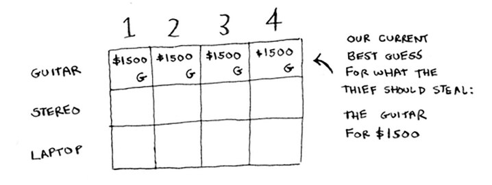

Bilasizmi, bu yakuniy yechim emas. Algoritmni ko'rib chiqsak, siz o'z taxminingizni aniqlaysiz.

#### The stereo row
Keyingi qatorni bajaramiz. Bu stereo uchun. Endi siz ikkinchi qatordasiz, siz stereo yoki gitara o'g'irlashingiz mumkin. Har bir qatorda siz ushbu qatordagi yoki uning ustidagi qatorlardagi narsalarni o'g'irlashingiz mumkin. Shunday qilib, siz hozir noutbukni o'g'irlashni tanlay olmaysiz, lekin siz stereo va / yoki gitara o'g'irlashingiz mumkin. Birinchi katakchadan boshlaylik, sig'imi 1 funt bo'lgan yukxalta. Siz 1 funt yukxalta ichiga sig'dira oladigan joriy maksimal qiymat 1500 dollarni tashkil qiladi.

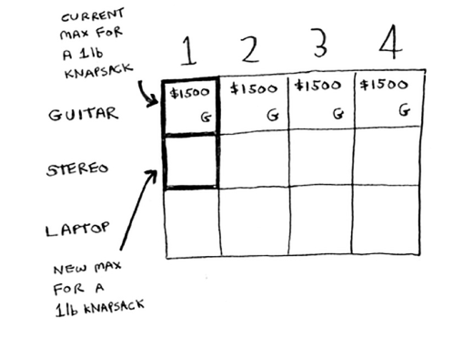

Stereoni o'g'irlash kerakmi yoki yo'qmi?

Sizda 1 funt sig'imli yukxalta bor. Stereo mos keladimi? Yo'q, bu juda og'ir! Stereo moslamani sig'dira olmaganingiz uchun 1 funtlik yukxalta uchun 1500 dollar maksimal taxmin bo'lib qoladi.

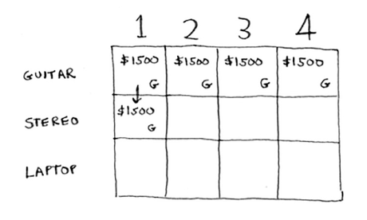

Keyingi ikkita hujayra uchun ham xuddi shunday. Bu sumkalar 2 funt va 3 funt sig'imga ega. Har ikkalasining eski maksimal qiymati 1500 dollar edi.

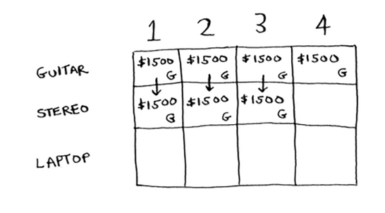

Stereo hali ham mos emas, shuning uchun sizning taxminlaringiz o'zgarishsiz qoladi. Agar sizda 4 funt sig'imli yukxalta bo'lsa-chi? Aha: stereo nihoyat mos keladi! Qadimgi maksimal qiymat 1500 dollar edi, lekin uning o'rniga stereoni qo'ysangiz, qiymat 3000 dollarni tashkil qiladi! Keling, stereoni olaylik.

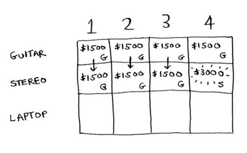

Siz hozirgina taxminingizni yangiladingiz! Agar sizda 4 funtlik yukxalta bo'lsa, unga kamida 3000 dollarlik tovarlar sig'ishi mumkin. Toʻrdan siz oʻz taxminingizni bosqichma-bosqich yangilayotganingizni koʻrishingiz mumkin.

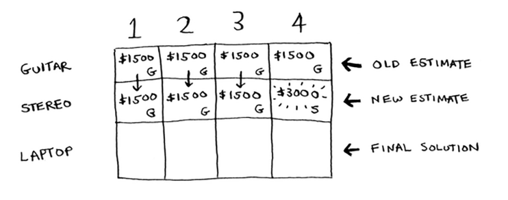

#### The laptop row
Keling, noutbuk bilan ham xuddi shunday qilaylik! Noutbukning og'irligi 3 funt, shuning uchun u 1 funt yoki 2 funt yukxalta ichiga sig'maydi. Dastlabki ikkita hujayraning taxminiy qiymati 1500 dollarni tashkil qiladi.

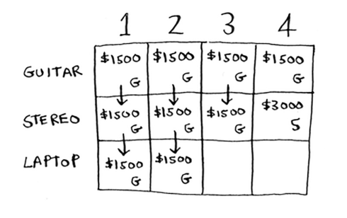

3 funt og'irlikda eski hisob 1500 dollar edi. Lekin uning o'rniga noutbukni tanlashingiz mumkin va bu 2000 dollarga teng. Shunday qilib, yangi maksimal taxmin $ 2,000!

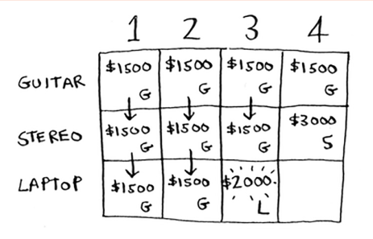

4 funtda narsalar juda qiziq bo'ladi. Bu muhim qism. Hozirgi taxmin 3000 dollarni tashkil qiladi. Noutbukni yukxalta ichiga qo'yishingiz mumkin, lekin u atigi 2000 dollar turadi.

Hmm, bu eski taxmin kabi yaxshi emas. Lekin kuting! Noutbukning og'irligi atigi 3 funt, shuning uchun sizda 1 funt bepul! Siz bu 1 funtga biror narsa qo'yishingiz mumkin.

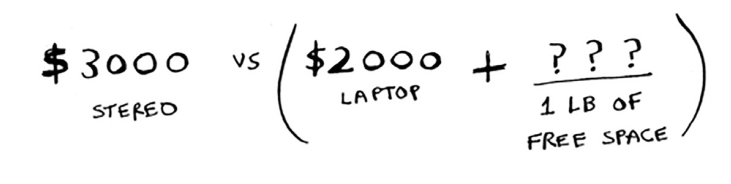

1 lb bo'sh joyga sig'adigan maksimal qiymat qancha? Xo'sh, siz hamma narsani hisoblab chiqdingiz.

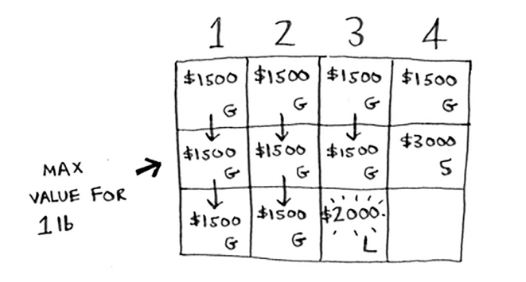

Oxirgi eng yaxshi hisob-kitoblarga ko'ra, siz gitarani o'sha 1 funtlik joyga sig'dira olasiz va bu 1500 dollarga teng. Shunday qilib, haqiqiy taqqoslash quyidagicha.

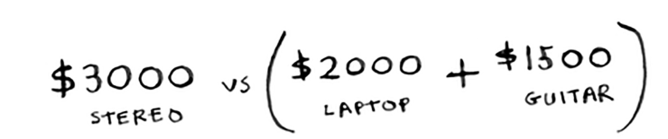

Siz nima uchun kichikroq sumkalar uchun maksimal qiymatlarni hisoblayotganingiz haqida hayron bo'lgandirsiz. Umid qilamanki, endi bu mantiqiy! Agar sizda bo'sh joy qolgan bo'lsa, ushbu bo'shliqqa nima mos kelishini aniqlash uchun ushbu kichik muammolarga javoblardan foydalanishingiz mumkin. Noutbukni + gitarani 3500 dollarga olish yaxshidir.

Yakuniy panjara shunday ko'rinadi.

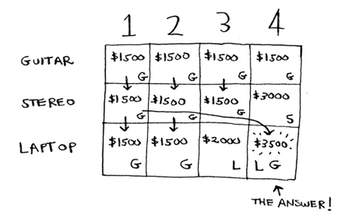

Javob bor: yukxalta ichiga sig'adigan maksimal qiymat gitara va noutbukdan tashkil topgan 3500 dollarni tashkil qiladi! Ehtimol, men o'sha oxirgi katakning qiymatini hisoblash uchun boshqa formuladan foydalangan deb o'ylaysiz. Buning sababi, men oldingi kataklarning qiymatlarini to'ldirishda keraksiz murakkablikni o'tkazib yubordim. Har bir hujayraning qiymati bir xil formula bilan hisoblanadi. Mana.

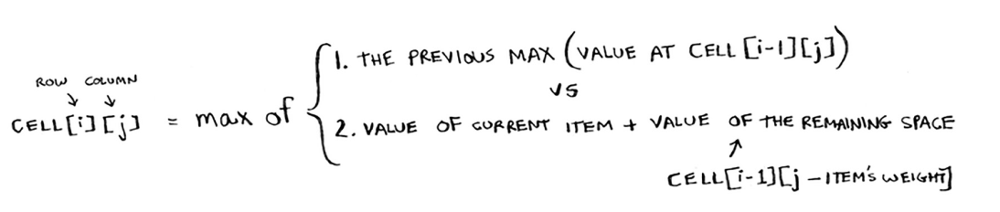

Siz ushbu formuladan ushbu to'rdagi har bir katak bilan foydalanishingiz mumkin va siz men qilgan to'rga ega bo'lishingiz kerak. Qanday qilib kichik muammolarni hal qilish haqida gapirganimni eslaysizmi? Kattaroq muammoni hal qilish uchun siz ikkita kichik muammoning echimlarini birlashtirdingiz.

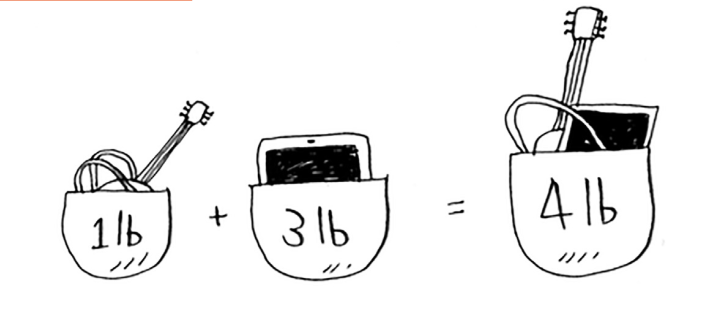