# Knapsack problem FAQ
Ehtimol, bu hali ham sehr kabi tuyuladi. Ushbu bo'lim ba'zi umumiy savollarga javob beradi.

## What happens if you add an item?

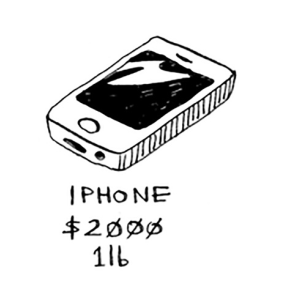

Faraz qilaylik, siz o'g'irlashingiz mumkin bo'lgan to'rtinchi narsa borligini tushundingiz, siz ilgari sezmagansiz! Shuningdek, siz iPhone-ni o'g'irlashingiz mumkin. Ushbu yangi elementni hisobga olish uchun hamma narsani qayta hisoblashingiz kerakmi? Yoq. Esda tutingki, dinamik dasturlash sizning taxminlaringizga asoslanib boradi. Hozircha 
bu maksimal qiymatlar.

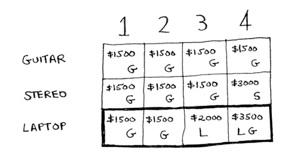

Ya'ni, 4 funtlik yukxalta uchun siz 3500 dollarlik tovarlarni o'g'irlashingiz mumkin. Siz buni oxirgi maksimal qiymat deb o'ylagan edingiz. Ammo iPhone uchun qator qo'shamiz.

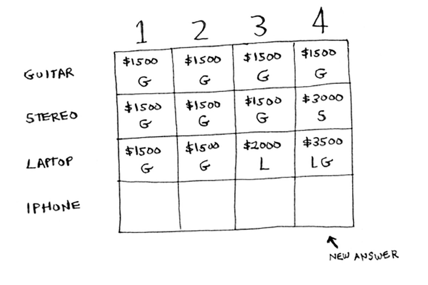

Ma'lum bo'lishicha, sizda yangi maksimal qiymat bor! O'qishdan oldin ushbu yangi qatorni to'ldirishga harakat qiling. Birinchi katakdan boshlaylik. iPhone 1 funtlik yukxalta ichiga sig'adi. Qadimgi maksimal 1500 dollar edi, lekin iPhone 2000 dollar turadi. Buning o'rniga iPhone ni olaylik.

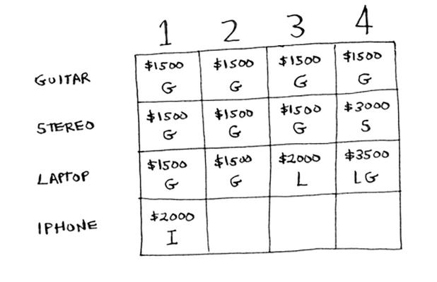

Keyingi katakda siz iPhone va gitara o'rnatishingiz mumkin.

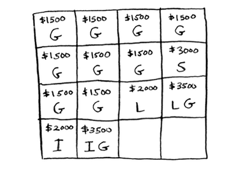

3-hujayra uchun siz iPhone va gitarani yana olishdan ko'ra yaxshiroq ish qila olmaysiz, shuning uchun uni avvalgidek qoldiring. Oxirgi katak uchun narsalar qiziqarli bo'ladi. Hozirgi maksimal 3500 dollar. Buning o'rniga siz iPhone-ni o'g'irlashingiz mumkin va sizda 3 funt bo'sh joy qoladi.

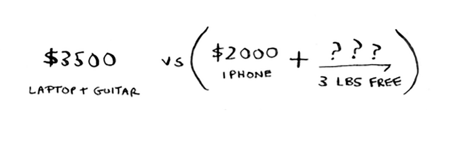

Bu 3 funt 2000 dollarga teng! iPhone-dan 2000 dollar + eski kichik muammodan 2000 dollar: bu 4000 dollar. Yangi maksimal! Mana yangi yakuniy tarmoq.

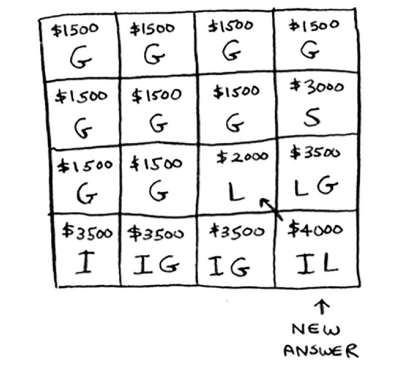

Savol: Ustunning qiymati hech qachon tushadimi? Bu mumkinmi?

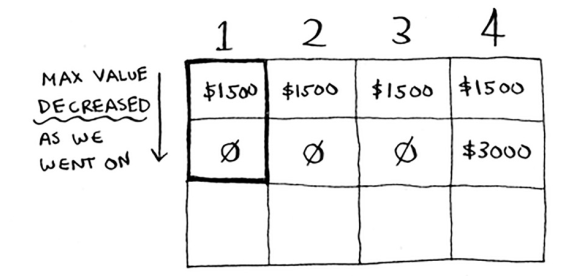

O'qishdan oldin javobni o'ylab ko'ring. Javob: Yoʻq. Har bir iteratsiyada siz joriy maksimal taxminni saqlayapsiz.

Hisob-kitob hech qachon avvalgidek yomonlasha olmaydi!

#### EXERCISES
9.1 Aytaylik, siz boshqa narsani o'g'irlashingiz mumkin: MP3 pleer. Uning vazni 1 funt va 1000 dollar turadi. Uni o'g'irlash kerakmi?

## What happens if you change the order of the rows?
Javob o'zgaradimi? Aytaylik, siz qatorlarni shu tartibda to'ldiring: stereo, noutbuk, gitara. To'r nimaga o'xshaydi? Davom etishdan oldin o'zingiz uchun katakchani to'ldiring. Mana, panjara qanday ko'rinishga ega.

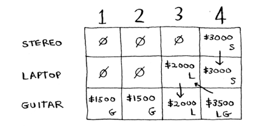

Javob o'zgarmaydi. Qatorlarning tartibi muhim emas.

## Can you fill in the grid column-wise instead of row-wise?

O'zingiz sinab ko'ring! Bu muammo uchun bu farq qilmaydi. Bu boshqa muammolar uchun farq qilishi mumkin.

## What happens if you add a smaller item?

Aytaylik, siz marjonlarni o'g'irlashingiz mumkin. Uning og'irligi 0,5 funt va 1000 dollarga teng. Hozircha sizning panjarangiz barcha og'irliklar butun sonlar deb hisoblaydi. Endi siz marjonlarni o'g'irlashga qaror qildingiz. Sizda 3,5 funt qoldi. 3,5 funtga sig'adigan maksimal qiymat qancha? Siz bilmaysiz! Siz faqat 1 lb, 2 lb, 3 lb va 4 lb yukxalta uchun qiymatlarni hisobladingiz. Siz 3,5 lb yukxalta qiymatini bilishingiz kerak.

*Marjon tufayli siz nozik tanelilikni hisobga olishingiz kerak, shuning uchun panjara o'zgarishi kerak.*

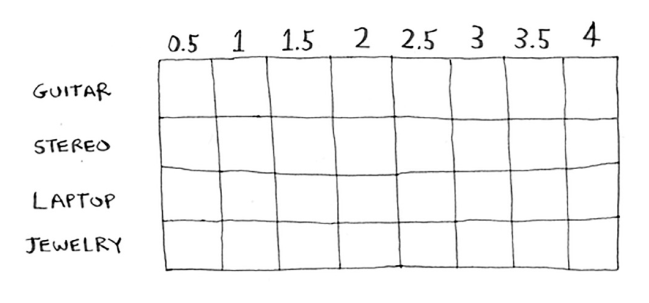

## Can you steal fractions of an item?

Aytaylik, siz oziq-ovqat do'konida o'g'risiz. Siz yasmiq va guruch qoplarini o'g'irlashingiz mumkin. Agar butun sumka mos kelmasa, uni ochib, ko'tara oladigan darajada olishingiz mumkin. Demak, endi hammasi emas yoki hech narsa emas - siz elementning bir qismini olishingiz mumkin. Buni dinamik dasturlash yordamida qanday hal qilasiz?

Javob: qila olmaysiz. Dinamik dasturlash yechimi bilan siz elementni olasiz yoki olmaysiz. Buyumning yarmini olishingiz kerakligini tushunishning hech qanday usuli yo'q.

Ammo bu holat ham ochko'z algoritm yordamida osonlik bilan hal qilinadi! Birinchidan, eng qimmatli narsadan imkon qadar ko'proq narsani oling. Bu tugagach, keyingi eng qimmatli narsadan imkon qadar ko'proq narsani oling va hokazo.

Misol uchun, sizda tanlash uchun ushbu elementlar bor deylik.

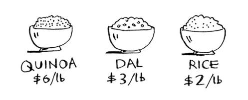

Quinoa har bir funt uchun hamma narsadan qimmatroq. Shunday qilib, olib yurishingiz mumkin bo'lgan barcha quinoani oling! Agar bu sizning sumkangizni to'ldirsa, bu siz qila oladigan eng yaxshi narsadir.

Agar quinoa tugasa va sumkangizda hali ham joy bo'lsa, keyingi eng qimmatli narsani oling va hokazo.

## Optimizing your travel itinerary

Aytaylik, siz Londonga yaxshi dam olish uchun ketyapsiz. U erda ikki kuningiz bor va siz ko'p narsalarni qilishni xohlaysiz. Siz hamma narsani qila olmaysiz, shuning uchun siz ro'yxat tuzasiz.

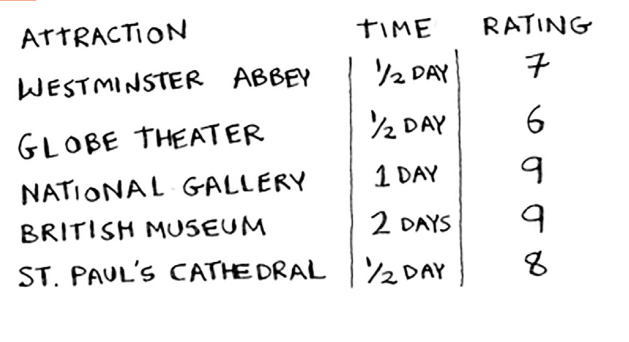

Siz ko'rmoqchi bo'lgan har bir narsa uchun qancha vaqt ketishini yozasiz va uni qanchalik ko'rishni xohlayotganingizni baholaysiz. Ushbu ro'yxatga asoslanib, nimani ko'rishingiz kerakligini aniqlay olasizmi?

Bu yana yukxalta muammosi! Yukxalta o'rniga sizda cheklangan vaqt bor. Stereo va noutbuklar o'rniga siz bormoqchi bo'lgan joylar ro'yxati mavjud. Davom etishdan oldin ushbu ro'yxat uchun dinamik dasturlash panjarasini chizing.

Mana, panjara qanday ko'rinishga ega.

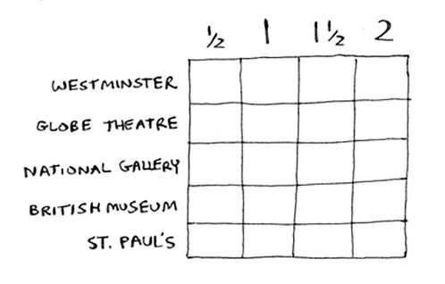

To'g'ri tushundingizmi? To'rni to'ldiring. Qaysi joylarni ko'rish kerak? Mana javob.

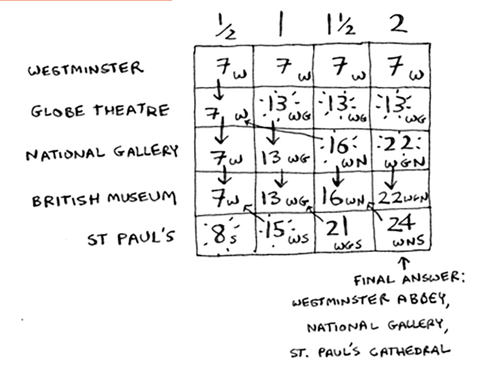

## Handling items that depend on each other

Aytaylik, siz Parijga borishni xohlaysiz, shuning uchun siz ro'yxatga bir nechta narsalarni qo'shasiz.

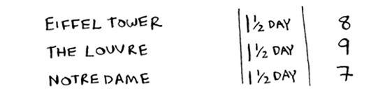

Bu joylar ko'p vaqtni oladi, chunki avval Londondan Parijga sayohat qilish kerak. Bu yarim kun davom etadi. Agar siz uchta elementni bajarishni istasangiz, to'rt yarim kun davom etadi.

Kutib turing, bu to'g'ri emas. Har bir element uchun Parijga sayohat qilishingiz shart emas. Parijda bo'lganingizdan so'ng, har bir narsaga faqat bir kun kerak bo'ladi. Shunday qilib, har bir element uchun bir kun + yarim kunlik sayohat = 4,5 kun emas, balki 3,5 kun bo'lishi kerak.

Agar siz Eyfel minorasini sumkangizga qo'ysangiz, Luvr "arzonroq" bo'ladi - bu sizga 1,5 kun o'rniga bir kunga tushadi. Buni dinamik dasturlashda qanday modellashtirasiz?

Qila olmaysiz. Dinamik dasturlash kuchli, chunki u kichik muammolarni hal qilishi va katta muammoni hal qilish uchun bu javoblardan foydalanishi mumkin. *Dinamik dasturlash faqat har bir kichik muammo diskret bo'lganda ishlaydi - u boshqa kichik muammolarga bog'liq bo'lmasa*. Bu dinamik dasturlash algoritmidan foydalangan holda Parijni hisobga olishning hech qanday usuli yo'qligini anglatadi.

## Is it possible that the solution will require more than two sub-knapsacks?

Ehtimol, eng yaxshi yechim ikkitadan ortiq narsalarni o'g'irlashni o'z ichiga oladi. Algoritm qanday tuzilgan bo'lsa, siz ko'pi bilan ikkita sumkani birlashtirasiz - sizda hech qachon ikkitadan ortiq sumka bo'lmaydi. Ammo o'sha pastki sumkalarning o'zlarining kichik sumkalari bo'lishi mumkin.

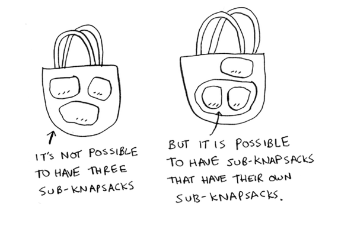

## Is it possible that the best solution doesn't fill the knapsack completely?

Ha. Aytaylik, siz olmosni ham o'g'irlashingiz mumkin.

Bu katta olmos: uning og'irligi 3,5 funt. Bu million dollarga arziydi, bu hamma narsadan ko'ra ko'proq. Siz, albatta, uni o'g'irlashingiz kerak!

Ammo yarim funt bo'sh joy qoldi va bu joyga hech narsa sig'maydi.

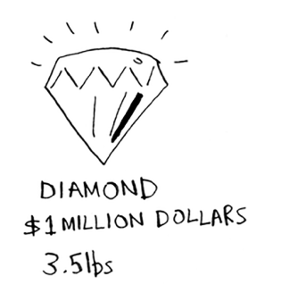

#### EXERCISES

9.2 Aytaylik, siz lagerga ketyapsiz. Sizda 6 funt sig'adigan yukxalta bor va siz quyidagi narsalarni olishingiz mumkin. Har birining qiymati bor va qiymat qanchalik baland bo'lsa, element shunchalik muhim bo'ladi:

* Suv, 3 lb, 10

* Kitob, 1 funt, 3

* Oziq-ovqat, 2 funt, 9

* Kurtka, 2 funt, 5

* Kamera, 1 funt, 6

Lagerga sayohat qilish uchun eng maqbul narsalar to'plami qanday?