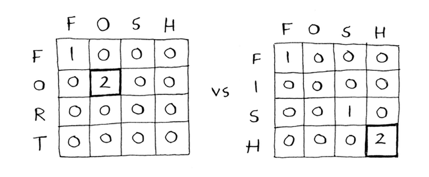

# Longest common substring
Siz hozirgacha bitta dinamik dasturlash muammosini ko'rdingiz. Olib tashlashlar qanday?

* Dinamik dasturlash biror cheklovga ega bo'lgan narsani `optimallashtirishga harakat qilganingizda foydali bo'ladi`. Yukxalta muammosida siz o'g'irlagan tovarlarning qiymatini yukxalta o'lchami bilan chegaralangan holda maksimal darajada oshirishingiz kerak edi.

* Muammo diskret kichik muammolarga bo'linishi mumkin bo'lgan va ular bir-biriga bog'liq bo'lmaganda dinamik dasturlashdan foydalanishingiz mumkin.

Dinamik dasturlash yechimini topish qiyin bo'lishi mumkin. Biz ushbu bo'limda nimaga e'tibor qaratamiz. Ba'zi umumiy maslahatlar quyidagilar:

* Har bir dinamik dasturlash yechimi tarmoqni o'z ichiga oladi.
* Hujayralardagi qiymatlar odatda siz optimallashtirishga harakat qilayotgan narsadir. Yukxalta muammosi uchun qiymatlar tovarlarning qiymati edi.

* Har bir katak kichik muammodir, shuning uchun muammoingizni qanday qilib kichik muammolarga bo'lish haqida o'ylab ko'ring. Bu sizga o'qlar nima ekanligini aniqlashga yordam beradi.

Keling, boshqa misolni ko'rib chiqaylik. Aytaylik, siz dictionary.com-ni ishga tushirdingiz. Kimdir so'zni yozadi va siz ularga ta'rif berasiz. 

Ammo kimdir so'zni noto'g'ri yozsa, ular qaysi so'zni nazarda tutganini taxmin qilishni xohlaysiz. Aleks *baliq* qidirmoqda, lekin u tasodifan *xish* qo'ydi. Bu sizning lug'atingizdagi so'z emas, lekin sizda o'xshash so'zlar ro'yxati bor.


(Bu o'yinchoq misoli, shuning uchun siz ro'yxatingizni ikki so'z bilan cheklaysiz. Aslida, bu ro'yxat minglab so'zlardan iborat bo'lishi mumkin.)

Aleks *xish* yozdi. Aleks qaysi so'zni yozishni nazarda tutgan: *baliq yoki vista*?
## Making the grid

Ushbu muammo uchun panjara nimaga o'xshaydi? Siz ushbu savollarga javob berishingiz kerak:

• Hujayralarning qiymatlari qanday?

• Ushbu muammoni kichik muammolarga qanday ajratasiz?

• To'rning o'qlari qanday?

Dinamik dasturlashda siz biror narsani *maksimal* darajada oshirishga harakat qilyapsiz. Bunday holda, siz ikkita so'z umumiy bo'lgan eng uzun pastki qatorni topishga harakat qilyapsiz. *Xish* va *baliq* qanday umumiy xususiyatga ega? *Hish* va *vista* haqida nima deyish mumkin? Bu siz hisoblamoqchi bo'lgan narsadir.

Esda tutingki, hujayralar uchun qiymatlar odatda siz optimallashtirishga harakat qilayotgan narsadir. Bunday holda, qiymatlar, ehtimol, son bo'ladi: ikkita satr umumiy bo'lgan eng uzun pastki qatorning uzunligi.

Ushbu muammoni kichik muammolarga qanday ajratasiz? Siz pastki qatorlarni solishtirishingiz mumkin. *Xish* va *baliqni* solishtirish o'rniga, avval uning va *fisni* solishtirishingiz mumkin. Har bir katakda ikkita umumiy qatorga ega bo'lgan eng uzun pastki qator uzunligi bo'ladi. Bu sizga o'qlar ikki so'z bo'lishi mumkinligi haqida ma'lumot beradi. Shunday qilib, panjara, ehtimol, shunday ko'rinadi.


Agar bu sizga qora sehrdek tuyulsa, tashvishlanmang. Bu qiyin narsa - shuning uchun men buni kitobda juda kech o'rgatyapman! Keyinchalik dinamik dasturlashni o'zingiz mashq qilishingiz uchun men sizga mashq beraman.

## Filling in the grid

Endi siz panjara qanday ko'rinishi haqida yaxshi tasavvurga egasiz. To'rning har bir katakchasini to'ldirish formulasi qanday? Siz biroz aldashingiz mumkin, chunki siz yechim nima bo'lishi kerakligini allaqachon bilasiz - *hish* va *baliqning* umumiy uzunligi 3 bo'lgan pastki qator bor: ish.

Ammo bu hali ham foydalanish formulasini aytmaydi. Kompyuter olimlari ba'zan *Feynman algoritmidan* foydalanish haqida hazillashadilar. Feynman algoritmi mashhur fizik Richard Feynman sharafiga nomlangan va u quyidagicha ishlaydi:

1. Muammoni yozing.

2. Qattiq o'ylang.

3. Yechimni yozing.


Kompyuter olimlari qiziqarli guruhdir!

Haqiqat shundaki, bu erda formulani hisoblashning oson usuli yo'q. Siz tajriba o'tkazishingiz va ishlaydigan narsani topishga harakat qilishingiz kerak. Ba'zida algoritmlar aniq retsept emas. Ular o'z g'oyangizni ustiga quradigan ramka.

Bu muammoni o'zingiz hal qilishga harakat qiling. Men sizga bir maslahat beraman - panjaraning bir qismi shunday ko'rinadi.


Boshqa qadriyatlar qanday? Har bir katak kichik `muammoning` qiymati ekanligini unutmang. Nima uchun katak (3, 3) 2 qiymatiga ega? Nima uchun katak (3, 4) 0 qiymatiga ega?

Formulani o'zingiz ishlab chiqishga harakat qilganingizdan keyin o'qing. Agar siz buni to'g'ri tushunmasangiz ham, mening tushuntirishim yanada mantiqiy bo'ladi.

## The solution

Mana oxirgi panjara.


Mana har bir katakchani to'ldirish uchun mening formulam.


Bu formula psevdokodda qanday ko'rinadi:

```
if word_a[i] == word_b[j]: # <-- The letters match.
    cell[i][j] = cell[i-1][j-1] + 1
else:                       # <-- The letters don't match.
    cell[i][j] = 0
```

Mana hish va vista uchun panjara.


Bir narsani ta'kidlash kerak: bu muammo uchun yakuniy yechim oxirgi katakda bo'lmasligi mumkin! Yukxalta muammosi uchun bu oxirgi hujayra har doim yakuniy yechimga ega edi. Ammo eng uzun umumiy pastki satr uchun yechim to'rdagi eng katta raqam bo'lib, u oxirgi katak bo'lmasligi mumkin.

Keling, asl savolga qaytaylik: qaysi qatorda xish bilan ko'proq umumiylik bor? *hish* va *baliq* umumiy uchta harfdan iborat pastki qatorga ega. *hish* va *vista* umumiy ikkita harfdan iborat pastki qatorga ega.

Aleks, ehtimol, *baliq* yozmoqchi bo'lgan.
## Longest common subsequence

Aytaylik, Aleks tasodifan foshni qidirdi. U qaysi so'zni nazarda tutgan: baliqmi yoki qal'ami?

Keling, ularni eng keng tarqalgan pastki qator formulasi yordamida taqqoslaylik.



Ularning ikkalasi ham bir xil: ikkita harf! Ammo baliq baliqqa yaqinroq.


Siz eng uzun umumiy `pastki qatorni` taqqoslayapsiz, lekin haqiqatan ham eng uzun umumiy `pastki qatorni` solishtirishingiz kerak: ketma-ketlikdagi harflar soni, bu ikki so'z umumiy. Eng uzun umumiy ketma-ketlikni qanday hisoblash mumkin?

Mana `baliq` va `baliq uchun qisman` panjara.


Ushbu to'rning formulasini aniqlay olasizmi? Eng uzun umumiy pastki qator eng uzun umumiy pastki qatorga juda o'xshaydi va formulalar ham juda o'xshash. Buni o'zingiz hal qilishga harakat qiling - men javobni keyin beraman.

## Longest common subsequence—solution

Mana oxirgi panjara.


Mana har bir katakchani to'ldirish uchun mening formulam.


Va bu psevdokodda:
```
if word_a[i] == word_b[j]:    # <- The letters match..
    cell[i][j] = cell[i-1][j-1] + 1
else: # <- The letters don’t match.ZZZZZZZZZZZZZZZZZZZZZZZZZZZZZZ.
    cell[i][j] = max(hujayra[i-1][j], cell[i][j-1])
```
Voy, siz buni qildingiz! Bu, albatta, kitobning eng qiyin boblaridan biri. Xo'sh, dinamik dasturlash haqiqatan ham ishlatilganmi? Ha:

* Biologlar DNK zanjirlarida o'xshashlikni topish uchun eng uzun umumiy ketma-ketlikdan foydalanadilar. Ular bu ikki hayvon yoki ikkita kasallik qanchalik o'xshashligini aniqlash uchun foydalanishlari mumkin. Ko'p sklerozni davolash uchun eng uzun umumiy ketma-ketlik qo'llaniladi.

* Siz hech qachon diff (masalan, git diff) dan foydalanganmisiz? Diff sizga ikkita fayl orasidagi farqni aytib beradi va buning uchun dinamik dasturlashdan foydalanadi.

* Biz torning o'xshashligi haqida gaplashdik. Levenshtein masofasi ikki satrning qanchalik o'xshashligini o'lchaydi va u dinamik dasturlashdan foydalanadi. Levenshtein masofasi imlo tekshiruvidan tortib foydalanuvchi mualliflik huquqi bilan himoyalangan ma'lumotlarni yuklayotganligini aniqlashgacha bo'lgan hamma narsa uchun ishlatiladi.

* Microsoft Word kabi so'zlarni o'rashni amalga oshiradigan ilovadan foydalanganmisiz? Chiziq uzunligi bir xil bo'lib qolishi uchun qaerga o'rash kerakligini qanday aniqlash mumkin? Dinamik dasturlash!

#### EXERCISES
9.3 `Ko'k` va `ishoralar` orasidagi eng uzun umumiy pastki qatorni hisoblash uchun to'rni chizing va to'ldiring.